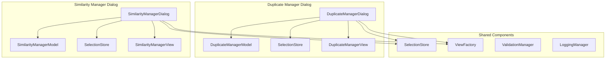
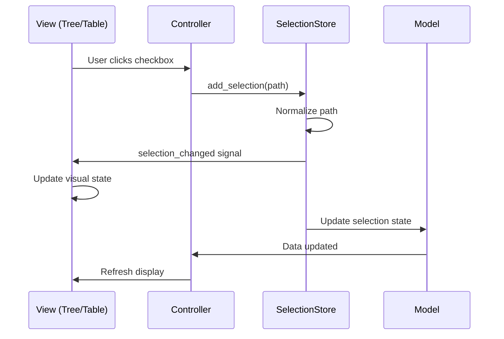
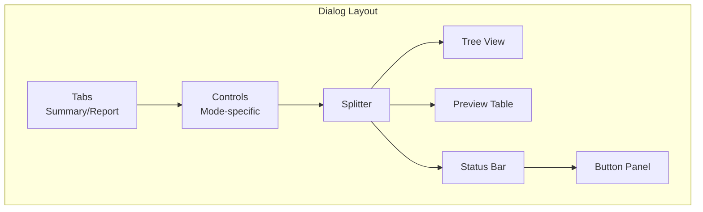
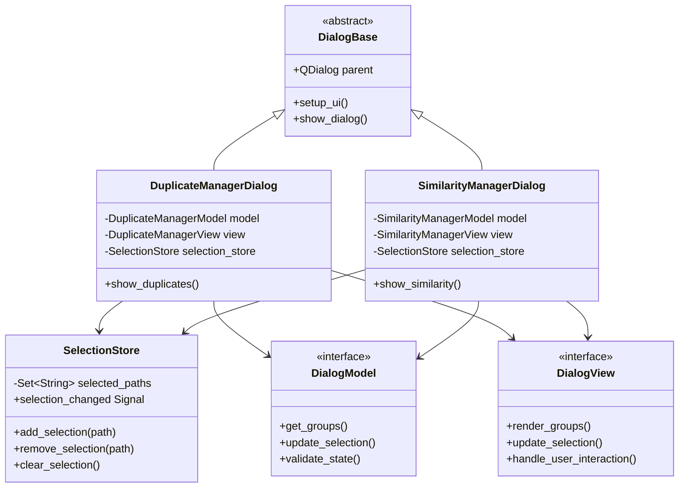
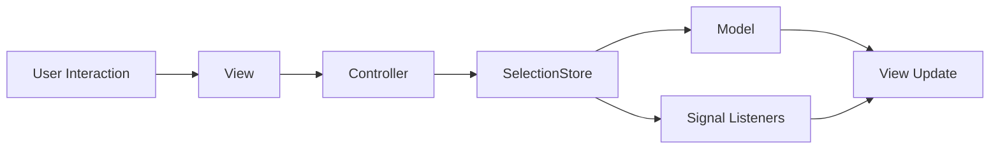
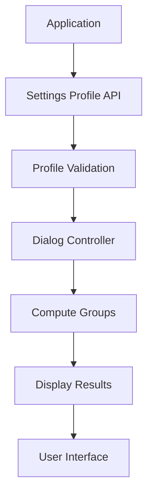

# File Management Dialogs - Complete Architectural Redesign

## Executive Summary

This document outlines a complete architectural redesign for the Duplicate Manager and Similarity Manager dialogs, addressing the fundamental issues in the current implementation. The new architecture emphasizes **composition over inheritance**, **proper MVC separation**, and **robust selection state management** through a dedicated `SelectionStore` pattern.

## Current Implementation Analysis

### Root Causes of Issues

1. **Forced Inheritance Pattern**
   - **STATUS: RESOLVED.** The legacy files (`img_app/img_app/widgets/base_group_manager.py`, `img_app/img_app/widgets/duplicate_manager.py`, `img_app/img_app/widgets/similarity_manager.py`) have been deleted.
   - The new architecture uses composition via `BaseFileManagerDialog` (in `src/pk_py_lib/gui/dialogs/base_file_manager_dialog.py`) and dedicated dialog classes (`DuplicateManagerDialog`, `SimilarityManagerDialog`).

2. **Poor Separation of Concerns**
   - UI logic, data management, and business logic mixed in single classes
   - Selection state management scattered across multiple methods
   - No clear boundaries between presentation and data layers

3. **Selection State Management Issues**
   - **STATUS: RESOLVED.** Selection state is now managed exclusively by the shared `SelectionStore` (in `src/pk_py_lib/gui/models.py`) using signal/slot communication.

4. **Custom Painting Problems**
   - **STATUS: RESOLVED.** The new views (`FileGroupView`, `SimilarityPreviewPane` in `src/pk_py_lib/gui/widgets.py`) use native Qt widgets and standard item flags/delegates, eliminating custom painting issues.

## New Architectural Pattern

### Composition Over Inheritance

The new architecture replaces inheritance with composition, allowing each dialog to be a focused, independent component that shares common functionality through injected dependencies.



### MVC Pattern Implementation

**Model Layer**
- Separate data models for each dialog type
- Clear separation between display data and selection state
- Immutable data structures for thread safety

**View Layer**
- Focused, single-responsibility view components
- Native Qt styling without custom painting overrides
- Proper signal/slot communication with controllers

**Controller Layer**
- Mediates between models and views
- Handles user interactions and state transitions
- Coordinates with external services (Settings Profiles, Database)

## SelectionStore Pattern Design

### Core Architecture

```python
class SelectionStore(QObject):
    """Robust selection state management with proper MVC separation"""
    
    # Signals for state changes
    selection_changed = Signal(set)  # Emits new selection set
    item_added = Signal(str)        # Individual item added
    item_removed = Signal(str)      # Individual item removed
    selection_cleared = Signal()    # All selections cleared
    
    def __init__(self, normalizer: Callable[[str], str]):
        super().__init__()
        self._selected_paths: set[str] = set()
        self._normalizer = normalizer
    
    def add_selection(self, path: str) -> None:
        """Add normalized path to selection with signal emission"""
        normalized = self._normalizer(path)
        if normalized not in self._selected_paths:
            self._selected_paths.add(normalized)
            self.item_added.emit(normalized)
            self.selection_changed.emit(self._selected_paths.copy())
    
    def remove_selection(self, path: str) -> None:
        """Remove normalized path from selection with signal emission"""
        normalized = self._normalizer(path)
        if normalized in self._selected_paths:
            self._selected_paths.remove(normalized)
            self.item_removed.emit(normalized)
            self.selection_changed.emit(self._selected_paths.copy())
    
    def clear_selection(self) -> None:
        """Clear all selections with signal emission"""
        if self._selected_paths:
            self._selected_paths.clear()
            self.selection_cleared.emit()
            self.selection_changed.emit(set())
    
    def get_selection_count(self) -> int:
        """Return number of selected items"""
        return len(self._selected_paths)
    
    def is_selected(self, path: str) -> bool:
        """Check if normalized path is selected"""
        return self._normalizer(path) in self._selected_paths
```

### Integration Pattern



## Data Models Design

### Base Data Structures

```python
@dataclass
class FileItem:
    """Immutable representation of a file item"""
    path: str
    size: int
    resolution: str
    mod_date: str
    score: Optional[float] = None
    file_type: str = ""
    savings: int = 0

@dataclass
class Group:
    """Immutable representation of a file group"""
    id: int
    items: List[FileItem]
    stats: GroupStats
    ref_path: str

@dataclass
class DialogState:
    """Complete state of a management dialog"""
    groups: List[Group]
    selection_store: SelectionStore
    settings_profile: Optional[SettingsProfile] = None
    current_view: DialogView = DialogView.TREE
```

### Dialog-Specific Models

**DuplicateManagerModel**
- Handles exact duplicate-specific data
- Manages duplicate detection results
- Provides duplicate-specific statistics

**SimilarityManagerModel** 
- Handles perceptual similarity data
- Manages similarity computation results
- Provides similarity-specific statistics and controls

## UI Layout Specifications

### Common Dialog Structure



### Duplicate Manager Layout

**Controls Section**
- Mode indicator: "Duplicates (Exact Matches)"
- Simple status display

**Tree Columns**
1. Select (checkbox)
2. Name (file basename)
3. Directory (parent path)
4. Size (human-readable)
5. File Type (extension)
6. Potential Savings (size difference)
7. Score (hidden for duplicates)

**Preview Behavior**
- No preview pane for duplicates
- Metadata-focused display only

### Similarity Manager Layout

**Controls Section**
- Mode indicator: "Similarity (Perceptual)"
- Algorithm selection (pHash/whash dropdown)
- Threshold spinner (0-64)
- "Compute Groups" button

**Tree Columns** 
1. Select (checkbox)
2. Name (file basename)
3. Directory (parent path)
4. Size (human-readable)
5. Resolution (dimensions)
6. Date (modification)
7. Score (similarity percentage)

**Preview Behavior**
- Dual-pane layout with image previews
- Thumbnail display with dimensions and paths
- Interactive selection synchronization

## Integration with Settings Profiles v1
## UI Interactions and Event Handling

### Mouse Events: Double-Click and Context Menu

The file management dialogs support enhanced user interactions through double-click and right-click context menus on file items in the QTreeWidget. These features provide quick access to files without leaving the application, improving workflow efficiency for inspecting, editing, or managing files directly from the results view.

#### Double-Click to Open File

- **Behavior**: Double-clicking a file item (child item under a group) opens the file using the default OS handler via [`QDesktopServices.openUrl()`](PySide6.QtGui.QDesktopServices.openUrl()).

- **Implementation**: Connected to the tree widget's `itemDoubleClicked` signal in the dialog's setup method (e.g., `_setup_tree_behavior`).

- **Cross-Platform Support**: Uses [`QUrl.fromLocalFile(path)`](PySide6.QtCore.QUrl.fromLocalFile()) for platform-agnostic opening. On Windows 11, this launches the default associated application (e.g., image viewer for JPG files). On macOS/Linux, it uses the system's default handler (e.g., Preview.app or Eye of GNOME).

- **Integration with Existing Systems**: Triggers only on file items, ignoring group headers. Does not interfere with selection state—double-click opens the file but leaves checkboxes unchanged. In the Similarity Manager, the preview pane remains focused on the current group; opening a file allows side-by-side comparison in an external app without disrupting the dialog's state management via `SelectionStore`.

- **Usability Enhancement**: Enables rapid file inspection or editing (e.g., opening an image in Photoshop) while keeping the manager open for batch operations like deletions. This reduces context switching, especially useful during duplicate/similarity reviews where users frequently verify files visually or in external tools.

#### Right-Click Context Menu

- **Behavior**: Right-clicking a file item displays a [`QMenu`](PySide6.QtWidgets.QMenu()) with context-specific actions tailored to file operations.

- **Menu Actions**:
  - **Open File**: Equivalent to double-click; opens with default OS handler.
  - **Copy Path**: Copies the absolute file path to the system clipboard using [`QApplication.clipboard().setText()`](PySide6.QtWidgets.QApplication.clipboard().setText()).
  - **File Management Operations**:
    - **Copy To**: Opens directory selection dialog and copies file to chosen location
    - **Move To**: Opens directory selection dialog and moves file to chosen location
  - **OS-Dependent Actions**:
    - **Windows-Specific**:
      - "Open Containing Folder": Launches File Explorer at the file's location with the file pre-selected (`explorer /select,"full_path"` via subprocess).
      - "Properties": Opens the native file properties dialog (`rundll32 shell32.dll,Control_RunDLL "full_path"` via subprocess).
    - **Fallback for Other OS (macOS/Linux)**: "Open Folder" opens the parent directory in the default file manager (e.g., Finder or Nautilus) using `QDesktopServices.openUrl()` on the parent path.

- **Implementation**: Connected to the tree widget's `customContextMenuRequested` signal. The menu is built dynamically based on `platform.system()` to include OS-specific items. Positioned at the mouse cursor using `mapToGlobal()`.

- **Integration with Selection and Preview Systems**: Menu appears only for file items (checked via item hierarchy). Actions are non-destructive to selection—e.g., copying path or opening does not toggle checkboxes in `SelectionStore`. In the Duplicate Manager (metadata-only), actions complement the tree view. In the Similarity Manager, they integrate with the dual-pane preview: opening a file allows external viewing while the thumbnail preview stays active for group comparison.

- **Edge Cases and Error Handling**:
  - **Invalid/Non-Existent Paths**: Validate with `Path(path).exists()`; if false, log warning and display a selectable error dialog via `show_selectable_error()`.
  - **Permission Denied**: Catch `OSError` or subprocess exceptions; log full details (path, action, platform, stack trace) to STDERR and show user-friendly message.
  - **Group Headers**: No menu shown; right-click ignored to prevent confusion.
  - **Clipboard/URL Failures**: Fallback to logging and notification; ensures partial failures (e.g., copy succeeds even if open fails) do not block the workflow.

- **Usability Enhancement**: The context menu offers power-user shortcuts for common file tasks directly in the results view, streamlining workflows. Windows-specific actions leverage familiar shell behaviors (e.g., selected file in Explorer), while fallbacks ensure cross-platform consistency. This enhances productivity by allowing quick navigation, path sharing, or property inspection without alt-tabbing to a file manager.

These interactions build on the MVC pattern: views emit signals to controllers, which handle business logic (e.g., path validation, logging) before delegating to OS services, ensuring seamless integration with the `SelectionStore` and immutable data models.

### Settings Profile Integration Pattern

```python
class DialogController(QObject):
    """Controller mediating between dialog, settings, and data"""
    
    def __init__(self, settings_api: SettingsProfilesAPI):
        self.settings_api = settings_api
        self.active_profile: Optional[SettingsProfile] = None
        self._load_active_profile()
    
    def _load_active_profile(self) -> None:
        """Load and validate active settings profile"""
        response = self.settings_api.get_active()
        if response.success and response.data:
            self.active_profile = SettingsProfile.from_dict(response.data)
            self._validate_profile_for_dialog()
    
    def compute_groups(self, algorithm: str, threshold: int) -> List[Group]:
        """Compute groups using active profile configuration"""
        if not self.active_profile:
            raise ValueError("No active profile configured")
        
        # Use profile's pool configuration and direction
        pools_config = self.active_profile.get_pools_config()
        direction = self.active_profile.get_direction()
        
        return self._compute_similarity_groups(
            algorithm=algorithm,
            threshold=threshold,
            pools_config=pools_config,
            direction=direction
        )
```

### Pool Direction Support

The architecture fully supports all pool directions:
- **A→B**: Find items in Pool B that match Pool A references
- **B→A**: Find items in Pool A that match Pool B references  
- **A_WITHOUT_IN_B**: Items in Pool A with no matches in Pool B
- **B_WITHOUT_IN_A**: Items in Pool B with no matches in Pool A

## Error Handling and Logging Strategy

### Structured Error Handling

```python
class DialogErrorHandler:
    """Centralized error handling for dialog operations"""
    
    def handle_computation_error(self, error: Exception, context: str) -> None:
        """Handle computation errors with user-friendly messages"""
        logger.error(f"Computation failed in {context}", exc_info=error)
        
        # User-friendly error message with selectable text
        error_msg = f"Failed to compute groups: {str(error)}"
        show_selectable_error(self.parent, "Computation Error", error_msg)
        
        # Detailed logging for diagnostics
        logger.error(f"Error details - Context: {context}, Error: {error}")

class DialogLogger:
    """Structured logging for dialog operations"""
    
    def log_selection_change(self, action: str, path: str, new_state: bool) -> None:
        """Log selection changes with context"""
        logger.info(
            f"Selection {action}",
            extra={
                "path": path,
                "state": new_state,
                "dialog_type": self.dialog_type
            }
        )
```

### Text Selectability Implementation

All user-facing text implements Qt's text selection capabilities:

```python
def create_selectable_label(text: str) -> QLabel:
    """Create a QLabel with selectable text"""
    label = QLabel(text)
    label.setTextInteractionFlags(Qt.TextSelectableByMouse)
    label.setCursor(Qt.IBeamCursor)
    return label

def show_selectable_error(parent: QWidget, title: str, message: str) -> None:
    """Show error dialog with selectable text"""
    msg_box = QMessageBox(parent)
    msg_box.setWindowTitle(title)
    msg_box.setText(message)
    msg_box.setTextInteractionFlags(Qt.TextSelectableByMouse)
    msg_box.exec()
```

## Class Diagrams and Relationships

### Core Component Relationships



### Data Flow Diagrams

**Selection State Flow**


**Settings Profile Integration Flow**


## Integration Patterns with Main Application

### Main Window Integration

```python
class MainWindow(QMainWindow):
    """Main application window with dialog integration"""
    
    def show_duplicate_manager(self, groups: List[Group]) -> None:
        """Show duplicate manager with pre-computed groups"""
        dialog = DuplicateManagerDialog(
            groups=groups,
            selection_store=self.selection_store,
            parent=self
        )
        dialog.exec()
    
    def show_similarity_manager(self, db_manager: DatabaseManager) -> None:
        """Show similarity manager with database integration"""
        dialog = SimilarityManagerDialog(
            db_manager=db_manager,
            settings_api=self.settings_api,
            selection_store=self.selection_store,
            parent=self
        )
        dialog.exec()
```

### Database Integration Pattern

```python
class DatabaseIntegration:
    """Handles database operations for dialogs"""
    
    def get_hashes_for_algorithm(self, algorithm: str) -> List[Dict]:
        """Get hashes from database for similarity computation"""
        conn = self.db_manager.get_connection()
        query = """
        SELECT im.absolute_path as path, ih.hash_value as hash
        FROM image_metadata im
        JOIN image_hashes ih ON im.id = ih.image_id
        WHERE ih.algorithm = ?
        """
        return [{'path': row.path, 'hash': row.hash} 
                for row in conn.execute(query, (algorithm,)).fetchall()]
```

## Implementation Roadmap

### Phase 1: Foundation (Week 1)
- [x] Implement `SelectionStore` with signal/slot architecture
- [x] Create base data models (`FileItem`, `Group`, `DialogState`)
- [x] Design and implement view factory components (`FileGroupView`, `SimilarityPreviewPane`)
- [x] Set up structured logging and error handling
 
### Phase 2: Dialog Implementation (Week 2)
- [x] Implement `DuplicateManagerDialog` with composition pattern
- [x] Implement `SimilarityManagerDialog` with composition pattern
- [x] Create dialog-specific models and views
- [x] Implement Settings Profiles v1 integration
 
### Phase 3: Integration & Testing (Week 3)
- [x] Integrate dialogs with main application (`MainWindow` updated)
- [x] Implement database integration patterns (Group conversion helpers added)
- [ ] Comprehensive testing of selection state management (Pending)
- [ ] User acceptance testing of new UI patterns (Pending)
 
### Phase 4: Optimization & Documentation (Week 4)
- [ ] Performance optimization and memory management (Deferred)
- [x] Comprehensive documentation and examples (Updating now)
- [ ] Final user testing and bug fixes (Pending)

## Benefits of New Architecture

### Improved Maintainability
- **Clear separation of concerns** with proper MVC pattern
- **Composition over inheritance** allows independent evolution
- **Modular design** enables easy testing and extension

### Enhanced Reliability  
- **Robust selection state management** with `SelectionStore` pattern
- **Proper signal/slot communication** eliminates race conditions
- **Structured error handling** with comprehensive logging

### Better User Experience
- **Native Qt styling** without custom painting issues
- **Consistent behavior** across both dialog types
- **Selectable text** throughout the interface for better usability

### Future-Proof Design
- **Settings Profiles v1 integration** ready for advanced configurations
- **Extensible architecture** supports new features and algorithms
- **Modular components** facilitate maintenance and updates

This architectural design provides a solid foundation for re-implementing the file management dialogs from scratch, addressing all the identified issues while providing a robust, maintainable, and user-friendly solution.