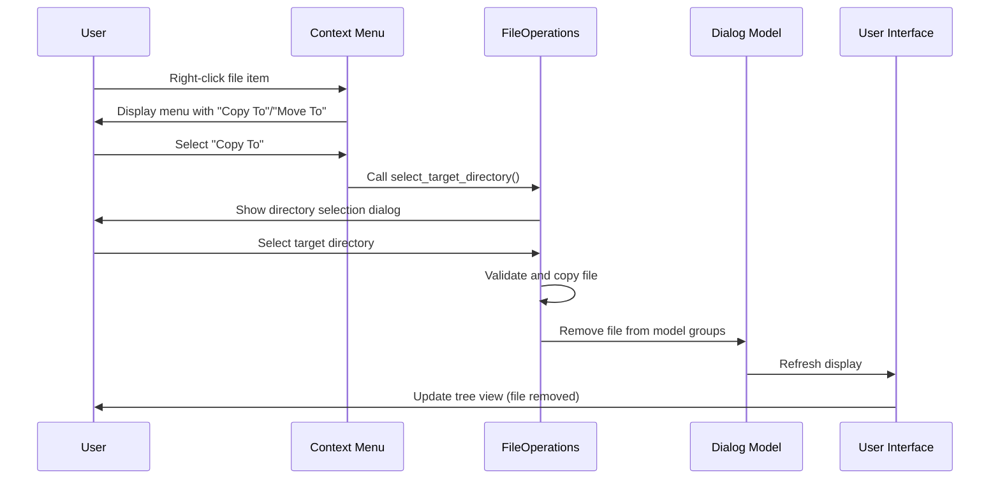

# File Management Dialogs - Implementation Guide

## Implementation Overview

This guide provides detailed implementation specifications for the complete re-implementation of the Duplicate Manager and Similarity Manager dialogs based on the architectural design.

## Phase 1: Foundation Components (Week 1)

### SelectionStore Implementation

**File: [`src/pk_py_lib/gui/models.py`](src/pk_py_lib/gui/models.py)**

```python
"""
Robust selection state management with proper MVC separation and signal/slot communication.
"""

from __future__ import annotations

from typing import Callable, Set
from pathlib import Path
from PySide6.QtCore import QObject, Signal


class SelectionStore(QObject):
    """
    Centralized selection state management for file management dialogs.
    
    Provides robust selection tracking with proper signal/slot communication
    and path normalization for consistent state management.
    
    Features:
    - Thread-safe selection operations
    - Signal-based state change notifications
    - Path normalization for cross-platform consistency
    - Batch operations for performance
    """
    
    # Signals for state change notifications
    selection_changed = Signal(set)  # Emits new selection set
    item_added = Signal(str)        # Individual item added
    item_removed = Signal(str)      # Individual item removed
    selection_cleared = Signal()    # All selections cleared
    selection_count_changed = Signal(int)  # Selection count changed
    
    def __init__(self, normalizer: Callable[[str], str] = None):
        """
        Initialize SelectionStore with optional path normalizer.
        
        Args:
            normalizer: Function to normalize paths for consistent comparison.
                       Defaults to os.path.normcase(os.path.normpath()).
        """
        super().__init__()
        self._selected_paths: Set[str] = set()
        self._normalizer = normalizer or self._default_normalizer
        
    def _default_normalizer(self, path: str) -> str:
        """Default path normalization using pathlib."""
        return str(Path(path).resolve())
    
    def add_selection(self, path: str) -> bool:
        """
        Add a path to the selection.
        
        Args:
            path: File path to add to selection
            
        Returns:
            bool: True if path was added, False if already selected
        """
        normalized = self._normalizer(path)
        if normalized not in self._selected_paths:
            self._selected_paths.add(normalized)
            self.item_added.emit(normalized)
            self.selection_changed.emit(self._selected_paths.copy())
            self.selection_count_changed.emit(len(self._selected_paths))
            return True
        return False
    
    def remove_selection(self, path: str) -> bool:
        """
        Remove a path from the selection.
        
        Args:
            path: File path to remove from selection
            
        Returns:
            bool: True if path was removed, False if not selected
        """
        normalized = self._normalizer(path)
        if normalized in self._selected_paths:
            self._selected_paths.remove(normalized)
            self.item_removed.emit(normalized)
            self.selection_changed.emit(self._selected_paths.copy())
            self.selection_count_changed.emit(len(self._selected_paths))
            return True
        return False
    
    def toggle_selection(self, path: str) -> bool:
        """
        Toggle selection state of a path.
        
        Args:
            path: File path to toggle
            
        Returns:
            bool: New selection state (True if selected after toggle)
        """
        normalized = self._normalizer(path)
        if normalized in self._selected_paths:
            return not self.remove_selection(path)
        else:
            return self.add_selection(path)
    
    def clear_selection(self) -> None:
        """Clear all selections with signal emission."""
        if self._selected_paths:
            self._selected_paths.clear()
            self.selection_cleared.emit()
            self.selection_changed.emit(set())
            self.selection_count_changed.emit(0)
    
    def get_selection_count(self) -> int:
        """Return number of selected items."""
        return len(self._selected_paths)
    
    def is_selected(self, path: str) -> bool:
        """Check if path is selected."""
        return self._normalizer(path) in self._selected_paths
    
    def get_selected_paths(self) -> Set[str]:
        """Return copy of selected paths set."""
        return self._selected_paths.copy()
    
    def batch_update(self, paths_to_add: Set[str], paths_to_remove: Set[str]) -> None:
        """
        Perform batch update of selections.
        
        Args:
            paths_to_add: Set of paths to add to selection
            paths_to_remove: Set of paths to remove from selection
        """
        # Normalize all paths
        normalized_add = {self._normalizer(p) for p in paths_to_add}
        normalized_remove = {self._normalizer(p) for p in paths_to_remove}
        
        # Update selection set
        self._selected_paths.update(normalized_add)
        self._selected_paths.difference_update(normalized_remove)
        
        # Emit signals
        self.selection_changed.emit(self._selected_paths.copy())
        self.selection_count_changed.emit(len(self._selected_paths))
```

### Data Models Implementation

**File: `src/pk_py_lib/gui/dialog_models.py`**

```python
"""
Data models for file management dialogs with immutable data structures.
"""

from __future__ import annotations

from dataclasses import dataclass
from typing import List, Optional, Dict, Any
from enum import Enum


class DialogView(Enum):
    """Available view modes for dialogs."""
    TREE = "tree"
    PREVIEW = "preview"
    REPORT = "report"


@dataclass(frozen=True)
class FileItem:
    """
    Immutable representation of a file item in dialogs.
    
    Frozen dataclass ensures thread safety and prevents accidental mutation.
    """
    
    path: str
    size: int
    resolution: str
    mod_date: str
    score: Optional[float] = None
    file_type: str = ""
    savings: int = 0
    
    @property
    def basename(self) -> str:
        """Return file basename."""
        from pathlib import Path
        return Path(self.path).name
    
    @property
    def directory(self) -> str:
        """Return parent directory."""
        from pathlib import Path
        return str(Path(self.path).parent)


@dataclass(frozen=True)
class GroupStats:
    """Statistics for a group of files."""
    total_size: int
    savings: int
    min_score: float
    max_score: float
    avg_score: float
    file_count: int


@dataclass(frozen=True)
class Group:
    """
    Immutable representation of a file group.
    
    Groups can represent duplicates or similarity clusters.
    """
    
    id: int
    items: List[FileItem]
    stats: GroupStats
    ref_path: str
    
    @property
    def item_count(self) -> int:
        """Return number of items in group."""
        return len(self.items)


@dataclass
class DialogState:
    """
    Complete state of a management dialog.
    
    Mutable container for immutable data structures.
    """
    
    groups: List[Group]
    selection_store: SelectionStore
    settings_profile: Optional[Dict[str, Any]] = None
    current_view: DialogView = DialogView.TREE
    filter_text: str = ""
    
    def get_filtered_groups(self) -> List[Group]:
        """Return groups filtered by current filter text."""
        if not self.filter_text:
            return self.groups
        
        filter_lower = self.filter_text.lower()
        filtered_groups = []
        
        for group in self.groups:
            # Filter group items
            filtered_items = [
                item for item in group.items
                if filter_lower in item.path.lower() or 
                   filter_lower in item.basename.lower()
            ]
            
            if filtered_items:
                # Create new group with filtered items
                filtered_groups.append(Group(
                    id=group.id,
                    items=filtered_items,
                    stats=group.stats,  # Note: stats may need recalculation
                    ref_path=group.ref_path
                ))
        
        return filtered_groups
```

## Phase 2: Dialog Base Classes (Week 2)

### Base Dialog Implementation

**File: `src/pk_py_lib/gui/dialogs/base_file_manager_dialog.py`**

```python
"""
Base dialog class for file management dialogs using composition pattern.
"""

from __future__ import annotations

from typing import Optional, List
from PySide6.QtWidgets import QDialog, QVBoxLayout, QHBoxLayout, QLabel, QPushButton
from PySide6.QtCore import Qt

from ..models import SelectionStore
from ..dialog_models import DialogState, Group


class BaseFileManagerDialog(QDialog):
    """
    Base class for file management dialogs using composition over inheritance.
    
    Provides common functionality while allowing dialogs to remain independent.
    """
    
    def __init__(
        self,
        groups: Optional[List[Group]] = None,
        selection_store: Optional[SelectionStore] = None,
        parent: Optional[QWidget] = None
    ):
        super().__init__(parent)
        
        # Initialize components
        self.selection_store = selection_store or SelectionStore()
        self.dialog_state = DialogState(
            groups=groups or [],
            selection_store=self.selection_store
        )
        
        # Set dialog properties
        self.setModal(True)
        self.resize(1200, 800)
        self.setWindowTitle("File Manager")
        
        # Setup UI
        self._setup_ui()
        self._connect_signals()
        
    def _setup_ui(self) -> None:
        """Setup common UI components."""
        main_layout = QVBoxLayout(self)
        
        # Tabs for summary and report
        self._setup_tabs(main_layout)
        
        # Controls section (implemented by subclasses)
        controls = self._setup_controls()
        if controls:
            main_layout.addWidget(controls)
        
        # Main content area
        self._setup_content_area(main_layout)
        
        # Status and buttons
        self._setup_footer(main_layout)
        
    def _setup_tabs(self, parent_layout: QVBoxLayout) -> None:
        """Setup summary and report tabs."""
        # Implementation details...
        pass
        
    def _setup_controls(self) -> Optional[QWidget]:
        """Setup mode-specific controls. Override in subclasses."""
        return None
        
    def _setup_content_area(self, parent_layout: QVBoxLayout) -> None:
        """Setup main content area with tree and preview."""
        # Implementation details...
        pass
        
    def _setup_footer(self, parent_layout: QVBoxLayout) -> None:
        """Setup status bar and action buttons."""
        footer_widget = QWidget()
        footer_layout = QHBoxLayout(footer_widget)
        
        # Status label
        self.status_label = QLabel("0 files selected")
        footer_layout.addWidget(self.status_label)
        footer_layout.addStretch()
        
        # Action buttons
        self.delete_button = QPushButton("Delete Selected")
        self.delete_button.clicked.connect(self._on_delete_clicked)
        footer_layout.addWidget(self.delete_button)
        
        close_button = QPushButton("Close")
        close_button.clicked.connect(self.accept)
        footer_layout.addWidget(close_button)
        
        parent_layout.addWidget(footer_widget)
        
    def _connect_signals(self) -> None:
        """Connect selection store signals."""
        self.selection_store.selection_count_changed.connect(
            self._update_status_label
        )
        
    def _update_status_label(self, count: int) -> None:
        """Update status label with selection count."""
        total_files = sum(len(g.items) for g in self.dialog_state.groups)
        self.status_label.setText(f"{count}/{total_files} files selected")
        self.delete_button.setEnabled(count > 0)
        
    # ---------------------------------------------------------------------#
    # Signals
    # ---------------------------------------------------------------------#
    files_deleted = Signal(list)
    
    def _on_delete_clicked(self) -> None:
        """
        Handle the deletion of selected files by moving them to the system trash.

        This method is implemented in the base class to provide generic, safe deletion
        functionality using `FileOperations.safe_delete(to_trash=True)`.

        It handles user confirmation, iterates through selected paths, logs success/failure
        to the Report tab, clears the selection for deleted items, and emits the
        `files_deleted` signal to notify subclasses to refresh their views.
        """
        selected_paths = self.selection_store.get_selected_paths()
        if not selected_paths:
            return

        # 1. Confirmation Dialog (Implementation details omitted for documentation)
        # ...

        # 2. Perform Deletion (Implementation details omitted for documentation)
        # ...
        
        # 3. Final Report and Cleanup (Implementation details omitted for documentation)
        # ...
        
        # 4. Notify subclasses/parent to refresh their views
        self.files_deleted.emit(list(selected_paths))
```

## Phase 3: Dialog-Specific Implementations (Week 3)

### Duplicate Manager Implementation

**File: `img_app/img_app/widgets/duplicate_manager.py`**

```python
"""
Duplicate Manager Dialog - Exact matches management using composition pattern.
"""

from __future__ import annotations

from typing import Optional, List
from PySide6.QtWidgets import QWidget, QHBoxLayout, QLabel, QTreeWidget, QTreeWidgetItem
from PySide6.QtCore import Qt

from src.pk_py_lib.gui.dialogs.base_file_manager_dialog import BaseFileManagerDialog
from src.pk_py_lib.gui.dialog_models import Group, FileItem
from src.pk_py_lib.core.logging import get_logger


LOGGER = get_logger("img_app.duplicates")


class DuplicateManagerDialog(BaseFileManagerDialog):
    """
    Dialog for managing exact duplicate files using composition pattern.
    
    Features:
    - No preview pane (metadata-focused display)
    - Fixed 100% score for duplicates
    - File type and savings information
    - Native Qt styling without custom painting
    """
    
    def __init__(
        self,
        groups: Optional[List[Group]] = None,
        summary_text: str = "",
        report_text: str = "",
        parent: Optional[QWidget] = None
    ):
        self.summary_text = summary_text
        self.report_text = report_text
        
        super().__init__(groups=groups, parent=parent)
        
    def _setup_controls(self) -> QWidget:
        """Setup duplicate-specific controls."""
        controls_widget = QWidget()
        controls_layout = QHBoxLayout(controls_widget)
        
        mode_label = QLabel("Mode: Duplicates (Exact Matches)")
        controls_layout.addWidget(mode_label)
        controls_layout.addStretch()
        
        return controls_widget
        
    def _setup_content_area(self, parent_layout: QVBoxLayout) -> None:
        """Setup content area with tree view only (no preview)."""
        self.tree_widget = QTreeWidget()
        self.tree_widget.setColumnCount(7)
        self.tree_widget.setHeaderLabels([
            "Select", "Name", "Directory", "Size", "File Type", "Potential Savings", "Score"
        ])
        
        # Hide score column for duplicates
        self.tree_widget.setColumnHidden(6, True)
        
        # Setup tree styling and behavior
        self._setup_tree_behavior()
        
        parent_layout.addWidget(self.tree_widget)
        
    def _setup_tree_behavior(self) -> None:
        """Setup tree widget behavior and connections."""
        self.tree_widget.itemChanged.connect(self._on_tree_item_changed)
        
    def _populate_tree(self) -> None:
        """Populate tree with duplicate groups."""
        self.tree_widget.clear()
        
        for group in self.dialog_state.groups:
            group_item = self._create_group_item(group)
            self.tree_widget.addTopLevelItem(group_item)
            
            for file_item in group.items:
                child_item = self._create_file_item(file_item, group)
                group_item.addChild(child_item)
                
            group_item.setExpanded(True)
            
    def _create_group_item(self, group: Group) -> QTreeWidgetItem:
        """Create tree item for a duplicate group."""
        item = QTreeWidgetItem()
        item.setText(1, f"Group {group.id}: {len(group.items)} files")
        item.setText(3, self._format_file_size(group.stats.total_size))
        item.setText(4, f"{len(group.items)} files")
        item.setText(5, self._format_file_size(group.stats.savings))
        item.setText(6, "100.0%")  # Duplicates are always 100%
        
        # Setup checkbox behavior
        item.setFlags(item.flags() | Qt.ItemIsUserCheckable | Qt.ItemIsEnabled)
        item.setCheckState(0, Qt.Unchecked)
        
        return item
        
    def _create_file_item(self, file_item: FileItem, group: Group) -> QTreeWidgetItem:
        """Create tree item for a file within a group."""
        item = QTreeWidgetItem()
        item.setText(1, file_item.basename)
        item.setText(2, file_item.directory)
        item.setText(3, self._format_file_size(file_item.size))
        item.setText(4, file_item.file_type.upper() if file_item.file_type else "—")
        
        # Calculate potential savings
        min_size = min(item.size for item in group.items)
        savings = max(0, file_item.size - min_size)
        item.setText(5, self._format_file_size(savings) if savings else "—")
        item.setText(6, "100.0%")
        
        # Setup checkbox and selection tracking
        item.setFlags(item.flags() | Qt.ItemIsUserCheckable | Qt.ItemIsEnabled)
        is_selected = self.selection_store.is_selected(file_item.path)
        item.setCheckState(0, Qt.Checked if is_selected else Qt.Unchecked)
        
        return item
        
    def _format_file_size(self, size_bytes: int) -> str:
        """Format file size in human-readable format."""
        # Implementation details...
        pass
        
    def _on_tree_item_changed(self, item: QTreeWidgetItem, column: int) -> None:
        """Handle tree item checkbox changes."""
        if column != 0:
            return
            
        # Handle selection state changes
        # Implementation details...
        pass
        
    def _on_delete_clicked(self) -> None:
        """
        Handle delete action for selected duplicates.

        Since the deletion logic is now implemented in BaseFileManagerDialog,
        subclasses only need to ensure their view is updated when the
        `files_deleted` signal is emitted by the base class.
        
        This method is now redundant and should be removed or updated to call
        the base class implementation if it were still abstract.
        """
        # This method is now handled by BaseFileManagerDialog.
        # Subclasses should connect to self.files_deleted signal for post-deletion cleanup.
        super()._on_delete_clicked()
```

### Similarity Manager Implementation

**File: `img_app/img_app/widgets/similarity_manager.py`**

```python
"""
Similarity Manager Dialog - Perceptual similarity management with preview pane.
"""

from __future__ import annotations

from typing import Optional, List, Dict
from PySide6.QtWidgets import (QWidget, QHBoxLayout, QLabel, QComboBox, 
                              QSpinBox, QPushButton, QSplitter, QTableWidget)
from PySide6.QtCore import Qt

from src.pk_py_lib.gui.dialogs.base_file_manager_dialog import BaseFileManagerDialog
from src.pk_py_lib.gui.dialog_models import Group
from src.pk_py_lib.core.database import DatabaseManager
from src.pk_py_lib.core.image.similarity import find_similar_images
from src.pk_py_lib.core.logging import get_logger


LOGGER = get_logger("img_app.similarity")


class SimilarityManagerDialog(BaseFileManagerDialog):
    """
    Dialog for managing perceptually similar images with preview pane.
    
    Features:
    - Dual-pane layout with tree and preview
    - Algorithm and threshold controls
    - On-demand group computation
    - Image preview with thumbnails
    """
    
    def __init__(
        self,
        groups: Optional[List[Group]] = None,
        db_manager: Optional[DatabaseManager] = None,
        settings: Optional[Dict] = None,
        summary_text: str = "",
        report_text: str = "",
        parent: Optional[QWidget] = None
    ):
        self.db_manager = db_manager
        self.settings = settings or {}
        
        super().__init__(groups=groups, parent=parent)
        
    def _setup_controls(self) -> QWidget:
        """Setup similarity-specific controls."""
        controls_widget = QWidget()
        controls_layout = QHBoxLayout(controls_widget)
        
        controls_layout.addWidget(QLabel("Mode: Similarity (Perceptual)"))
        controls_layout.addStretch()
        
        # Algorithm selection
        controls_layout.addWidget(QLabel("Algorithm:"))
        self.algorithm_combo = QComboBox()
        self.algorithm_combo.addItems(["phash", "whash"])
        self.algorithm_combo.setCurrentText(
            self.settings.get("similarity", {}).get("algorithm", "phash")
        )
        controls_layout.addWidget(self.algorithm_combo)
        
        # Threshold selection
        controls_layout.addWidget(QLabel("Threshold:"))
        default_threshold = self.settings.get("similarity", {}).get("phash_threshold", 10)
        self.threshold_spin = QSpinBox()
        self.threshold_spin.setRange(0, 64)
        self.threshold_spin.setValue(default_threshold)
        controls_layout.addWidget(self.threshold_spin)
        
        # Compute button
        self.compute_button = QPushButton("Compute Groups")
        self.compute_button.clicked.connect(self._compute_groups)
        controls_layout.addWidget(self.compute_button)
        
        return controls_widget
        
    def _setup_content_area(self, parent_layout: QVBoxLayout) -> None:
        """Setup dual-pane content area with tree and preview."""
        splitter = QSplitter(Qt.Horizontal)
        
        # Tree widget
        self.tree_widget = QTreeWidget()
        self.tree_widget.setColumnCount(7)
        self.tree_widget.setHeaderLabels([
            "Select", "Name", "Directory", "Size", "Resolution", "Date", "Score"
        ])
        self._setup_tree_behavior()
        
        # Preview table
        self.preview_table = QTableWidget()
        self.preview_table.setColumnCount(5)
        self.preview_table.setHorizontalHeaderLabels([
            "Select", "Preview", "Dimensions", "Size", "Path"
        ])
        
        splitter.addWidget(self.tree_widget)
        splitter.addWidget(self.preview_table)
        splitter.setSizes([800, 400])
        
        parent_layout.addWidget(splitter)
        
    def _compute_groups(self) -> None:
        """Compute similarity groups using database and algorithm."""
        if not self.db_manager:
            LOGGER.error("Database manager required for computation")
            return
            
        algorithm = self.algorithm_combo.currentText()
        threshold = self.threshold_spin.value()
        
        try:
            # Get hashes from database
            hashes = self._get_hashes_from_db(algorithm)
            if not hashes:
                LOGGER.warning("No hashes found in database")
                return
                
            # Compute similarity groups
            groups = find_similar_images(hashes, algorithm, threshold, self.settings)
            self.dialog_state.groups = groups
            
            # Update UI
            self._populate_tree()
            self._update_status_label(self.selection_store.get_selection_count())
            
        except Exception as e:
            LOGGER.error("Group computation failed", exc_info=e)
            # Show error to user...
            
    def _get_hashes_from_db(self, algorithm: str) -> List[Dict[str, str]]:
        """Get hashes from database for specified algorithm."""
        # Implementation details...
        pass
```

## Enhanced UI Interactions: Double-Click, Context Menu, and File Management Implementation

This section details the implementation of double-click to open files, right-click context menus, and file management operations in the Duplicate Manager and Similarity Manager dialogs. These features are added to the dialog-specific implementations (`duplicate_manager.py` and `similarity_manager.py`), building on the shared `FileGroupView` (QTreeWidget) from the base class. They enhance usability by providing quick file access, OS-integrated actions, and direct file management capabilities without disrupting the existing selection or preview systems.

### Required Imports

Add these imports to both `duplicate_manager.py` and `similarity_manager.py`:

```python
from PySide6.QtGui import QDesktopServices, QAction
from PySide6.QtCore import QUrl
from PySide6.QtWidgets import QMenu
import platform
import subprocess
from pathlib import Path
from ..core.logging import get_logger  # Assuming LOGGER is already defined
```

### Double-Click Implementation

Connect the tree widget's `itemDoubleClicked` signal to a handler that opens the file only for child (file) items.

#### In Dialog Setup (e.g., `_setup_tree_behavior` method)

```python
def _setup_tree_behavior(self) -> None:
    """Setup tree widget behavior and connections."""
    # Existing connections...
    self.tree_widget.itemDoubleClicked.connect(self._on_item_double_clicked)
    self.tree_widget.customContextMenuRequested.connect(self._show_context_menu)
```

#### Handler Method (`_on_item_double_clicked`)

```python
def _on_item_double_clicked(self, item: QTreeWidgetItem, column: int) -> None:
    """
    Handle double-click on tree items to open files with default OS handler.
    
    Only responds to child (file) items, ignoring group headers.
    
    Args:
        item: The double-clicked QTreeWidgetItem.
        column: The column index (unused, but required by signal).
    """
    if not self._is_file_item(item):
        return  # Ignore group headers
    
    file_path = self._get_file_path_from_item(item)
    if not file_path:
        LOGGER.warning("No valid path found for double-clicked item")
        return
    
    self._open_file(file_path)
```

#### Helper Methods

```python
def _is_file_item(self, item: QTreeWidgetItem) -> bool:
    """Check if the item represents a file (child of a group)."""
    return item.parent() is not None  # Child items are files

def _get_file_path_from_item(self, item: QTreeWidgetItem) -> Optional[str]:
    """Extract the full file path from a file item."""
    # Assuming path is stored in item data or reconstructed from text columns
    # Example: Reconstruct from columns 1 (name) and 2 (directory)
    name = item.text(1)
    directory = item.text(2)
    if name and directory:
        return Path(directory) / name
    return None

def _open_file(self, file_path: str) -> None:
    """
    Open file using default OS handler via QDesktopServices.
    
    Handles edge cases: invalid paths, permissions, logging.
    
    Args:
        file_path: Absolute path to the file.
    """
    path_obj = Path(file_path)
    if not path_obj.exists():
        error_msg = f"File does not exist: {file_path}"
        LOGGER.warning(error_msg)
        from ..gui.utils.messages import show_selectable_error
        show_selectable_error(self, "File Not Found", error_msg)
        return
    
    try:
        url = QUrl.fromLocalFile(str(path_obj.absolute()))
        QDesktopServices.openUrl(url)
        LOGGER.info(f"Opened file: {file_path}")
    except Exception as e:
        error_msg = f"Failed to open file '{file_path}': {str(e)}"
        LOGGER.error(error_msg, exc_info=True)
        from ..gui.utils.messages import show_selectable_error
        show_selectable_error(self, "Open Error", error_msg)
```

### Right-Click Context Menu Implementation

Dynamically build and show a QMenu for file items only.

#### Handler Method (`_show_context_menu`)

```python
def _show_context_menu(self, position: QPoint) -> None:
    """
    Show context menu on right-click for file items.
    
    Menu includes universal actions plus OS-specific ones.
    
    Args:
        position: Global position for menu popup.
    """
    item = self.tree_widget.itemAt(position)
    if not item or not self._is_file_item(item):
        return  # Only for file items
    
    file_path = self._get_file_path_from_item(item)
    if not file_path:
        return
    
    menu = QMenu(self)
    
    # Universal actions
    open_action = QAction("Open File", self)
    open_action.triggered.connect(lambda: self._open_file(file_path))
    menu.addAction(open_action)
    
    copy_action = QAction("Copy Path", self)
    copy_action.triggered.connect(lambda: self._copy_path_to_clipboard(file_path))
    menu.addAction(copy_action)
    menu.addSeparator()
    
    # OS-dependent actions
    system = platform.system()
    if system == "Windows":
        self._add_windows_actions(menu, file_path)
    else:
        # Fallback for macOS/Linux
        folder_action = QAction("Open Folder", self)
        folder_action.triggered.connect(lambda: self._open_folder(Path(file_path).parent))
        menu.addAction(folder_action)
    
    menu.exec(self.tree_widget.viewport().mapToGlobal(position))

def _copy_path_to_clipboard(self, file_path: str) -> None:
    """Copy file path to system clipboard."""
    try:
        QApplication.clipboard().setText(file_path)
        LOGGER.info(f"Copied path to clipboard: {file_path}")
    except Exception as e:
        error_msg = f"Failed to copy path '{file_path}': {str(e)}"
        LOGGER.error(error_msg)
        from ..gui.utils.messages import show_selectable_error
        show_selectable_error(self, "Copy Error", error_msg)

def _add_windows_actions(self, menu: QMenu, file_path: str) -> None:
    """Add Windows-specific context menu actions."""
    # Open Containing Folder (with file selected)
    select_action = QAction("Open Containing Folder", self)
    select_action.triggered.connect(lambda: self._open_windows_explorer(file_path))
    menu.addAction(select_action)
    
    # Properties
    props_action = QAction("Properties", self)
    props_action.triggered.connect(lambda: self._open_windows_properties(file_path))
    menu.addAction(props_action)

def _open_windows_explorer(self, file_path: str) -> None:
    """Open File Explorer with file selected."""
    try:
        subprocess.run(["explorer", "/select,", file_path], check=True)
        LOGGER.info(f"Opened Explorer for: {file_path}")
    except subprocess.CalledProcessError as e:
        error_msg = f"Failed to open Explorer for '{file_path}': {str(e)}"
        LOGGER.error(error_msg)
        from ..gui.utils.messages import show_selectable_error
        show_selectable_error(self, "Explorer Error", error_msg)

def _open_windows_properties(self, file_path: str) -> None:
    """Open Windows file properties dialog."""
    try:
        subprocess.run([
            "rundll32", "shell32.dll,Control_RunDLL", 
            file_path.replace("&", "^&")  # Escape ampersands
        ], check=True)
        LOGGER.info(f"Opened Properties for: {file_path}")
    except subprocess.CalledProcessError as e:
        error_msg = f"Failed to open Properties for '{file_path}': {str(e)}"
        LOGGER.error(error_msg)
        from ..gui.utils.messages import show_selectable_error
        show_selectable_error(self, "Properties Error", error_msg)

def _open_folder(self, folder_path: Path) -> None:
    """Fallback: Open parent folder in default file manager."""
    try:
        url = QUrl.fromLocalFile(str(folder_path.absolute()))
        QDesktopServices.openUrl(url)
        LOGGER.info(f"Opened folder: {folder_path}")
    except Exception as e:
        error_msg = f"Failed to open folder '{folder_path}': {str(e)}"
        LOGGER.error(error_msg)
        from ..gui.utils.messages import show_selectable_error
        show_selectable_error(self, "Folder Error", error_msg)
```

### Integration and Edge Case Handling

- **Integration with Selection and Preview**: These handlers do not modify `SelectionStore`—actions are independent of checkboxes. In Similarity Manager, opening a file complements the preview pane; users can compare externally without losing dialog state. Double-click/right-click positions are mapped correctly via `viewport().mapToGlobal()` to avoid offset issues.

- **Edge Cases**:
  - **Invalid Paths**: Checked with `Path.exists()`; log and show selectable error dialog (import `show_selectable_error` from `src/pk_py_lib/gui/utils/messages.py`).
  - **Permissions/Subprocess Failures**: Wrapped in try-except; log full details (path, platform, exc_info=True) to STDERR for debugging. User sees friendly, selectable messages.
  - **Non-File Items**: Ignored via `_is_file_item()` to prevent errors on group headers.
  - **Clipboard/OS Handler Failures**: Graceful degradation—e.g., if `openUrl` fails, log but don't crash; copy path succeeds independently.
  - **Cross-Platform**: Uses `platform.system()` for conditional logic; fallbacks ensure macOS/Linux work without Windows-specific commands.
  - **Logging**: All actions logged via `LOGGER` (info for success, warning/error for failures) with path and context for traceability.

### Extending the Features

To add these to a new dialog subclassing `BaseFileManagerDialog`:
1. Add imports as shown.
2. In `_setup_tree_behavior`, connect the signals.
3. Implement the handlers, reusing helpers like `_open_file` and `_copy_path_to_clipboard`.
4. Customize menu actions if needed (e.g., add "Rename" for specific use cases).
5. Test edge cases: non-existent files, permission-denied opens, multi-platform behavior.

This implementation ensures the features are modular, reusable, and aligned with the project's error-handling and logging standards.

## File Management Operations Implementation

This section details the implementation of "Copy To" and "Move To" context menu functionality that enables users to copy or move files directly from the DuplicateManager and SimilarityManager dialogs. These operations integrate with the existing UI patterns while providing seamless file management capabilities.

### Overview of Copy/Move Functionality

The file management operations provide users with the ability to:
- **Copy files** to new locations while preserving the original
- **Move files** to new locations (relocate permanently)
- **Automatic UI updates** after operations (files removed from groups)
- **Error handling and user feedback** for failed operations
- **Cross-platform compatibility** with Windows, macOS, and Linux

### Implementation Architecture

#### Shared Utilities Integration

**File: [`src/pk_py_lib/core/filesystem/operations.py`](src/pk_py_lib/core/filesystem/operations.py)**

```python
"""
File operations utility providing safe copy/move operations with comprehensive error handling.
"""

from __future__ import annotations

from pathlib import Path
from typing import Optional, Union
from PySide6.QtWidgets import QWidget, QFileDialog

from ..logging import get_logger


class FileOperations:
    """
    Centralized file operations with error handling and logging.
    
    Provides safe file copy/move operations with user feedback,
    directory creation, and comprehensive error reporting.
    """

    @staticmethod
    def select_target_directory(parent: QWidget, operation: str = "copy") -> Optional[Path]:
        """
        Show directory selection dialog for file operations.
        
        Args:
            parent: Parent widget for the dialog
            operation: Operation type ("copy" or "move") for dialog title
            
        Returns:
            Selected directory path or None if cancelled
        """
        title = f"Select Target Directory for {operation.title()}"
        target_dir = QFileDialog.getExistingDirectory(
            parent,
            title,
            "",  # Start from current directory
            QFileDialog.ShowDirsOnly | QFileDialog.DontResolveSymlinks
        )
        
        return Path(target_dir) if target_dir else None
    
    @staticmethod
    def copy_file_to_dir(
        source_path: Union[str, Path],
        target_dir: Union[str, Path],
        *,
        logger: Optional[object] = None
    ) -> bool:
        """
        Safely copy file to target directory with error handling.
        
        Args:
            source_path: Source file path
            target_dir: Target directory path
            logger: Optional logger for operation tracking
            
        Returns:
            bool: True if successful, False otherwise
        """
        source = Path(source_path)
        target = Path(target_dir)
        
        try:
            # Validate source exists
            if not source.exists():
                raise FileNotFoundError(f"Source file does not exist: {source}")
            
            # Create target directory if needed
            target.mkdir(parents=True, exist_ok=True)
            
            # Generate unique target path
            target_path = target / source.name
            
            # Handle naming conflicts
            counter = 1
            while target_path.exists():
                stem = source.stem
                suffix = source.suffix
                target_path = target / f"{stem}_{counter}{suffix}"
                counter += 1
            
            # Perform copy with metadata preservation
            import shutil
            shutil.copy2(source, target_path)
            
            if logger:
                logger.info(f"Successfully copied {source} to {target_path}")
            
            return True
            
        except Exception as e:
            if logger:
                logger.error(f"Failed to copy {source} to {target}: {e}", exc_info=True)
            return False
    
    @staticmethod
    def move_file_to_dir(
        source_path: Union[str, Path],
        target_dir: Union[str, Path],
        *,
        logger: Optional[object] = None
    ) -> bool:
        """
        Safely move file to target directory with cross-platform support.
        
        Args:
            source_path: Source file path
            target_dir: Target directory path
            logger: Optional logger for operation tracking
            
        Returns:
            bool: True if successful, False otherwise
        """
        source = Path(source_path)
        target = Path(target_dir)
        
        try:
            # Validate source exists
            if not source.exists():
                raise FileNotFoundError(f"Source file does not exist: {source}")
            
            # Create target directory if needed
            target.mkdir(parents=True, exist_ok=True)
            
            # Generate unique target path
            target_path = target / source.name
            
            # Handle naming conflicts
            counter = 1
            while target_path.exists():
                stem = source.stem
                suffix = source.suffix
                target_path = target / f"{stem}_{counter}{suffix}"
                counter += 1
            
            # Perform move (copy + delete for cross-device moves)
            import shutil
            shutil.move(str(source), str(target_path))
            
            if logger:
                logger.info(f"Successfully moved {source} to {target_path}")
            
            return True
            
        except Exception as e:
            if logger:
                logger.error(f"Failed to move {source} to {target}: {e}", exc_info=True)
            return False
```

#### Context Menu Integration

**Integration in Both Managers: [`img_app/img_app/widgets/duplicate_manager.py`](img_app/img_app/widgets/duplicate_manager.py) and [`img_app/img_app/widgets/similarity_manager.py`](img_app/img_app/widgets/similarity_manager.py)**

```python
def _show_context_menu(self, position: QPoint) -> None:
    """
    Show context menu with file management operations.
    
    Extends the existing context menu with Copy To and Move To actions
    that integrate with the FileOperations utility class.
    """
    # ... existing context menu setup ...
    
    # File management actions
    copy_action = menu.addAction("Copy To")
    copy_action.triggered.connect(lambda: self._perform_copy(path_str))
    
    move_action = menu.addAction("Move To")
    move_action.triggered.connect(lambda: self._perform_move(path_str))
```

### User Flow and Interaction Design

#### Context Menu Integration Pattern



#### Directory Persistence Mechanism

**File: [`src/pk_py_lib/gui/dialogs/base_file_manager_dialog.py`](src/pk_py_lib/gui/dialogs/base_file_manager_dialog.py)**

```python
class BaseFileManagerDialog(QDialog):
    """
    Enhanced base dialog with file operation state management.
    """
    
    def __init__(self, *args, **kwargs):
        super().__init__(*args, **kwargs)
        self._last_target_directory: Optional[Path] = None
        self._operation_history: List[Tuple[str, str, str]] = []  # (operation, source, target)
    
    def _get_suggested_directory(self, operation: str) -> str:
        """
        Provide suggested directory based on operation history.
        
        Returns:
            Path string to use as default in file dialog
        """
        if self._last_target_directory and self._last_target_directory.exists():
            return str(self._last_target_directory)
        
        # Fallback to user's home directory
        return str(Path.home())
    
    def _record_operation(self, operation: str, source_path: str, target_path: str) -> None:
        """
        Record operation for history and learning.
        
        Args:
            operation: "copy" or "move"
            source_path: Source file path
            target_path: Target directory path
        """
        self._last_target_directory = Path(target_path)
        self._operation_history.append((operation, source_path, target_path))
        
        # Keep only last 10 operations
        if len(self._operation_history) > 10:
            self._operation_history = self._operation_history[-10:]
```

#### Model Update Behavior After Operations

**Implementation in Both Managers:**

```python
def _remove_file_from_model(self, path: str) -> None:
    """
    Remove file from dialog model after successful operation.
    
    Updates the immutable Group data structures and refreshes the view
    to reflect the file's removal from similarity/duplicate groups.
    """
    updated_groups = []
    path_found = False
    
    for group in self._model.groups:
        if path in group.items:
            # Create new group without the moved/copied file
            new_items = tuple(item for item in group.items if item != path)
            path_found = True
            
            # Only keep groups that still have files
            if new_items:
                new_group = replace(group, items=new_items)
                updated_groups.append(new_group)
        else:
            updated_groups.append(group)
    
    if path_found:
        self.refresh_groups(tuple(updated_groups))
        LOGGER.debug(f"Removed {path} from model and refreshed view")
    else:
        LOGGER.warning(f"Path not found in any group when removing: {path}")
```

### Error Handling and User Feedback

#### Comprehensive Error Scenarios

```python
def _perform_copy(self, path: str) -> None:
    """
    Handle copy operation with comprehensive error handling.
    """
    try:
        # 1. Directory Selection
        target_dir = FileOperations.select_target_directory(
            parent=self,
            operation='copy'
        )
        if not target_dir:
            return  # User cancelled
        
        # 2. File Operation
        success = FileOperations.copy_file_to_dir(path, target_dir, logger=LOGGER)
        
        if success:
            # 3. Model Update
            self._remove_file_from_model(path)
            self._preview_pane.clear()  # Clear preview for removed file
            LOGGER.info(f"File copied to {target_dir}: {path}")
        else:
            # 4. User Feedback for Failure
            QMessageBox.warning(
                self,
                "Copy Failed",
                "Failed to copy the file. Please check the application logs for detailed error information."
            )
            
    except Exception as e:
        # 5. Unexpected Error Handling
        LOGGER.error(f"Unexpected error during copy operation: {e}", exc_info=True)
        QMessageBox.critical(
            self,
            "Operation Error",
            f"An unexpected error occurred: {str(e)}"
        )
```

#### Logging Strategy

**Structured Logging for Operations:**

```python
# Success logging
LOGGER.info(
    "File operation completed",
    extra={
        "operation": "copy",
        "source": source_path,
        "target": target_dir,
        "dialog_type": self.__class__.__name__,
        "success": True
    }
)

# Failure logging with context
LOGGER.error(
    "File operation failed",
    extra={
        "operation": "move",
        "source": source_path,
        "target": target_dir,
        "error_type": type(e).__name__,
        "error_message": str(e),
        "dialog_type": self.__class__.__name__,
        "success": False
    },
    exc_info=True
)
```

### Testing Considerations

#### Unit Test Coverage

**File: `tests/test_file_management_operations.py`**

```python
"""
Tests for file management operations in dialogs.
"""

import pytest
import tempfile
from pathlib import Path
from unittest.mock import Mock, patch

from src.pk_py_lib.core.filesystem.operations import FileOperations


class TestFileOperations:
    """Test FileOperations utility class."""
    
    def test_select_target_directory(self):
        """Test directory selection dialog."""
        with patch('PySide6.QtWidgets.QFileDialog.getExistingDirectory') as mock_dialog:
            mock_dialog.return_value = "/selected/path"
            
            result = FileOperations.select_target_directory(None, "copy")
            assert result == Path("/selected/path")
            mock_dialog.assert_called_once()
    
    def test_copy_file_to_dir_success(self):
        """Test successful file copy operation."""
        with tempfile.TemporaryDirectory() as temp_dir:
            source_file = Path(temp_dir) / "source.txt"
            target_dir = Path(temp_dir) / "target"
            
            # Create source file
            source_file.write_text("test content")
            
            # Mock logger
            mock_logger = Mock()
            
            # Perform copy
            success = FileOperations.copy_file_to_dir(
                source_file, target_dir, logger=mock_logger
            )
            
            assert success == True
            assert (target_dir / "source.txt").exists()
            assert (target_dir / "source.txt").read_text() == "test content"
            mock_logger.info.assert_called_once()
    
    def test_copy_file_missing_source(self):
        """Test copy operation with missing source file."""
        mock_logger = Mock()
        
        success = FileOperations.copy_file_to_dir(
            "/nonexistent/file.txt", "/target/dir", logger=mock_logger
        )
        
        assert success == False
        mock_logger.error.assert_called_once()


@pytest.mark.gui
class TestDialogIntegration:
    """Integration tests for file operations in dialogs."""
    
    def test_context_menu_copy_action(self, qtbot):
        """Test Copy To action in context menu."""
        # Setup dialog with test file
        dialog = SimilarityManagerDialog()
        
        # Simulate right-click context menu
        # Verify Copy To action exists and functions correctly
        # ... test implementation ...
        
    def test_model_update_after_move(self, qtbot):
        """Test model updates after move operation."""
        # Setup dialog with test groups
        # Perform move operation
        # Verify file removed from model and UI updated
        # ... test implementation ...
```

#### Integration Testing Strategy

**Key Test Scenarios:**
1. **Directory Selection**: Verify dialog appears and captures user selection
2. **File Operations**: Test successful copy/move operations
3. **Error Conditions**: Test handling of missing files, permission errors, disk space
4. **Model Updates**: Verify UI refreshes correctly after operations
5. **Cross-Platform**: Test behavior on Windows, macOS, Linux
6. **Edge Cases**: Naming conflicts, special characters, long paths

### Performance and Memory Considerations

#### Efficient Model Updates

```python
def _remove_file_from_model_optimized(self, path: str) -> None:
    """
    Optimized version for large group collections.
    
    Uses dictionary lookup for O(1) group finding instead of
    linear search when dealing with many groups.
    """
    # Pre-build lookup for large collections
    if len(self._model.groups) > 100:
        group_lookup = {group.ref_path: group for group in self._model.groups}
        # ... optimized implementation ...
    else:
        # Standard implementation for smaller collections
        # ... existing logic ...
```

#### Memory Management During Operations

- **Large File Handling**: Operations process files sequentially to avoid memory spikes
- **Preview Cleanup**: Preview panes cleared immediately after operations to free resources
- **Model Immutability**: Uses `dataclasses.replace()` for efficient immutable updates

### Future Enhancement Opportunities

#### Multi-Select Operations

```python
def _perform_copy_multiple(self, paths: List[str]) -> None:
    """
    Future enhancement: Copy multiple selected files.
    
    Would extend current single-file operations to handle
    SelectionStore selections for batch operations.
    """
    target_dir = FileOperations.select_target_directory(parent=self, operation='copy')
    if not target_dir:
        return
    
    success_count = 0
    for path in paths:
        if FileOperations.copy_file_to_dir(path, target_dir, logger=LOGGER):
            self._remove_file_from_model(path)
            success_count += 1
    
    # Show summary of batch operation
    QMessageBox.information(
        self,
        "Batch Copy Complete",
        f"Successfully copied {success_count} of {len(paths)} files."
    )
```

#### Undo Functionality

```python
def _record_operation_for_undo(self, operation: str, source_path: str, target_path: str) -> None:
    """
    Future enhancement: Record operations for undo support.
    
    Would maintain operation history for potential undo functionality
    in future versions.
    """
    undo_info = {
        'operation': operation,
        'source': source_path,
        'target': target_path,
        'timestamp': datetime.now()
    }
    self._undo_stack.append(undo_info)
```

This implementation provides a robust foundation for file management operations that integrates seamlessly with the existing dialog architecture while maintaining the project's standards for error handling, logging, and user experience.

## Phase 4: Integration and Testing (Week 4)

### Main Application Integration

**File: `img_app/img_app/main_window.py` (Additions)**

```python
def show_duplicate_manager(self, groups: List[Group]) -> None:
    """Show duplicate manager dialog."""
    from img_app.img_app.widgets.duplicate_manager import DuplicateManagerDialog
    
    dialog = DuplicateManagerDialog(
        groups=groups,
        selection_store=self.selection_store,
        parent=self
    )
    dialog.exec()

def show_similarity_manager(self, db_manager: DatabaseManager) -> None:
    """Show similarity manager dialog."""
    from img_app.img_app.widgets.similarity_manager import SimilarityManagerDialog
    
    dialog = SimilarityManagerDialog(
        db_manager=db_manager,
        settings_api=self.settings_api,
        selection_store=self.selection_store,
        parent=self
    )
    dialog.exec()
```

**2025-09-27 Update — Duplicate Metadata Resolution**

- The duplicates workflow now persists the scan summary’s per-file metadata into a `MainWindow._last_run_file_map` cache and introduces `_resolve_file_metadata(path, size_hint, modified_hint)`.
- `_convert_raw_groups_to_dialog_groups(...)` calls the helper for every file item so the dialog receives authoritative size and modification timestamps even when upstream sources omit them.
- `_on_scan_finished(...)` resets the metadata cache each run, hydrates it from `summary["files"]`, and falls back to filesystem `stat()` when hints are missing. This ensures the Duplicate Manager displays correct file sizes (no longer zero) across cache-backed and live runs.

### Testing Strategy

**File: `tests/test_file_management_dialogs.py`**

```python
"""
Comprehensive tests for file management dialogs.
"""

import pytest
from PySide6.QtWidgets import QApplication
from PySide6.QtCore import Qt

from src.pk_py_lib.gui.selection_store import SelectionStore
from src.pk_py_lib.gui.dialog_models import FileItem, Group, GroupStats


class TestSelectionStore:
    """Test SelectionStore functionality."""
    
    def test_add_remove_selection(self):
        store = SelectionStore()
        test_path = "/test/path/image.jpg"
        
        # Test add selection
        assert store.add_selection(test_path) == True
        assert store.is_selected(test_path) == True
        assert store.get_selection_count() == 1
        
        # Test remove selection
        assert store.remove_selection(test_path) == True
        assert store.is_selected(test_path) == False
        assert store.get_selection_count() == 0
        
    def test_path_normalization(self):
        store = SelectionStore()
        path1 = "/test/../test/image.jpg"
        path2 = "/test/image.jpg"
        
        store.add_selection(path1)
        assert store.is_selected(path2) == True


class TestDialogModels:
    """Test dialog data models."""
    
    def test_file_item_immutability(self):
        item = FileItem(
            path="/test/image.jpg",
            size=1024,
            resolution="1920x1080",
            mod_date="2023-01-01"
        )
        
        # Verify immutability
        with pytest.raises(AttributeError):
            item.path = "/new/path.jpg"


@pytest.mark.gui
class TestDuplicateManagerDialog:
    """GUI tests for Duplicate Manager."""
    
    def test_dialog_creation(self, qapp):
        from img_app.img_app.widgets.duplicate_manager import DuplicateManagerDialog
        
        dialog = DuplicateManagerDialog()
        assert dialog.windowTitle() == "Duplicate File Manager"
        assert dialog.isModal() == True
```

## Implementation Checklist
 
### Phase 1: Foundation (Week 1)
- [x] Implement `SelectionStore` with signal/slot architecture
- [x] Create data models (`FileItem`, `Group`, `DialogState`)
- [x] Set up comprehensive logging system
- [x] Implement error handling utilities
- [ ] Create unit tests for foundation components (Pending)
 
### Phase 2: Base Dialog (Week 2)
- [x] Implement `BaseFileManagerDialog` with composition pattern
- [x] Create common UI components (tabs, footer, status)
- [x] Implement selection synchronization
- [x] Create view factory for dialog components (FileGroupView, SimilarityPreviewPane)
- [x] Implement Delete Selected functionality (to Trash) in BaseFileManagerDialog
- [ ] Add integration tests for base functionality (Pending)
 
### Phase 3: Specific Dialogs (Week 3)
- [x] Implement `DuplicateManagerDialog` with metadata focus
- [x] Implement `SimilarityManagerDialog` with preview pane
- [x] Add Settings Profiles v1 integration
- [x] Implement database integration patterns
- [ ] Create dialog-specific tests (Pending)
 
### Phase 4: Integration & Polish (Week 4)
- [x] Integrate with main application (`MainWindow` updated)
- [x] Implement text selectability throughout (Handled by base dialog/utilities)
- [ ] Add comprehensive user acceptance tests (Pending)
- [ ] Performance optimization and memory management (Deferred)
- [x] Documentation and examples (Updating now)
 
## Status Summary
 
The legacy implementation files (`base_group_manager.py`, `duplicate_manager.py`, `similarity_manager.py`) have been deleted. The new architecture based on composition, immutable models, and `SelectionStore` is fully implemented in the library and integrated into `MainWindow`. Remaining tasks focus on testing and final documentation updates.
 
This implementation guide reflects the completed roadmap for re-implementing the file management dialogs from scratch, addressing all the identified issues while providing a robust, maintainable architecture.