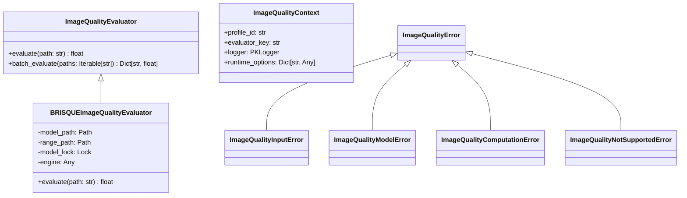
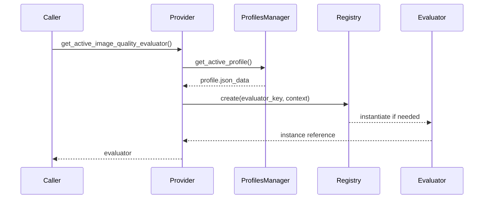

# Image Quality Evaluation Architecture

## Summary

This document defines the architecture for a pluggable image quality evaluation subsystem residing under [`src/pk_py_lib/core/image/quality`](src/pk_py_lib/core/image/quality/__init__.py:1). The initial implementation ships with a BRISQUE-based evaluator leveraging OpenCV's bundled quality models. The design emphasizes modularity, reusable abstractions, strict error reporting, centralized logging, and seamless integration with the existing settings profile platform.

## Goals

- Provide a standard evaluator interface (`[class ImageQualityEvaluator](src/pk_py_lib/core/image/quality/base.py:1)`) that enforces a single method `evaluate(path: str) -> float`.
- Implement a production-ready BRISQUE evaluator (`[class BRISQUEImageQualityEvaluator](src/pk_py_lib/core/image/quality/brisque.py:1)`) built on `cv2.quality.QualityBRISQUE`.
- Expose a registry/factory (`[class ImageQualityEvaluatorRegistry](src/pk_py_lib/core/image/quality/registry.py:1)`) and provider utilities that resolve the active evaluator using settings profiles.
- Extend `[SETTINGS_PROFILE_SCHEMA](src/pk_py_lib/core/settings_schema.py:28)` to support the key `image_quality_evaluator` with default `'brisque'`, including normalization and validation.
- Surface errors via a clear taxonomy rooted in `[class ImageQualityError](src/pk_py_lib/core/image/quality/exceptions.py:1)` while also logging diagnostic detail through `[get_logger](src/pk_py_lib/core/logging/logger.py:388)`.
- Maintain extensibility for future evaluators (e.g., Laplacian variance, SSIM, ML models) without breaking the base contract. All evaluators normalize scores to a higher-better convention (e.g., 0-100 where 100 is perfect quality).

## Non-Goals

- Implement evaluator-specific persistence or caching (future work).
- Deliver execution code beyond design scope; this document outlines architecture and implementation plan only.
- Replace existing similarity or duplicate detection logic; integration points remain orthogonal.

## Architectural Overview

### Module Layout (new and updated files)

| Path | Responsibility |
| --- | --- |
| [`src/pk_py_lib/core/image/quality/__init__.py`](src/pk_py_lib/core/image/quality/__init__.py:1) | Export convenience APIs (`get_active_evaluator`, registry helpers). |
| [`src/pk_py_lib/core/image/quality/base.py`](src/pk_py_lib/core/image/quality/base.py:1) | Define `[class ImageQualityEvaluator]` interface, `[class ImageQualityContext](src/pk_py_lib/core/image/quality/base.py:40)` dataclass, and base evaluation helpers. |
| [`src/pk_py_lib/core/image/quality/exceptions.py`](src/pk_py_lib/core/image/quality/exceptions.py:1) | Provide `[class ImageQualityError]` hierarchy (input, model, computation, unsupported). |
| [`src/pk_py_lib/core/image/quality/brisque.py`](src/pk_py_lib/core/image/quality/brisque.py:1) | Implement BRISQUE evaluator that loads OpenCV's default models and guards runtime errors. |
| [`src/pk_py_lib/core/image/quality/registry.py`](src/pk_py_lib/core/image/quality/registry.py:1) | Manage evaluator registration, construction, and lifecycle caching. |
| [`src/pk_py_lib/core/image/quality/provider.py`](src/pk_py_lib/core/image/quality/provider.py:1) | Bridge settings profiles to registry, exposing `get_active_image_quality_evaluator()`. |
| [`src/pk_py_lib/core/settings_schema.py`](src/pk_py_lib/core/settings_schema.py:28) | Add schema entry and normalization logic for `image_quality_evaluator`. |
| [`src/pk_py_lib/core/settings_profiles.py`](src/pk_py_lib/core/settings_profiles.py:292) | Extend profile JSON handling to recognize evaluator selection. |
| [`src/pk_py_lib/api/settings_profiles.py`](src/pk_py_lib/api/settings_profiles.py:69) | Surface the new option through API payloads (if applicable in downstream work). |

### Component Responsibilities

- `[class ImageQualityEvaluator](src/pk_py_lib/core/image/quality/base.py:1)`  
  - Abstract method `[def evaluate](src/pk_py_lib/core/image/quality/base.py:26)` validating arguments and returning `float`.
  - Optional `[def batch_evaluate](src/pk_py_lib/core/image/quality/base.py:55)` defaulting to iterative calls.

- `[class ImageQualityContext](src/pk_py_lib/core/image/quality/base.py:40)`  
  - Captures metadata (e.g., effective model paths, evaluation timestamp) to enrich logging and errors.

- `[class ImageQualityError](src/pk_py_lib/core/image/quality/exceptions.py:1)`  
  - Subclasses:
    - `[class ImageQualityInputError](src/pk_py_lib/core/image/quality/exceptions.py:20)` for missing/unreadable files.
    - `[class ImageQualityModelError](src/pk_py_lib/core/image/quality/exceptions.py:35)` for missing model assets.
    - `[class ImageQualityComputationError](src/pk_py_lib/core/image/quality/exceptions.py:50)` wrapping OpenCV failures.
    - `[class ImageQualityNotSupportedError](src/pk_py_lib/core/image/quality/exceptions.py:65)` for unknown evaluator keys.

- `[class BRISQUEImageQualityEvaluator](src/pk_py_lib/core/image/quality/brisque.py:1)`
  - Implements robust asset management to ensure the required BRISQUE SVM model (`brisque_model_live.yml`) and range file (`brisque_range_live.yml`) are present and valid.
  - Automatically downloads and repairs corrupted or missing assets from the official OpenCV repository if necessary.
  - If asset repair fails, it logs a critical error and falls back to using Laplacian variance (sharpness) for quality assessment.
  - Computes BRISQUE score via `cv2.quality.QualityBRISQUE_create` and `compute`.
  - Uses `[get_logger](src/pk_py_lib/core/logging/logger.py:388)` for traceability.

- `[class ImageQualityEvaluatorRegistry](src/pk_py_lib/core/image/quality/registry.py:1)`  
  - Maintains `Dict[str, Callable[[ImageQualityContext], ImageQualityEvaluator]]` for constructors.
  - Provides `[def register](src/pk_py_lib/core/image/quality/registry.py:40)` and `[def create](src/pk_py_lib/core/image/quality/registry.py:58)` APIs.
  - Supplies caching hooks to reuse singleton evaluators when appropriate.

- `[def get_active_image_quality_evaluator](src/pk_py_lib/core/image/quality/provider.py:25)`  
  - Reads active profile via `[SettingsProfilesManager.get_active_profile](src/pk_py_lib/core/settings_profiles.py:461)`.
  - Extracts `image_quality_evaluator` (default `'brisque'`) from normalized profile data.
  - Delegates to registry and handles errors with fallback logging.

### Mermaid Class Diagram



### Sequence: Active Evaluator Resolution



## Settings Integration

1. **Schema**  
   - Add property `image_quality_evaluator` to `[SETTINGS_PROFILE_SCHEMA](src/pk_py_lib/core/settings_schema.py:28)`:
     ```json
     "image_quality_evaluator": {
         "type": "string",
         "enum": ["brisque"],
         "default": "brisque"
     }
     ```
   - Extend `[normalize_settings](src/pk_py_lib/core/settings_schema.py:361)` to apply default `'brisque'`.
   - Update `[validate_settings_schema](src/pk_py_lib/core/settings_schema.py:260)` to ensure the field participates in validation.

2. **Profile Manager**  
   - Ensure `[SettingsProfilesManager.create_profile](src/pk_py_lib/core/settings_profiles.py:501)` and `[update_profile](src/pk_py_lib/core/settings_profiles.py:577)` persist the evaluator key inside `json_data`.
   - Update profile duplication/import/export flows to round-trip the new field.

3. **GUI / API Considerations**  
   - Expose new selector via future GUI work; design ensures JSON payload already includes the field.
   - Provide API docs update referencing `[docs/roo/img-app-api-specifications.md](docs/roo/img-app-api-specifications.md:1543)` in subsequent documentation tasks.

## GUI Integration

### Quality Column in Similarity Results Table

The image quality evaluator integrates with the Similarity Manager dialog in `img_app` by adding a "Quality" column to the results table. This column displays the computed quality score for each image when an evaluator (e.g., BRISQUE) is active; otherwise, it shows "-".

**Feature Description:**
- Located as the last column in similarity mode (after "Score").
- Right-aligned for numeric display.
- Group rows show "-" (no aggregate quality computed in PoC).
- Individual image rows compute scores on-the-fly using `get_active_image_quality_evaluator().evaluate(path)`.

**Computation Logic:**
- During table population (`_build_file_item` in [`FileGroupView`](src/pk_py_lib/gui/widgets.py:84)), fetch the active evaluator.
- If evaluator is None, set cell to "-".
- Else, try `evaluator.evaluate(image_path)`; format as "{score:.2f}".
- Catch exceptions (e.g., [`ImageQualityError`](src/pk_py_lib/core/image/quality/exceptions.py:1)), log warning, set to "-".
- On evaluator change (combo selection), call `_refresh_quality_scores()` in [`SimilarityManagerDialog`](img_app/img_app/widgets/similarity_manager.py:61) to iterate visible rows and recompute/update cells.

**Display and Error Handling:**
- Scores are normalized floats (higher better, e.g., 74.50 for BRISQUE).
- Errors/tooltips show path; selectable text per guidelines.
- Logging: INFO for successful scores, WARNING for failures with path and exception.
- Edge cases: Invalid paths during refresh → "-", no scan results → empty table, mid-scan changes → refresh disabled.

This integration keeps computation simple (no caching) for PoC, with full error reporting to console/logs.

## Error Handling Strategy

- `ImageQualityInputError`: raised when `path` does not exist, is unreadable, or fails OpenCV loading.
- `ImageQualityModelError`: raised when OpenCV model files are missing. The BRISQUE evaluator resolves paths using `cv2.samples.findFile` and validates result; failure yields this error.
- `ImageQualityComputationError`: wraps exceptions from `cv2.quality.QualityBRISQUE_compute`, capturing error codes and messages.
- `ImageQualityNotSupportedError`: raised by registry when key is unregistered.
- All exceptions include structured context (profile ID, evaluator key, filesystem metadata) and are logged using `[logger.error](src/pk_py_lib/core/logging/logger.py:232)` with `exception` payloads to ensure stack traces appear in terminal logs.

## Logging Integration

- Instantiate module-level logger via `[get_logger](src/pk_py_lib/core/logging/logger.py:388)` (namespace `pk_py_lib.core.image.quality`).
- Log at `DEBUG` for detailed steps (model loading, score computation) and `INFO` for high-level operations.
- On errors, call `logger.error(..., exception=exc)` ensuring `[configure_logging](src/pk_py_lib/core/logging/logger.py:415)` routes output to file/console.

## BRISQUE Evaluator Workflow

1. **Asset Management and Repair**
   - The evaluator uses internal utility functions (`_ensure_asset`) to check for the presence and integrity of `brisque_model_live.yml` and `brisque_range_live.yml` in the local `models/` directory.
   - If an asset is missing or appears corrupted (e.g., contains HTML content from a failed download, or is too small), the evaluator attempts to automatically download the official files from the OpenCV GitHub repository.
   - If the repair succeeds, an `INFO` message is logged. If the repair fails, a `RuntimeError` is raised, which is caught during initialization.

2. **Engine Initialization**
   - The `[class BRISQUEImageQualityEvaluator](src/pk_py_lib/core/image/quality/brisque.py:1)` constructor attempts to initialize `cv2.quality.QualityBRISQUE_create` using the validated local model paths.
   - If initialization fails (e.g., due to an OpenCV error like "Input file is invalid" even after repair), a detailed `ERROR` is logged with traceback, and the evaluator instance falls back to `None`, triggering Laplacian variance fallback during evaluation.

3. **Evaluation Steps**
   - Validate input path; raise `ImageQualityFileError` on failure.
   - Load image via `cv2.imread(path, cv2.IMREAD_COLOR)`.
   - If BRISQUE engine is active:
     - Compute score `score, *args = self.brisque.compute(image)`. The score is extracted as a float, handling potential tuple wrapping inconsistencies in OpenCV bindings.
     - Normalize score: `100.0 - raw_score`, clamped to [0.0, 100.0].
   - If BRISQUE engine is inactive (fallback):
     - Compute Laplacian variance on grayscale image.
     - Normalize variance empirically to a 0-100 scale.
   - Return normalized score (higher = better quality).

4. **Error Handling**
   - All initialization failures are logged as `ERROR` with full traceback.
   - Computation failures (e.g., during `compute`) are logged as `WARNING` and trigger the Laplacian fallback.

## Code Skeletons

### [`src/pk_py_lib/core/image/quality/base.py`](src/pk_py_lib/core/image/quality/base.py:1)

```python
from __future__ import annotations

from abc import ABC, abstractmethod
from dataclasses import dataclass, field
from pathlib import Path
from typing import Dict, Iterable, Optional

from pk_py_lib.core.logging.logger import get_logger

logger = get_logger(__name__)


@dataclass(frozen=True)
class ImageQualityContext:
    """Holds context for evaluation (profile id, evaluator key, runtime options)."""
    profile_id: Optional[str] = None
    evaluator_key: str = "brisque"
    runtime_options: Dict[str, object] = field(default_factory=dict)


class ImageQualityEvaluator(ABC):
    """Abstract base interface for all image quality evaluators."""

    @abstractmethod
    def evaluate(self, path: str, *, context: Optional[ImageQualityContext] = None) -> float:
        """Compute quality score for a single image path."""

    def batch_evaluate(
        self,
        paths: Iterable[str],
        *,
        context: Optional[ImageQualityContext] = None,
    ) -> Dict[str, float]:
        """Default iterative batch implementation."""
        results: Dict[str, float] = {}
        for candidate in paths:
            results[str(Path(candidate))] = self.evaluate(candidate, context=context)
        return results
```

### [`src/pk_py_lib/core/image/quality/exceptions.py`](src/pk_py_lib/core/image/quality/exceptions.py:1)

```python
class ImageQualityError(Exception):
    """Base error for image quality evaluation."""


class ImageQualityInputError(ImageQualityError):
    """Raised when an image path is missing or unreadable."""


class ImageQualityModelError(ImageQualityError):
    """Raised when required BRISQUE model assets cannot be located or loaded."""


class ImageQualityComputationError(ImageQualityError):
    """Raised when the evaluator fails during computation."""


class ImageQualityNotSupportedError(ImageQualityError):
    """Raised when the requested evaluator key is not registered."""
```

### [`src/pk_py_lib/core/image/quality/brisque.py`](src/pk_py_lib/core/image/quality/brisque.py:1)

```python
from __future__ import annotations

import threading
from pathlib import Path
from typing import Optional

import cv2
import numpy as np

from .base import ImageQualityContext, ImageQualityEvaluator
from .exceptions import (
    ImageQualityComputationError,
    ImageQualityInputError,
    ImageQualityModelError,
)
from pk_py_lib.core.logging.logger import get_logger

logger = get_logger(__name__)


class BRISQUEImageQualityEvaluator(ImageQualityEvaluator):
    """BRISQUE-based quality evaluator using OpenCV's bundled models."""

    _MODEL_FILES = (
        "qualitymodels/BRISQUE_model_live.yml",
        "qualitymodels/BRISQUE_range_live.yml",
    )

    def __init__(self) -> None:
        self._model_lock = threading.RLock()
        self._model_path: Optional[Path] = None
        self._range_path: Optional[Path] = None

    def evaluate(self, path: str, *, context: Optional[ImageQualityContext] = None) -> float:
        candidate = Path(path)
        if not candidate.is_file():
            raise ImageQualityInputError(f"Image does not exist: {candidate}")

        image = cv2.imread(str(candidate), cv2.IMREAD_GRAYSCALE)
        if image is None or not image.size:
            raise ImageQualityInputError(f"Failed to load image: {candidate}")

        model_path, range_path = self._ensure_model_assets()
        try:
            score = cv2.quality.QualityBRISQUE_compute(image, str(model_path), str(range_path))
        except cv2.error as exc:
            raise ImageQualityComputationError(f"BRISQUE computation failed: {exc}") from exc

        logger.debug(
            "BRISQUE evaluated %s -> %.4f",
            candidate,
            float(score[0]),
        )
        return float(score[0])

    def _ensure_model_assets(self) -> tuple[Path, Path]:
        with self._model_lock:
            if self._model_path and self._range_path:
                return self._model_path, self._range_path

            model_path = cv2.samples.findFile(self._MODEL_FILES[0], required=False)
            range_path = cv2.samples.findFile(self._MODEL_FILES[1], required=False)
            if not model_path or not range_path:
                raise ImageQualityModelError(
                    "OpenCV BRISQUE model files not found. Verify opencv-contrib-python installation."
                )
            self._model_path = Path(model_path)
            self._range_path = Path(range_path)
            logger.info("Loaded BRISQUE model from %s", self._model_path)
            return self._model_path, self._range_path
```

### [`src/pk_py_lib/core/image/quality/registry.py`](src/pk_py_lib/core/image/quality/registry.py:1)

```python
from __future__ import annotations

from typing import Callable, Dict, Optional

from .base import ImageQualityContext, ImageQualityEvaluator
from .exceptions import ImageQualityNotSupportedError


class ImageQualityEvaluatorRegistry:
    """Registry for mapping evaluator keys to constructors."""

    def __init__(self) -> None:
        self._registry: Dict[str, Callable[[ImageQualityContext], ImageQualityEvaluator]] = {}
        self._singleton_cache: Dict[str, ImageQualityEvaluator] = {}

    def register(
        self,
        key: str,
        factory: Callable[[ImageQualityContext], ImageQualityEvaluator],
        *,
        singleton: bool = True,
    ) -> None:
        self._registry[key] = factory
        if not singleton and key in self._singleton_cache:
            self._singleton_cache.pop(key)

    def create(self, key: str, context: ImageQualityContext) -> ImageQualityEvaluator:
        factory = self._registry.get(key)
        if factory is None:
            raise ImageQualityNotSupportedError(f"Unsupported evaluator key: {key}")
        if key in self._singleton_cache:
            return self._singleton_cache[key]
        instance = factory(context)
        self._singleton_cache[key] = instance
        return instance
```

### [`src/pk_py_lib/core/image/quality/provider.py`](src/pk_py_lib/core/image/quality/provider.py:1)

```python
from __future__ import annotations

from typing import Optional

from pk_py_lib.core.settings_profiles import SettingsProfilesManager
from pk_py_lib.core.database import DatabaseManager

from .base import ImageQualityContext, ImageQualityEvaluator
from .registry import ImageQualityEvaluatorRegistry


_registry = ImageQualityEvaluatorRegistry()


def get_registry() -> ImageQualityEvaluatorRegistry:
    return _registry


def get_active_image_quality_evaluator(
    *,
    db_manager: Optional[DatabaseManager] = None,
) -> ImageQualityEvaluator:
    manager = SettingsProfilesManager(db_manager or DatabaseManager())
    profile = manager.get_active_profile()
    profile_data = profile.json_data or {}
    evaluator_key = profile_data.get("image_quality_evaluator", "brisque")

    context = ImageQualityContext(profile_id=profile.id, evaluator_key=evaluator_key)
    return _registry.create(evaluator_key, context)
```

## Usage Example

```python
from pk_py_lib.core.image.quality import get_active_image_quality_evaluator

evaluator = get_active_image_quality_evaluator()
score = evaluator.evaluate("C:/photos/example.jpg")
print(f"BRISQUE score: {score:.2f}")
```

## Normalization Convention

To ensure consistency across the pluggable system, all evaluators normalize their scores such that higher float values indicate higher image quality, typically on a 0-100 scale where 100 represents perfect quality. This addresses variations in native scales (e.g., BRISQUE's lower-better 0-100).

### Implementation in Subclasses

- **Base Interface**: The `[class ImageQualityEvaluator](src/pk_py_lib/core/image/quality/base.py:1)` docstring mandates normalization in the `evaluate` method. Subclasses must transform native scores accordingly.

- **BRISQUE Example**: Native BRISQUE scores are lower-better (0: pristine, 100: distorted). The `[class BRISQUEImageQualityEvaluator](src/pk_py_lib/core/image/quality/brisque.py:1)` inverts this via `normalized_score = 100.0 - raw_score`, clamping to [0.0, 100.0] for edge cases (e.g., raw >100 or <0). Both raw and normalized values are logged for debugging.

- **Future Evaluators**:
  - For higher-better natives (e.g., some sharpness metrics), pass through or scale to 0-100.
  - For lower-better (e.g., NIQE), invert similarly.
  - Document the transformation in the subclass docstring and log intermediate values.

This convention simplifies downstream usage (e.g., sorting images by quality) and supports extensibility without changing consumer code.

## Usage Example

```python
from pk_py_lib.core.image.quality import get_active_image_quality_evaluator

evaluator = get_active_image_quality_evaluator()
score = evaluator.evaluate("C:/photos/example.jpg")
print(f"Normalized quality score: {score:.2f}")  # e.g., 74.7 (higher is better)
```

- Higher normalized scores indicate better perceived quality; no inversion needed by consumers.

## Implementation Plan

1. Scaffold new modules (`base.py`, `exceptions.py`, `brisque.py`, `registry.py`, `provider.py`, updated `__init__.py`).
2. Register BRISQUE evaluator during module import (`get_registry().register("brisque", ...)`).
3. Update settings schema normalization and validation with defaults and allowed values.
4. Ensure settings manager and API surfaces persist and round-trip the evaluator selection.
5. Produce documentation updates (this document plus cross-links in architecture plan).
6. Add unit tests covering:
   - Successful BRISQUE evaluation (with sample image).
   - Missing file → `ImageQualityInputError`.
   - Missing model → `ImageQualityModelError` (via monkeypatch).
   - Registry unsupported key → `ImageQualityNotSupportedError`.
   - Provider resolution using active profile stub.

## Testing Strategy

- Unit tests under `tests/core/image/test_quality_brisque.py` mocking OpenCV where necessary.
- Integration test verifying provider reads evaluator key from sample profile.
- Add regression tests to `[tests/test_settings_schema.py](tests/test_settings_schema.py:137)` ensuring schema defaults include `image_quality_evaluator`.
- Smoke test hooking evaluator into CLI or GUI entry points (manual run) to confirm settings-driven selection.

## Observability and Logging

- Log model loading events at `INFO` with absolute paths.
- Log each evaluation at `DEBUG`, including file size and resulting score.
- Errors log with stack traces to satisfy requirements from `[docs/roo/img-app-error-handling-edge-cases.md](docs/roo/img-app-error-handling-edge-cases.md:14)`.

## Extensibility Notes

- Future evaluators (e.g., Laplacian, SSIM) simply implement `[class ImageQualityEvaluator]` and register under new keys; schema update extends enum list.
- Introduce runtime options via `ImageQualityContext.runtime_options` enabling per-profile configuration (e.g., Laplacian window size).
- Consider caching evaluation results leveraging `[CacheManager](src/pk_py_lib/core/cache.py:1)` in later milestones.

## Open Questions

- Do we require per-profile overrides for BRISQUE model paths? (Currently defaulting to OpenCV bundled assets.)
- Should GUI expose a slider threshold tied to evaluator output? Future work.
