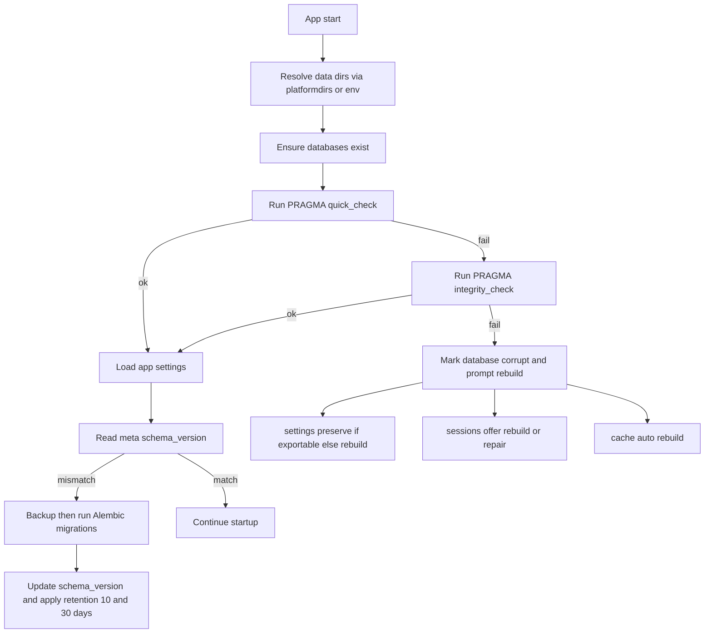
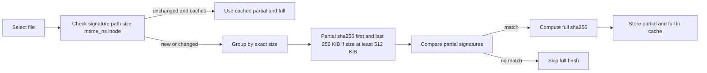
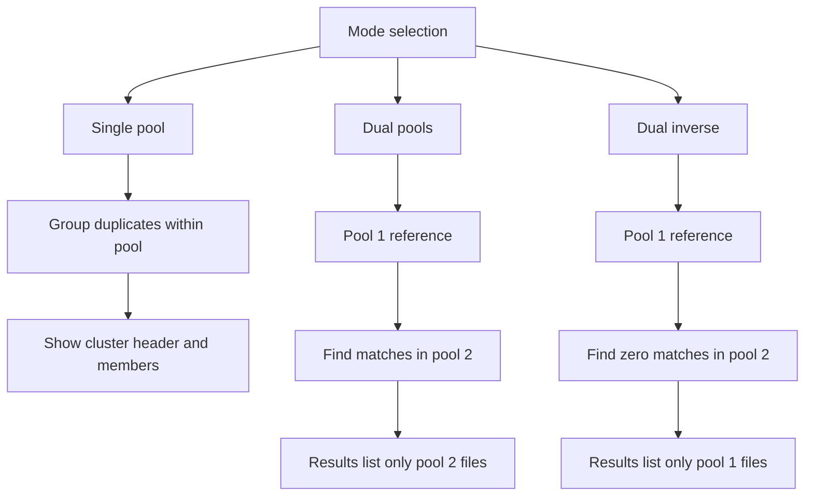

# KDC Image Organizer - Implementation Guide

## 1. Overview

This guide provides step-by-step instructions for implementing the KDC Image Organizer application using the specifications defined in the accompanying documents. The implementation leverages the pk-py-lib component library and follows a phased development approach.
### 1.1 Canonical integration updates

This guide is aligned with the canonical decisions. Implementation must follow these cross‑cutting policies:

- Data locations
  - Use platformdirs with Vendor Pk and App Img App
  - Environment override PK_IMG_APP_HOME to relocate base of data and cache trees
  - Databases
    - settings.db and sessions.db in user_data_dir
    - cache.db in user_cache_dir
  - Directory structure
    - data back up folder at data/backups
    - cache thumbnails at cache/thumbnails

- Startup database validation and migration
  - For each of settings.db, sessions.db, cache.db
    - If missing, create with initial schema and meta schema_version
    - Run PRAGMA quick_check
    - If quick_check fails, run PRAGMA integrity_check
    - If integrity_check fails
      - settings.db prompt to preserve settings if exportable then rebuild
      - sessions.db offer rebuild or attempt repair
      - cache.db safe to rebuild automatically
    - If schema version mismatch
      - Make timestamped backup in backups
      - Run Alembic migrations
      - Update meta schema_version
  - Backup retention policy
    - Keep 10 most recent backups per database
    - Purge backups older than 30 days

- Identical file hashing strategy
  - Algorithm sha256
  - Staged prefilters for performance
    - Stage size filter group by exact file size
    - Stage partial hash for files at least 512 KiB
      - Hash first 256 KiB and last 256 KiB
    - Stage full hash
      - Compute full sha256 only for candidates with matching partial signature
  - Cache strategy
    - Store both partial and full hashes in cache.db
    - Invalidate when signature changes absolute_path file_size mtime_ns or inode where available

- Results semantics
  - Single pool
    - Group duplicate sets within the pool
    - UI shows cluster header and all member files
  - Dual pools default
    - Pool 1 reference
    - Results show only pool 2 files that match pool 1
  - Dual pools inverse
    - Show only pool 1 files that have zero matches in pool 2

- Settings profiles model
  - id name description created_at updated_at profile_version
  - pool_mode single or dual
  - inverse_mode applies only to dual
  - Per pool paths include_dirs exclude_dirs include_globs exclude_globs
  - Hash options hash_algo sha256 staged_hashing true partial_hash_size_kb 256
  - Cache invalidation keys absolute_path file_size mtime_ns inode

- Settings GUI behaviors
  - CRUD create select edit delete copy clone
  - Set as default
  - Validate paths on save
  - Preview effective include exclude
  - Test hash settings on a small sample

References
- Canonical decisions see [canonical-decisions.md](docs/roo/canonical-decisions.md)
- Specification see [img-app-specification.md](docs/roo/img-app-specification.md)
- Data model see [img-app-data-model.md](docs/roo/img-app-data-model.md)
- Technical architecture see [img-app-technical-architecture.md](docs/roo/img-app-technical-architecture.md)

### 1.2 Key workflow diagrams

#### 1.2.1 Startup validation and migration



Legend
- Retention 10 and 30 days means keep 10 most recent backups and purge older than 30 days

#### 1.2.2 Staged hashing pipeline for identical files



#### 1.2.3 Results semantics by mode



Implementation checklist alignment
- Ensure DataLocations uses platformdirs with vendor Pk and app Img App and supports PK_IMG_APP_HOME
- Ensure DatabaseManager performs quick_check integrity_check and meta schema_version checks then runs Alembic with pre migration backup and retention
- Ensure CacheManager provides staged sha256 hashing with partial first and last 256 KiB and invalidation on path size mtime_ns inode
- Ensure Results panel follows single dual and inverse display rules
- Ensure Settings GUI provides full profile CRUD defaults path validation preview and test hashing

## 2. Development Environment Setup

### 2.1 Prerequisites
```bash
# Required software
- Python 3.13+
- PDM package manager
- Git
- Visual Studio Code (recommended)
- Qt Designer (optional, for UI design)

# System requirements
- Windows 10/11, macOS 10.15+, or Linux (Ubuntu 20.04+)
- 8GB RAM minimum (16GB recommended)
- 10GB free disk space
```

### 2.2 Project Initialization
```bash
# Clone repository
git clone <repository-url>
cd pk-py-lib

# Create virtual environment
pdm venv create

# Install dependencies
pdm install

# Verify installation
pdm run python -c "import PySide6; print(PySide6.__version__)"
```

### 2.3 Directory Structure Setup
```bash
# Create img_app directory structure
mkdir -p img_app/img_app/{core,gui,processing,data,utils,config}
mkdir -p img_app/img_app/gui/{widgets,panels,dialogs,models}
mkdir -p img_app/img_app/core/{algorithms,operations,managers}
mkdir -p img_app/tests/{unit,integration,fixtures}
mkdir -p img_app/assets/{icons,images,themes}
mkdir -p img_app/docs
```

## 3. Phase 1: Foundation (Week 1)

### 3.1 Core Application Structure

#### Step 1: Create Application Entry Point
```python
# img_app/img_app/__main__.py
"""Application entry point."""

import sys
from img_app.app import main

if __name__ == "__main__":
    sys.exit(main())
```

#### Step 2: Implement Main Application Class
```python
# img_app/img_app/app.py
"""Main application module."""

import sys
from PySide6.QtWidgets import QApplication
from PySide6.QtCore import Qt
from img_app.core.managers import ApplicationManager
from img_app.gui.main_window import MainWindow

def main():
    """Main application entry point."""
    # Enable high DPI support
    QApplication.setHighDpiScaleFactorRoundingPolicy(
        Qt.HighDpiScaleFactorRoundingPolicy.PassThrough
    )
    
    # Create application
    app = QApplication(sys.argv)
    app.setApplicationName("KDC Image Organizer")
    app.setOrganizationName("KDC")
    
    # Initialize application manager
    app_manager = ApplicationManager()
    app_manager.initialize()
    
    # Create and show main window
    window = MainWindow(app_manager)
    window.show()
    
    # Run event loop
    return app.exec()
```

#### Step 3: Implement Application Manager
```python
# img_app/img_app/core/managers.py
"""Core application management."""

from pathlib import Path
from pk_py_lib.core.logging import AdvancedLogger
from img_app.config.settings import ConfigurationManager
from img_app.data.database import DatabaseManager
from img_app.data.cache import CacheManager

class ApplicationManager:
    """Central application controller."""
    
    def __init__(self):
        self.logger = AdvancedLogger("img_app")
        self.config_manager = None
        self.database_manager = None
        self.cache_manager = None
        
    def initialize(self):
        """Initialize application components."""
        self.logger.info("Initializing application")
        
        # Initialize configuration
        self.config_manager = ConfigurationManager()
        self.config_manager.load_default_profile()
        
        # Initialize database
        self.database_manager = DatabaseManager()
        self.database_manager.initialize()
        
        # Initialize cache
        cache_dir = self.config_manager.get_cache_directory()
        self.cache_manager = CacheManager(cache_dir)
        
        self.logger.info("Application initialized successfully")
```

### 3.2 Basic GUI Implementation

#### Step 4: Create Main Window
```python
# img_app/img_app/gui/main_window.py
"""Main application window."""

from PySide6.QtWidgets import (
    QMainWindow, QMenuBar, QToolBar, 
    QStatusBar, QDockWidget, QWidget
)
from PySide6.QtCore import Qt
from img_app.gui.panels import FilePanel, ResultsPanel, PreviewPanel

class MainWindow(QMainWindow):
    """Main application window."""
    
    def __init__(self, app_manager):
        super().__init__()
        self.app_manager = app_manager
        self.setup_ui()
        
    def setup_ui(self):
        """Initialize UI components."""
        self.setWindowTitle("KDC Image Organizer")
        self.setMinimumSize(1024, 768)
        
        # Create menu bar
        self.create_menus()
        
        # Create toolbar
        self.create_toolbar()
        
        # Create central widget
        self.create_central_widget()
        
        # Create dockable panels
        self.create_panels()
        
        # Create status bar
        self.create_status_bar()
        
    def create_menus(self):
        """Create application menus."""
        menubar = self.menuBar()
        
        # File menu
        file_menu = menubar.addMenu("&File")
        file_menu.addAction("&New Scan", self.new_scan)
        file_menu.addAction("&Open Results", self.open_results)
        file_menu.addSeparator()
        file_menu.addAction("E&xit", self.close)
        
    def create_panels(self):
        """Create dockable panels."""
        # File panel
        self.file_dock = QDockWidget("Files", self)
        self.file_panel = FilePanel(self.app_manager)
        self.file_dock.setWidget(self.file_panel)
        self.addDockWidget(Qt.LeftDockWidgetArea, self.file_dock)
```

### 3.3 Data Layer Setup

#### Step 5: Implement Database Manager
```python
# img_app/img_app/data/database.py
"""Database management."""

import sqlite3
from pathlib import Path
from contextlib import contextmanager

class DatabaseManager:
    """Manages database connections and operations."""
    
    def __init__(self):
        self.settings_db_path = None
        self.cache_db_path = None
        
    def initialize(self):
        """Initialize databases."""
        # Get database paths from config
        data_dir = Path.home() / ".kdc_image_organizer"
        data_dir.mkdir(exist_ok=True)
        
        self.settings_db_path = data_dir / "settings.db"
        self.cache_db_path = data_dir / "cache.db"
        
        # Create databases if needed
        self.create_databases()
        
    def create_databases(self):
        """Create database schemas."""
        # Create settings database
        with self.get_connection(self.settings_db_path) as conn:
            conn.executescript(SETTINGS_SCHEMA)
            
        # Create cache database
        with self.get_connection(self.cache_db_path) as conn:
            conn.executescript(CACHE_SCHEMA)
            
    @contextmanager
    def get_connection(self, db_path):
        """Get database connection context."""
        conn = sqlite3.connect(db_path)
        conn.row_factory = sqlite3.Row
        try:
            yield conn
            conn.commit()
        except Exception:
            conn.rollback()
            raise
        finally:
            conn.close()
```

## 4. Phase 2: Core Features (Week 2)

### 4.1 File Selection Implementation

#### Step 6: Implement File Selection Panel
```python
# img_app/img_app/gui/panels/file_panel.py
"""File selection panel."""

from PySide6.QtWidgets import QWidget, QVBoxLayout, QTreeView, QPushButton
from pk_py_lib.gui.file_selector import FileSelector

class FilePanel(QWidget):
    """File and folder selection panel."""
    
    def __init__(self, app_manager):
        super().__init__()
        self.app_manager = app_manager
        self.setup_ui()
        
    def setup_ui(self):
        layout = QVBoxLayout()
        
        # Use pk-py-lib file selector
        self.file_selector = FileSelector(
            mode='multi',
            filters=['*.jpg', '*.png', '*.heic']
        )
        layout.addWidget(self.file_selector)
        
        # Add control buttons
        self.add_files_btn = QPushButton("Add Files")
        self.add_folder_btn = QPushButton("Add Folder")
        self.clear_btn = QPushButton("Clear All")
        
        layout.addWidget(self.add_files_btn)
        layout.addWidget(self.add_folder_btn)
        layout.addWidget(self.clear_btn)
        
        self.setLayout(layout)
```

### 4.2 Similarity Algorithm Implementation

#### Step 7: Implement Base Algorithm Interface
```python
# img_app/img_app/core/algorithms/base.py
"""Base algorithm interface."""

from abc import ABC, abstractmethod
from typing import Any
from PIL import Image

class BaseAlgorithm(ABC):
    """Abstract base class for similarity algorithms."""
    
    @property
    @abstractmethod
    def name(self) -> str:
        """Algorithm name."""
        pass
        
    @abstractmethod
    def compute_hash(self, image: Image) -> Any:
        """Compute image hash/signature."""
        pass
        
    @abstractmethod
    def compare(self, hash1: Any, hash2: Any) -> float:
        """Compare hashes, return similarity 0.0-1.0."""
        pass
```

#### Step 8: Implement pHash Algorithm
```python
# img_app/img_app/core/algorithms/phash.py
"""Perceptual hash algorithm."""

import imagehash
from PIL import Image
from img_app.core.algorithms.base import BaseAlgorithm

class PerceptualHashAlgorithm(BaseAlgorithm):
    """pHash implementation."""
    
    @property
    def name(self) -> str:
        return "phash"
        
    def __init__(self, hash_size: int = 8):
        self.hash_size = hash_size
        
    def compute_hash(self, image: Image) -> imagehash.ImageHash:
        """Compute perceptual hash."""
        return imagehash.phash(image, hash_size=self.hash_size)
        
    def compare(self, hash1: imagehash.ImageHash, 
                hash2: imagehash.ImageHash) -> float:
        """Compare perceptual hashes."""
        distance = hash1 - hash2
        max_distance = self.hash_size * self.hash_size
        similarity = 1.0 - (distance / max_distance)
        return max(0.0, min(1.0, similarity))
```

### 4.3 Processing Engine

#### Step 9: Implement Similarity Engine
```python
# img_app/img_app/processing/similarity.py
"""Similarity detection engine."""

from concurrent.futures import ThreadPoolExecutor
from typing import List, Dict, Optional
from pathlib import Path
from PIL import Image

class SimilarityEngine:
    """Orchestrates similarity detection."""
    
    def __init__(self, app_manager):
        self.app_manager = app_manager
        self.algorithms = {}
        self.thread_pool = None
        
    def register_algorithm(self, algorithm):
        """Register similarity algorithm."""
        self.algorithms[algorithm.name] = algorithm
        
    def find_similar_images(
        self,
        images: List[Path],
        threshold: float = 0.85,
        algorithm_names: List[str] = None
    ) -> List[SimilarityGroup]:
        """Find similar images in collection."""
        
        # Initialize thread pool
        max_threads = self.app_manager.config_manager.get_setting(
            "app_settings.max_threads",
            default=4,
            scope="app"
        )
        self.thread_pool = ThreadPoolExecutor(max_workers=max_threads)
        
        try:
            # Load and hash images
            hashes = self._compute_hashes(images, algorithm_names)
            
            # Compare images
            groups = self._find_groups(hashes, threshold)
            
            return groups
            
        finally:
            self.thread_pool.shutdown()
```

## 5. Phase 3: Results Display (Week 3)

### 5.1 Results Panel Implementation

#### Step 10: Create Results Display
```python
# img_app/img_app/gui/panels/results_panel.py
"""Results display panel."""

from PySide6.QtWidgets import (
    QWidget, QVBoxLayout, QTreeWidget, 
    QTreeWidgetItem, QHeaderView
)
from PySide6.QtCore import Qt

class ResultsPanel(QWidget):
    """Display similarity detection results."""
    
    def __init__(self, app_manager):
        super().__init__()
        self.app_manager = app_manager
        self.setup_ui()
        
    def setup_ui(self):
        layout = QVBoxLayout()
        
        # Create results tree
        self.results_tree = QTreeWidget()
        self.results_tree.setHeaderLabels([
            "Group/File", "Size", "Dimensions", 
            "Similarity", "Actions"
        ])
        
        # Configure tree
        header = self.results_tree.header()
        header.setStretchLastSection(False)
        header.setSectionResizeMode(0, QHeaderView.Stretch)
        
        layout.addWidget(self.results_tree)
        self.setLayout(layout)
        
    def display_results(self, groups):
        """Display similarity groups."""
        self.results_tree.clear()
        
        for group_idx, group in enumerate(groups):
            # Create group header
            group_item = QTreeWidgetItem([
                f"Group {group_idx + 1} ({len(group.members)} images)",
                f"{group.total_size_readable}",
                "",
                f"{group.avg_similarity:.0%}",
                ""
            ])
            
            # Add member images
            for member in group.members:
                member_item = QTreeWidgetItem([
                    member.file_name,
                    member.file_size_readable,
                    f"{member.width}×{member.height}",
                    f"{member.similarity_score:.0%}",
                    ""
                ])
                group_item.addChild(member_item)
                
            self.results_tree.addTopLevelItem(group_item)
            group_item.setExpanded(True)
```

### 5.2 Preview Panel

#### Step 11: Implement Image Preview
```python
# img_app/img_app/gui/panels/preview_panel.py
"""Image preview panel."""

from PySide6.QtWidgets import QWidget, QVBoxLayout, QLabel
from PySide6.QtCore import Qt
from PySide6.QtGui import QPixmap
from pk_py_lib.gui.widgets import ImageViewer

class PreviewPanel(QWidget):
    """Image preview and comparison panel."""
    
    def __init__(self, app_manager):
        super().__init__()
        self.app_manager = app_manager
        self.setup_ui()
        
    def setup_ui(self):
        layout = QVBoxLayout()
        
        # Use pk-py-lib image viewer
        self.image_viewer = ImageViewer()
        layout.addWidget(self.image_viewer)
        
        # Add info label
        self.info_label = QLabel("No image selected")
        self.info_label.setAlignment(Qt.AlignCenter)
        layout.addWidget(self.info_label)
        
        self.setLayout(layout)
        
    def display_image(self, image_path):
        """Display single image."""
        self.image_viewer.load_image(image_path)
        
    def compare_images(self, paths):
        """Display images for comparison."""
        self.image_viewer.set_comparison_mode(paths)
```

## 6. Phase 4: File Operations (Week 4)

### 6.1 Delete Operations

#### Step 12: Implement Safe Deletion
```python
# img_app/img_app/core/operations/file_ops.py
"""File operations with safety checks."""

from pathlib import Path
from typing import List
import send2trash
from img_app.core.operations.undo import UndoManager

class FileOperations:
    """Handles file system operations."""
    
    def __init__(self, app_manager):
        self.app_manager = app_manager
        self.undo_manager = UndoManager()
        
    def delete_files(
        self, 
        files: List[Path],
        use_trash: bool = True,
        create_backup: bool = False
    ) -> bool:
        """Delete files with safety options."""
        
        # Log operation
        self.app_manager.logger.info(
            f"Deleting {len(files)} files",
            use_trash=use_trash
        )
        
        deleted = []
        errors = []
        
        for file_path in files:
            try:
                if create_backup:
                    self._create_backup(file_path)
                    
                if use_trash:
                    send2trash.send2trash(str(file_path))
                else:
                    file_path.unlink()
                    
                deleted.append(file_path)
                
            except Exception as e:
                errors.append((file_path, str(e)))
                
        # Record for undo
        self.undo_manager.record_operation(
            "delete", 
            {"files": deleted, "use_trash": use_trash}
        )
        
        return len(errors) == 0
```

### 6.2 Undo System

#### Step 13: Implement Undo Manager
```python
# img_app/img_app/core/operations/undo.py
"""Undo/redo system."""

from collections import deque
from typing import Any, Dict

class UndoManager:
    """Manages undo/redo operations."""
    
    def __init__(self, max_history: int = 50):
        self.undo_stack = deque(maxlen=max_history)
        self.redo_stack = deque(maxlen=max_history)
        
    def record_operation(self, operation_type: str, data: Dict[str, Any]):
        """Record operation for undo."""
        operation = {
            "type": operation_type,
            "data": data,
            "timestamp": datetime.now()
        }
        self.undo_stack.append(operation)
        self.redo_stack.clear()  # Clear redo on new operation
        
    def undo(self) -> Optional[Dict]:
        """Undo last operation."""
        if not self.undo_stack:
            return None
            
        operation = self.undo_stack.pop()
        self.redo_stack.append(operation)
        return operation
        
    def redo(self) -> Optional[Dict]:
        """Redo undone operation."""
        if not self.redo_stack:
            return None
            
        operation = self.redo_stack.pop()
        self.undo_stack.append(operation)
        return operation
```

## 7. Testing Implementation

### 7.1 Unit Tests

#### Step 14: Test Similarity Algorithms
```python
# img_app/tests/unit/test_algorithms.py
"""Algorithm unit tests."""

import pytest
from PIL import Image
from img_app.core.algorithms.phash import PerceptualHashAlgorithm

class TestPerceptualHash:
    """Test perceptual hash algorithm."""
    
    def test_identical_images(self):
        """Test identical images have similarity 1.0."""
        algo = PerceptualHashAlgorithm()
        image = Image.new('RGB', (100, 100), 'red')
        
        hash1 = algo.compute_hash(image)
        hash2 = algo.compute_hash(image)
        
        similarity = algo.compare(hash1, hash2)
        assert similarity == 1.0
        
    def test_different_images(self):
        """Test different images have low similarity."""
        algo = PerceptualHashAlgorithm()
        image1 = Image.new('RGB', (100, 100), 'red')
        image2 = Image.new('RGB', (100, 100), 'blue')
        
        hash1 = algo.compute_hash(image1)
        hash2 = algo.compute_hash(image2)
        
        similarity = algo.compare(hash1, hash2)
        assert similarity < 0.5
```

### 7.2 Integration Tests

#### Step 15: Test Complete Workflow
```python
# img_app/tests/integration/test_workflow.py
"""Integration tests for complete workflows."""

import pytest
from pathlib import Path
from img_app.core.managers import ApplicationManager
from img_app.processing.similarity import SimilarityEngine

class TestSimilarityWorkflow:
    """Test complete similarity detection workflow."""
    
    @pytest.fixture
    def app_manager(self):
        """Create application manager for testing."""
        manager = ApplicationManager()
        manager.initialize()
        return manager
        
    def test_find_duplicates(self, app_manager, tmp_path):
        """Test finding duplicate images."""
        # Create test images
        test_images = self.create_test_images(tmp_path)
        
        # Initialize engine
        engine = SimilarityEngine(app_manager)
        
        # Find similar images
        groups = engine.find_similar_images(
            test_images,
            threshold=0.90
        )
        
        # Verify results
        assert len(groups) > 0
        assert all(g.avg_similarity >= 0.90 for g in groups)
```

## 8. Configuration and Settings

### 8.1 Settings Management

#### Step 16: Implement Configuration Manager
```python
# img_app/img_app/config/settings.py
"""Application configuration management."""

from typing import Any, Optional
from pathlib import Path
import json

class ConfigurationManager:
    """Manages application configuration."""
    
    DEFAULT_SETTINGS = {
        "theme": "light",
        "language": "en",
        "ui_scale": 1.0,
        "app_settings.max_threads": 4,
        "app_settings.max_memory_mb": 2048,
        "app_settings.cache_size_mb": 5120,
        "algorithms.default": ["phash"],
        "algorithms.threshold": 0.85
    }
    
    def __init__(self):
        self.settings = {}
        self.profile_name = "default"
        
    def load_default_profile(self):
        """Load default settings profile."""
        self.settings = self.DEFAULT_SETTINGS.copy()
        
    def get_setting(self, key: str, default: Any = None) -> Any:
        """Get configuration value."""
        keys = key.split('.')
        value = self.settings
        
        for k in keys:
            if isinstance(value, dict) and k in value:
                value = value[k]
            else:
                return default
                
        return value
        
    def set_setting(self, key: str, value: Any):
        """Set configuration value."""
        keys = key.split('.')
        target = self.settings
        
        for k in keys[:-1]:
            if k not in target:
                target[k] = {}
            target = target[k]
            
        target[keys[-1]] = value
```

## 9. Performance Optimization

### 9.1 Memory Management

#### Step 17: Implement Memory Manager
```python
# img_app/img_app/utils/memory.py
"""Memory management utilities."""

import psutil
import gc
from typing import Optional

class MemoryManager:
    """Monitors and manages memory usage."""
    
    def __init__(self, limit_mb: int = 2048):
        self.limit_bytes = limit_mb * 1024 * 1024
        self.warning_threshold = 0.8
        
    def get_current_usage(self) -> int:
        """Get current memory usage in bytes."""
        process = psutil.Process()
        return process.memory_info().rss
        
    def check_memory(self) -> bool:
        """Check if memory usage is within limits."""
        current = self.get_current_usage()
        return current < self.limit_bytes
        
    def cleanup_if_needed(self):
        """Perform cleanup if memory usage is high."""
        usage_ratio = self.get_current_usage() / self.limit_bytes
        
        if usage_ratio > self.warning_threshold:
            gc.collect()
            return True
        return False
```

### 9.2 Caching Strategy

#### Step 18: Implement Cache Manager
```python
# img_app/img_app/data/cache.py
"""Cache management system."""

from pathlib import Path
from typing import Optional, Dict
import pickle
from datetime import datetime, timedelta

class CacheManager:
    """Manages application caching."""
    
    def __init__(self, cache_dir: Path, max_size_mb: int = 5120):
        self.cache_dir = cache_dir
        self.cache_dir.mkdir(exist_ok=True)
        self.max_size_bytes = int(max_size_mb * 1024 * 1024)
        
    def get_thumbnail(self, image_path: Path, size: int) -> Optional[bytes]:
        """Retrieve cached thumbnail."""
        cache_key = self._get_cache_key(image_path, f"thumb_{size}")
        cache_file = self.cache_dir / f"{cache_key}.cache"
        
        if cache_file.exists():
            # Check if still valid
            if self._is_cache_valid(cache_file, image_path):
                # Update last-access metadata
                try:
                    cache_file.utime(None)
                except Exception:
                    pass
                return cache_file.read_bytes()
                
        return None
        
    def cache_thumbnail(self, image_path: Path, size: int, data: bytes):
        """Store thumbnail in cache."""
        cache_key = self._get_cache_key(image_path, f"thumb_{size}")
        cache_file = self.cache_dir / f"{cache_key}.cache"
        
        cache_file.write_bytes(data)
        
        # Check cache size and cleanup if needed
        self._cleanup_if_needed()
```

## 10. Deployment

### 10.1 Build Configuration

#### Step 19: Create Build Script
```python
# build.py
"""Build script for creating executable."""

import PyInstaller.__main__
import shutil
from pathlib import Path

def build_app():
    """Build standalone executable."""
    
    # Clean previous builds
    for path in ['build', 'dist']:
        if Path(path).exists():
            shutil.rmtree(path)
    
    # Run PyInstaller
    PyInstaller.__main__.run([
        'img_app/__main__.py',
        '--name=KDC Image Organizer',
        '--windowed',
        '--icon=assets/icon.ico',
        '--add-data=assets;assets',
        '--hidden-import=PySide6',
        '--hidden-import=PIL',
        '--hidden-import=cv2',
        '--hidden-import=imagehash',
        '--onedir',
        '--clean'
    ])
    
    print("Build complete! Executable in dist/ directory")

if __name__ == "__main__":
    build_app()
```

### 10.2 Installation Script

#### Step 20: Create Installer
```python
# installer.py
"""Installation script."""

import os
import sys
import shutil
from pathlib import Path

def install():
    """Install application."""
    
    # Determine installation directory
    if sys.platform == "win32":
        install_dir = Path(os.environ["PROGRAMFILES"]) / "KDC Image Organizer"
    elif sys.platform == "darwin":
        install_dir = Path("/Applications/KDC Image Organizer.app")
    else:
        install_dir = Path.home() / ".local" / "share" / "kdc-image-organizer"
    
    # Copy files
    print(f"Installing to {install_dir}")
    install_dir.mkdir(parents=True, exist_ok=True)
    
    # Copy executable and resources
    shutil.copytree("dist/KDC Image Organizer", install_dir, dirs_exist_ok=True)
    
    # Create desktop shortcut
    create_desktop_shortcut(install_dir)
    
    print("Installation complete!")

def create_desktop_shortcut(install_dir):
    """Create desktop shortcut."""
    # Platform-specific shortcut creation
    pass

if __name__ == "__main__":
    install()
```

## 11. Development Workflow

### 11.1 Git Workflow
```bash
# Feature development
git checkout -b feature/similarity-detection
# Make changes
git add .
git commit -m "feat: Add similarity detection engine"
git push origin feature/similarity-detection
# Create pull request

# Bug fixes
git checkout -b fix/memory-leak
# Fix issue
git add .
git commit -m "fix: Resolve memory leak in thumbnail cache"
git push origin fix/memory-leak
```

### 11.2 Testing Workflow
```bash
# Run all tests
pdm run pytest

# Run specific test file
pdm run pytest tests/unit/test_algorithms.py

# Run with coverage
pdm run pytest --cov=img_app --cov-report=html

# Run integration tests only
pdm run pytest tests/integration/
```

### 11.3 Development Commands
```bash
# Run application in development
pdm run python -m img_app

# Format code
pdm run black img_app/

# Type checking
pdm run mypy img_app/

# Linting
pdm run ruff img_app/

# Build executable
pdm run python build.py
```

## 12. Troubleshooting Guide

### 12.1 Common Issues

#### Issue: Import errors with PySide6
```python
# Solution: Ensure PySide6 is properly installed
pdm add PySide6>=6.6.0
# Verify installation
python -c "from PySide6 import QtCore; print(QtCore.__version__)"
```

#### Issue: Memory errors with large image sets
```python
# Solution: Implement batch processing
def process_in_batches(images, batch_size=100):
    for i in range(0, len(images), batch_size):
        batch = images[i:i+batch_size]
        process_batch(batch)
        gc.collect()  # Force garbage collection
```

#### Issue: Database lock errors
```python
# Solution: Use proper connection management
with database.get_connection() as conn:
    # Perform operations
    pass  # Connection automatically closed
```

### 12.2 Performance Optimization Tips

1. **Use lazy loading** for large image collections
2. **Implement progressive loading** in UI
3. **Cache computed hashes** to avoid recomputation
4. **Use memory-mapped files** for very large images
5. **Implement batch database operations**

## 13. Next Steps

After completing the basic implementation:

1. **Add advanced features**:
   - EXIF-based organization
   - Batch processing operations
   - Advanced filtering and search

2. **Implement plugins**:
   - Create plugin API
   - Develop example plugins
   - Document plugin development

3. **Enhance UI**:
   - Add themes support
   - Implement drag-and-drop
   - Add keyboard shortcuts

4. **Optimize performance**:
   - Profile and optimize bottlenecks
   - Implement GPU acceleration
   - Add distributed processing

5. **Prepare for release**:
   - Complete documentation
   - Create user manual
   - Set up CI/CD pipeline
## 14. Integrating the Settings Manager at Startup

Status: Planned

Purpose
- Enforce that the application runs with a valid, explicitly selected Active settings profile before the main window is created.
- Provide a modal Settings/Profile Manager at startup to handle first-run (zero profiles), selection, CRUD+copy, validation, and Set Active/Default operations.

Scope and References
- App bootstrap: [img_app/img_app/app.py](img_app/img_app/app.py:60)
- Main window: [img_app/img_app/main_window.py](img_app/img_app/main_window.py:1)
- Library configuration and DB: [src/pk_py_lib/core/configuration.py](src/pk_py_lib/core/configuration.py:1), [src/pk_py_lib/core/database.py](src/pk_py_lib/core/database.py:1)
- Proposed APIs:
  - Library core profiles manager: [src/pk_py_lib/core/settings_profiles.py](src/pk_py_lib/core/settings_profiles.py:1)
  - Library API adapter: [src/pk_py_lib/api/settings_profiles.py](src/pk_py_lib/api/settings_profiles.py:1)
  - Reusable GUI dialog: [src/pk_py_lib/gui/settings/profile_manager.py](src/pk_py_lib/gui/settings/profile_manager.py:1)
  - App integration helper: [img_app/img_app/widgets/settings_manager.py](img_app/img_app/widgets/settings_manager.py:1)

14.1 Startup Gate: High-Level Sequence

- Initialize DatabaseManager and ConfigurationManager
- Launch Settings/Profile Manager modal
- Require a valid Active profile before continuing
- If canceled with no Active profile, exit application

```mermaid
flowchart TD
  A[App start] --> B[Init DatabaseManager]
  B --> C[Init ConfigurationManager]
  C --> D[Open Settings/Profile Manager modal]
  D --> E{Valid Active profile set}
  E -->|Yes| F[Close modal]
  E -->|No (Cancel)| X[Exit app]
  F --> G[Create MainWindow]
  G --> H[Show main UI]
```

14.2 Integration Steps (no code)

1) Initialize core components
- Create and initialize [DatabaseManager.initialize()](src/pk_py_lib/core/database.py:405) to ensure settings.db exists with canonical schema and meta table.
- Construct [ConfigurationManager](src/pk_py_lib/core/configuration.py:126) with the database manager instance.

2) Display the startup modal
- Invoke the reusable dialog from [src/pk_py_lib/gui/settings/profile_manager.py](src/pk_py_lib/gui/settings/profile_manager.py:1) as a blocking modal.
- The dialog is responsible for:
  - Listing profiles and showing an empty-state for zero profiles
  - Creating/copying/editing/deleting profiles with validation
  - Setting Active (updates meta.active_profile_id) and optionally Default (profiles.is_default)
  - Enforcing invariants: cannot delete Active or last remaining profile

3) Active profile contract
- The modal must ensure that, when it closes with acceptance, there is a valid Active profile:
  - meta.active_profile_id points to an existing profiles.id
  - [ConfigurationManager.switch_profile()](src/pk_py_lib/core/configuration.py:399) aligns the in-process active profile
- If canceled without any Active profile defined, terminate the application early per policy.

4) Proceed to main window creation
- After acceptance, read app-scoped settings (e.g., cache size) and other dependent configuration as needed, then instantiate [MainWindow](img_app/img_app/main_window.py:49).
- Attach managers (database, configuration, cache) to the window instance as currently done in [img_app/img_app/app.py](img_app/img_app/app.py:106).

14.3 App-Side Helper (recommended organization)

- Add a small integration helper in [img_app/img_app/widgets/settings_manager.py](img_app/img_app/widgets/settings_manager.py:1) to:
  - Accept DB/Config instances
  - Launch the modal dialog
  - Return a boolean indicating whether to continue (Active profile present) or exit
- Keep application bootstrap (main) thin and declarative.

14.4 Dependencies and Notes

- GUI framework: PySide6 (already in project)
- Database: SQLite via [DatabaseManager](src/pk_py_lib/core/database.py:1)
- Active vs Default semantics:
  - Active: controls current session; stored in meta.active_profile_id
  - Default: preferred for future sessions; only one profile has is_default=1
- Fallback strategy (rare):
  - If SQLite initialization fails catastrophically, core may choose to write a minimal JSON fallback (profiles.json) and proceed with warnings; see architecture notes in [docs/roo/img-app-technical-architecture.md](docs/roo/img-app-technical-architecture.md:1)

14.5 Validation, Errors, and UX

- Validation:
  - Name: required; 1–64; [A–Z a–z 0–9 space _ -]; unique (case-insensitive)
  - Thresholds: UI percent 0–100 maps to internal 0.0–1.0 (see thresholds helpers)
- Errors and edge cases:
  - Duplicate name, delete Active, delete last profile
  - Database locked, write failures, import/export errors
- See detailed catalog in [docs/roo/img-app-error-handling-edge-cases.md](docs/roo/img-app-error-handling-edge-cases.md:1)

14.6 Testing Guidance

- Unit tests (core and API):
  - CRUD invariants: create, unique naming, copy, set default exclusivity, delete constraints
  - Active profile persistence in meta.active_profile_id and ConfigurationManager alignment
- GUI tests (pytest-qt):
  - First-run flow: zero profiles → create → set active → continue
  - Existing Active: dialog shows; Continue proceeds without edits
  - Cancel without Active: application exits
- Integration tests:
  - Startup gate prevents main window creation without Active
  - Switching Active affects session configuration retrieval (e.g., hashing policy, cache size if profile-scoped later)

14.7 Rationale

- Modal-first startup ensures deterministic configuration and reduces runtime drift.
- Clear separation between Default and Active improves UX and aligns with session vs preference semantics.
- The reusable dialog emphasizes library-first design and reusability across apps.

Next Steps
- Implement the reusable dialog in [src/pk_py_lib/gui/settings/profile_manager.py](src/pk_py_lib/gui/settings/profile_manager.py:1) per the UI spec.
- Implement core profile manager [src/pk_py_lib/core/settings_profiles.py](src/pk_py_lib/core/settings_profiles.py:1) and API adapter [src/pk_py_lib/api/settings_profiles.py](src/pk_py_lib/api/settings_profiles.py:1).
- Add startup-gate helper in [img_app/img_app/widgets/settings_manager.py](img_app/img_app/widgets/settings_manager.py:1) and wire it in [img_app/img_app/app.py](img_app/img_app/app.py:60).
- Add pytest-qt tests for modal flows and invariants.
<!-- Settings Manager implementation updates -->

## 14A. Settings Manager — Library Files, App Integration, and Acceptance

Status: Approved

This section finalizes the concrete implementation plan for the reusable Settings/Profile Manager and its startup integration. It supersedes earlier references to `src/pk_py_lib/gui/settings/profile_manager.py`. The canonical module path is `src/pk_py_lib/gui/settings_manager/`.

14A.1 Library file structure (to implement under pk-py-lib)
- [src/pk_py_lib/gui/settings_manager/__init__.py](src/pk_py_lib/gui/settings_manager/__init__.py:1)
- [src/pk_py_lib/gui/settings_manager/dialog.py](src/pk_py_lib/gui/settings_manager/dialog.py:1)
  - ProfileManagerDialog (PySide6 QDialog)
  - Two-pane List/Detail layout, search/filter, inline validation, Apply/Continue/Cancel
- [src/pk_py_lib/gui/settings_manager/controller.py](src/pk_py_lib/gui/settings_manager/controller.py:1)
  - Orchestrates interactions with [SettingsProfilesAPI](src/pk_py_lib/api/settings_profiles.py:69)
  - Performs list/create/update/delete/copy/set_active/set_default/export/import through API
  - Maps ApiResponse errors (ErrorCodes) to user-facing messages
- [src/pk_py_lib/gui/settings_manager/models.py](src/pk_py_lib/gui/settings_manager/models.py:1)
  - View-models and adapters (ProfileVM, ValidationIssues, ListModel if needed)
- [src/pk_py_lib/gui/settings_manager/validators.py](src/pk_py_lib/gui/settings_manager/validators.py:1)
  - Name validation (delegates to [SettingsProfilesAPI.validate_name()](src/pk_py_lib/api/settings_profiles.py:295))
  - Optional helpers (threshold conversions using [threshold helpers](src/pk_py_lib/core/utils/thresholds.py:1)), path checks (non-blocking hooks)

Notes
- GUI code never touches the DB directly. All persistence flows through [SettingsProfilesAPI](src/pk_py_lib/api/settings_profiles.py:69), which delegates to the core [SettingsProfilesManager](src/pk_py_lib/core/settings_profiles.py:95).

14A.2 App-side integration helper (startup gate)
- Path: [img_app/img_app/widgets/settings_manager.py](img_app/img_app/widgets/settings_manager.py:1)
- Responsibilities:
  - Accept initialized DatabaseManager and ConfigurationManager
  - Instantiate API [SettingsProfilesAPI](src/pk_py_lib/api/settings_profiles.py:69)
  - Launch [ProfileManagerDialog](src/pk_py_lib/gui/settings_manager/dialog.py:1) as a blocking modal
  - On success:
    - Ensure `meta.active_profile_id` points to a real id (API guarantees via core)
    - Call [ConfigurationManager.switch_profile()](src/pk_py_lib/core/configuration.py:399) to align in-process state
    - Return True to proceed with main window creation
  - On cancel/no-active: return False → caller exits app per policy

14A.3 Startup wiring (app main)
- Entry: [img_app/img_app/app.py](img_app/img_app/app.py:60)
- Sequence:
  1) Initialize DB via [DatabaseManager.initialize()](src/pk_py_lib/core/database.py:415)
  2) Initialize ConfigurationManager [ConfigurationManager](src/pk_py_lib/core/configuration.py:96)
  3) Run startup gate helper [img_app/img_app/widgets/settings_manager.py](img_app/img_app/widgets/settings_manager.py:1)
  4) If gate returns False → exit; else create and show [MainWindow](img_app/img_app/main_window.py:49)

Mermaid (unchanged logic, updated references)
```mermaid
flowchart TD
  A[App start] --> B[Init DatabaseManager]
  B --> C[Init ConfigurationManager]
  C --> D[Open Settings/Profile Manager modal]
  D --> E{Valid Active profile set}
  E -->|Yes| F[Close modal]
  E -->|No (Cancel)| X[Exit app]
  F --> G[Create MainWindow]
  G --> H[Show main UI]
```

14A.4 Controller-level API calls and invariants
- List: [SettingsProfilesAPI.list_profiles()](src/pk_py_lib/api/settings_profiles.py:109) (compute is_active from meta.active_profile_id)
- Create: [SettingsProfilesAPI.create()](src/pk_py_lib/api/settings_profiles.py:172)
- Update: [SettingsProfilesAPI.update()](src/pk_py_lib/api/settings_profiles.py:191)
- Delete: [SettingsProfilesAPI.delete()](src/pk_py_lib/api/settings_profiles.py:214) — blocked for Active or last remaining (core invariant)
- Copy: [SettingsProfilesAPI.copy()](src/pk_py_lib/api/settings_profiles.py:230)
- Set Active: [SettingsProfilesAPI.set_active()](src/pk_py_lib/api/settings_profiles.py:260)
- Set Default: [SettingsProfilesAPI.set_default()](src/pk_py_lib/api/settings_profiles.py:276)
- Validate name: [SettingsProfilesAPI.validate_name()](src/pk_py_lib/api/settings_profiles.py:295)
- Export / Import: [SettingsProfilesAPI.export_profile()](src/pk_py_lib/api/settings_profiles.py:314), [SettingsProfilesAPI.import_profile()](src/pk_py_lib/api/settings_profiles.py:329)

14A.5 Error mappings and UX surfaces
- ValueError → INVALID_CONFIG (inline field errors, dialog banners)
- sqlite3.OperationalError("locked") → LOCKED_DB (Retry/Exit choice)
- PermissionError → PERMISSION_DENIED (keep dialog open; allow Export of edits)
- Else → UNKNOWN_ERROR
- Reference: [_map_exception](src/pk_py_lib/api/settings_profiles.py:48); detailed UX in [docs/roo/img-app-error-handling-edge-cases.md](docs/roo/img-app-error-handling-edge-cases.md:1)

14A.6 Acceptance criteria (implementation-level)
- Library components exist under `src/pk_py_lib/gui/settings_manager/` and can be imported independently by other apps
- Dialog behaviors match UI acceptance (see [docs/roo/img-app-ui-design.md](docs/roo/img-app-ui-design.md:1), section 13A)
- All CRUD+copy+set-active+set-default operations go through API and respect invariants (no direct SQL from GUI)
- Startup gate prevents main window creation unless a valid Active profile exists
- After acceptance, [ConfigurationManager.switch_profile()](src/pk_py_lib/core/configuration.py:399) invoked with the selected profile for session alignment
- Error cases mapped to ErrorCodes and surfaced appropriately; no partial writes on failures (transactions)

14A.7 Test guidance (pytest-qt + unit)
- Core/API unit tests:
  - Name validation, uniqueness collisions
  - Delete Active and delete-last blocked
  - Default exclusivity toggling
  - Active persistence in `meta.active_profile_id`
- GUI tests (pytest-qt):
  - First-run: zero profiles → create → set active → continue
  - Existing active: dialog shows; Continue immediately available
  - Delete constraints disabled/grayed appropriately
  - LOCKED_DB flow shows Retry/Exit
- Integration:
  - Startup gate blocks main window without Active
  - Switching Active affects retrieval via ConfigurationManager

Cross-references
- Architectural details and persistence: [img-app-technical-architecture.md §11A](docs/roo/img-app-technical-architecture.md:1)
- API contract and acceptance: [img-app-api-specifications.md §13A](docs/roo/img-app-api-specifications.md:1)
- Errors and concurrency: [img-app-error-handling-edge-cases.md §13A](docs/roo/img-app-error-handling-edge-cases.md:1)
- Canonical decisions: [canonical-decisions.md §17A](docs/roo/canonical-decisions.md:1)