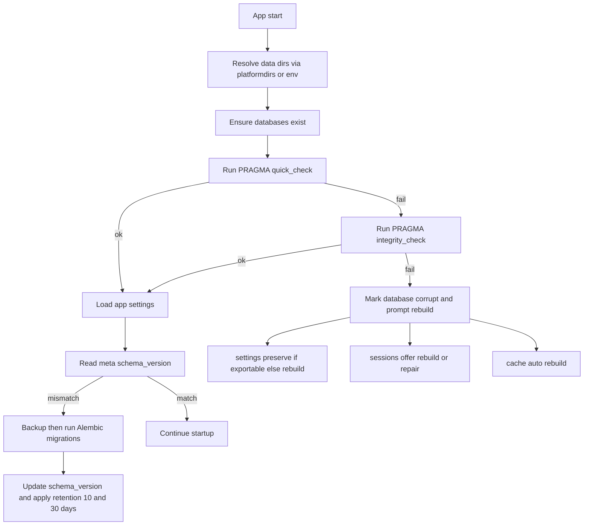
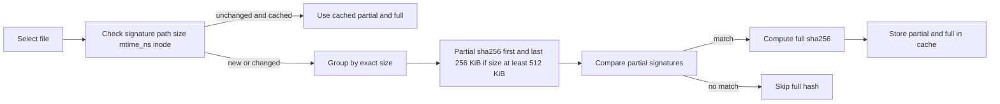
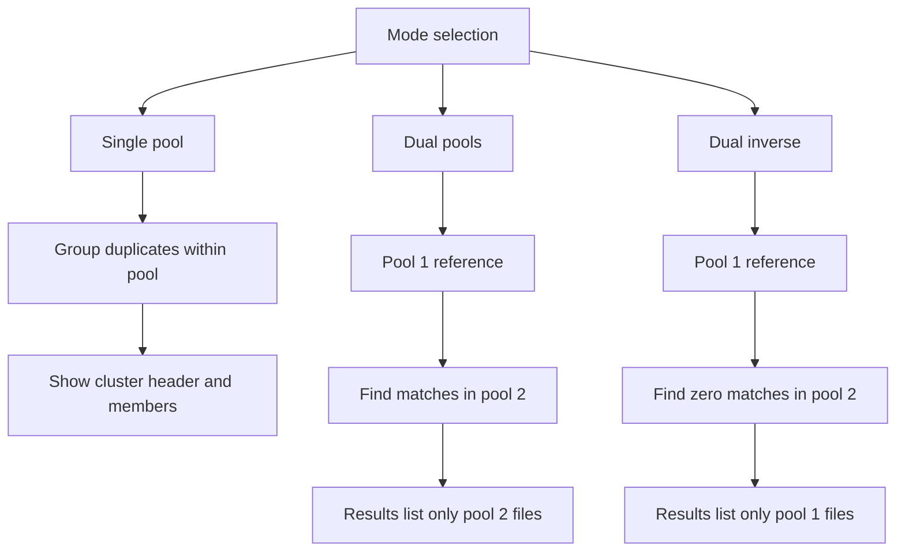
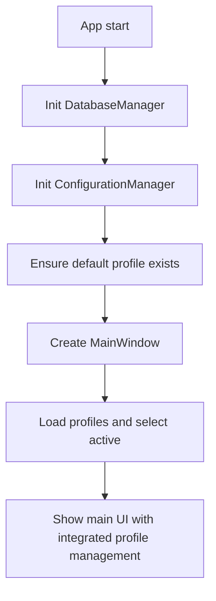
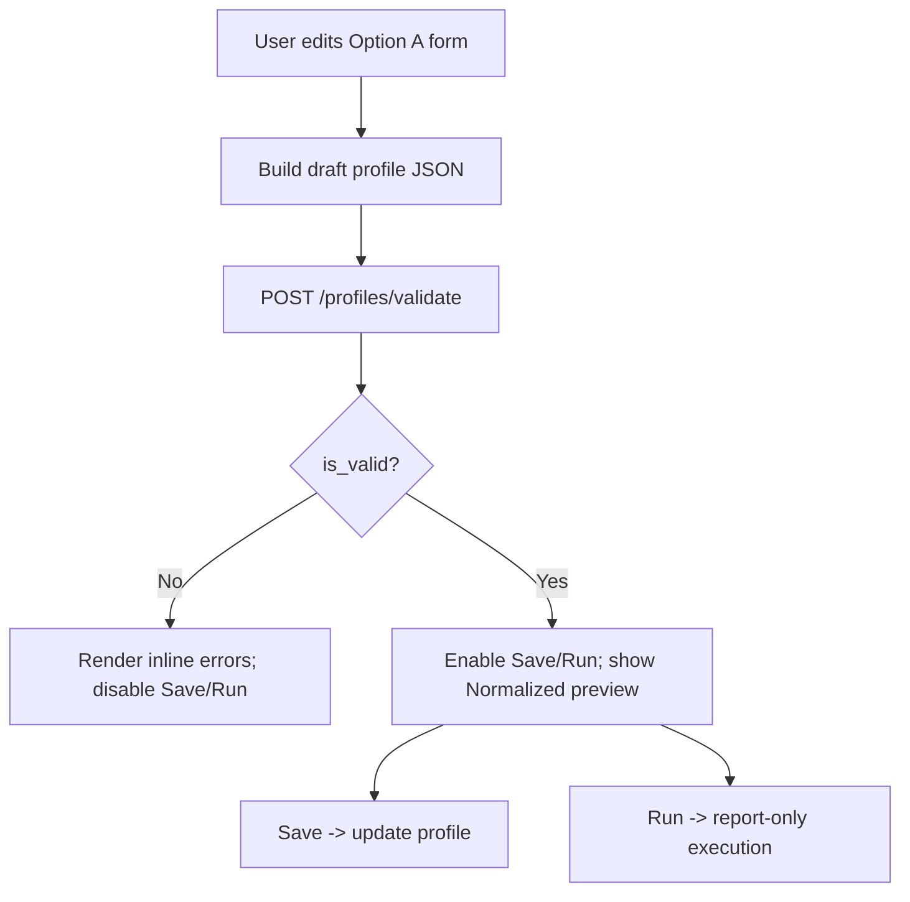

# KDC Image Organizer - Implementation Guide

## Conventions

- Cache size is configured via app_settings.cache_size_mb (units: MB). Do not use max_size_gb, MAX_CACHE_SIZE_GB, or ambiguous "GB" phrasing.
- Thresholds:
  - UI displays values on a 0–100 scale.
  - Internal logic uses 0.0–1.0.
  - Conversions: internal = ui / 100; ui = round(internal * 100).
- File extension tokens must be dot-prefixed (e.g., .png, .jpg, .jpeg, .tiff, .webp).
> Updated for Settings Profiles v1 (Option A) — Balanced Defaults — Package A — Set A
>
> This guide now includes a phased plan to introduce a strongly typed Settings Profile schema, a centralized validator (single source of truth), normalization utilities, and GUI progressive enable/disable behaviors, followed by migration from the current key/value settings manager. Cross-references: data model [docs/roo/img-app-data-model.md](docs/roo/img-app-data-model.md), UI [docs/roo/img-app-ui-design.md](docs/roo/img-app-ui-design.md), API [docs/roo/img-app-api-specifications.md](docs/roo/img-app-api-specifications.md), architecture [docs/roo/img-app-technical-architecture.md](docs/roo/img-app-technical-architecture.md), errors [docs/roo/img-app-error-handling-edge-cases.md](docs/roo/img-app-error-handling-edge-cases.md), decision §18 [docs/roo/canonical-decisions.md](docs/roo/canonical-decisions.md).

## 1. Overview

This guide provides step-by-step instructions for implementing the KDC Image Organizer application using the specifications defined in the accompanying documents. The implementation leverages the pk-py-lib component library and follows a phased development approach.
### 1.1 Canonical integration updates

This guide is aligned with the canonical decisions. Implementation must follow these cross‑cutting policies:

- Data locations (canonical decision §11)
  - Use platformdirs with Vendor "Pk" and App "Img App"
  - Environment override PK_IMG_APP_HOME to relocate base of data and cache trees
  - Three-database architecture:
    - settings.db in user_data_dir (user configuration & profiles)
    - sessions.db in user_data_dir (scan sessions & results)
    - cache.db in user_cache_dir (transient cache data)
  - Directory structure:
    - data/backups/ for database backups
    - cache/thumbnails/ for file-backed thumbnail storage

- Startup database validation and migration
  - For each of settings.db, sessions.db, cache.db
    - If missing, create with initial schema and meta schema_version
    - Run PRAGMA quick_check
    - If quick_check fails, run PRAGMA integrity_check
    - If integrity_check fails
      - settings.db prompt to preserve settings if exportable then rebuild
      - sessions.db offer rebuild or attempt repair
      - cache.db safe to rebuild automatically
    - If schema version mismatch
      - Make timestamped backup in backups
      - Run Alembic migrations
      - Update meta schema_version
  - Backup retention policy
    - Keep 10 most recent backups per database
    - Purge backups older than 30 days

- Identical file hashing strategy
  - Algorithm sha256
  - Staged prefilters for performance
    - Stage size filter group by exact file size
    - Stage partial hash for files at least 512 KiB
      - Hash first 256 KiB and last 256 KiB
    - Stage full hash
      - Compute full sha256 only for candidates with matching partial signature
  - Cache strategy
    - Store both partial and full hashes in cache.db
    - Invalidate when signature changes absolute_path file_size mtime_ns or inode where available

- Results semantics
  - Single pool
    - Group duplicate sets within the pool
    - UI shows cluster header and all member files
  - Dual pools default
    - Pool 1 reference
    - Results show only pool 2 files that match pool 1
  - Dual pools inverse
    - Show only pool 1 files that have zero matches in pool 2

- Settings profiles model
  - id name description created_at updated_at profile_version
  - pool_mode single or dual
  - inverse_mode applies only to dual
  - Per pool paths include_dirs exclude_dirs include_globs exclude_globs
  - Hash options hash_algo sha256 staged_hashing true partial_hash_size_kb 256
  - Cache invalidation keys absolute_path file_size mtime_ns inode

- Settings GUI behaviors
  - CRUD create select edit delete copy clone
  - Set as default
  - Validate paths on save
  - Preview effective include exclude
  - Test hash settings on a small sample

References
- Canonical decisions see [canonical-decisions.md](docs/roo/canonical-decisions.md)
- Specification see [img-app-specification.md](docs/roo/img-app-specification.md)
- Data model see [img-app-data-model.md](docs/roo/img-app-data-model.md)
- Technical architecture see [img-app-technical-architecture.md](docs/roo/img-app-technical-architecture.md)

### 1.2 Key workflow diagrams

#### 1.2.1 Startup validation and migration



Legend
- Retention 10 and 30 days means keep 10 most recent backups and purge older than 30 days

#### 1.2.2 Staged hashing pipeline for identical files



#### 1.2.3 Results semantics by mode



Implementation checklist alignment
- Ensure DataLocations uses platformdirs with vendor Pk and app Img App and supports PK_IMG_APP_HOME
- Ensure DatabaseManager performs quick_check integrity_check and meta schema_version checks then runs Alembic with pre migration backup and retention
- Ensure FlatCacheManager provides staged sha256 hashing with partial first and last 256 KiB and invalidation on path size mtime_ns inode
- Ensure Results panel follows single dual and inverse display rules
- Ensure Settings GUI provides full profile CRUD; for Option A Balanced defaults, path validation blocks Save/Run until required pool paths are valid

### 1.3 Balanced Defaults — Implementation Steps (Option A v1)

Source of truth and wiring
- Central defaults module (library, no code changes here; design reference):
  - Path: src/pk_py_lib/core/settings/defaults.py
  - Contents: constants for Balanced defaults:
    - Pools: recurse=True; max_depth=0 (unlimited); follow_symlinks=False; include_hidden=False; include=["**/*"]; exclude=[]; type_filters=[".jpg",".jpeg",".png",".webp",".tiff",".bmp",".gif",".heic",".heif"]
    - Similarity: algorithm="pHash"; degree_ui=90; pHash.hash_size=8
    - Duplicates: algorithm="blake3" fixed; no degree
    - Scope/Direction: kind="two_pool"; direction="A_TO_B"
    - Output: mode="report_only"
- JSON Schema annotations:
  - Encode the same defaults with "default" on applicable properties to document expected behavior (see [docs/roo/img-app-data-model.md](docs/roo/img-app-data-model.md:965))
- Centralized validator behavior:
  - Apply default-filling on validate/load to produce a normalized profile (returned to GUI/API); treat omitted fields as defaults
  - Enforce OS-aware pattern case: Windows case-insensitive; POSIX case-sensitive
- Extension filter matching is case-insensitive on all operating systems
  - Enforce path existence/readability; block Save/Run until valid
- GUI initialization:
  - Initialize widgets from the normalized profile returned by validator so the UI shows the applied defaults (e.g., Degree=90, Recurse checked, Max depth=0, A→B selected when both pools validate)
- Direction enabling:
  - Only enable and auto-select A→B after Pools A and B validate; otherwise keep direction radios disabled
- Tests (see 14B.7 S6 and additions below):
  - Minimal payload → normalized with defaults (criteria, pools, scope.direction, output)
  - OS-aware case matching behavior for patterns
  - Path validation blocks Save/Run until fixed
  - Hidden files excluded by default; follow_symlinks False
  - max_depth=0 interpreted as unlimited traversal
  - RAW formats off by default; enabling RAW should require explicit opt-in via type_filters

## 2. Development Environment Setup

### 2.1 Prerequisites
```bash
# Required software
- Python 3.13+
- PDM package manager
- Git
- Visual Studio Code (recommended)
- Qt Designer (optional, for UI design)

# System requirements
- Windows 10/11, macOS 10.15+, or Linux (Ubuntu 20.04+)
- 8192 MB RAM minimum (≈8 GB); 16384 MB recommended (≈16 GB)
- 10240 MB free disk space (≈10 GB)
```

### 2.2 Project Initialization
```bash
# Clone repository
git clone <repository-url>
cd pk-py-lib

# Create virtual environment
pdm venv create

# Install dependencies
pdm install

# Verify installation
pdm run python -c "import PySide6; print(PySide6.__version__)"
```

### 2.3 Directory Structure Setup
```bash
# Create img_app directory structure
mkdir -p img_app/img_app/{core,gui,processing,data,utils,config}
mkdir -p img_app/img_app/gui/{widgets,panels,dialogs,models}
mkdir -p img_app/img_app/core/{algorithms,operations,managers}
mkdir -p img_app/tests/{unit,integration,fixtures}
mkdir -p img_app/assets/{icons,images,themes}
mkdir -p img_app/docs
```

## 3. Phase 1: Foundation (Week 1)

### 3.1 Core Application Structure

#### Step 1: Create Application Entry Point
```python
# img_app/img_app/__main__.py
"""Application entry point."""

import sys
from img_app.app import main

if __name__ == "__main__":
    sys.exit(main())
```

#### Step 2: Implement Main Application Class
```python
# img_app/img_app/app.py
"""Main application module."""

import sys
from PySide6.QtWidgets import QApplication
from PySide6.QtCore import Qt
from img_app.core.managers import ApplicationManager
from img_app.gui.main_window import MainWindow

def main():
    """Main application entry point."""
    # Enable high DPI support
    QApplication.setHighDpiScaleFactorRoundingPolicy(
        Qt.HighDpiScaleFactorRoundingPolicy.PassThrough
    )

    # Create application
    app = QApplication(sys.argv)
    app.setApplicationName("KDC Image Organizer")
    app.setOrganizationName("KDC")

    # Initialize application manager
    app_manager = ApplicationManager()
    app_manager.initialize()

    # Create and show main window
    window = MainWindow(app_manager)
    window.show()

    # Run event loop
    return app.exec()
```

#### Step 3: Implement Application Manager
```python
# img_app/img_app/core/managers.py
"""Core application management."""

from pathlib import Path
from pk_py_lib.core.logging import AdvancedLogger
from img_app.config.settings import ConfigurationManager
from img_app.data.database import DatabaseManager
from pk_py_lib.core.flat_cache import FlatCacheManager

class ApplicationManager:
    """Central application controller."""

    def __init__(self):
        self.logger = AdvancedLogger("img_app")
        self.config_manager = None
        self.database_manager = None
        self.cache_manager = None

    def initialize(self):
        """Initialize application components."""
        self.logger.info("Initializing application")

        # Initialize configuration
        self.config_manager = ConfigurationManager()
        self.config_manager.load_default_profile()

        # Initialize database
        self.database_manager = DatabaseManager()
        self.database_manager.initialize()

        # Initialize cache
        cache_dir = self.config_manager.get_cache_directory()
        self.flat_cache_manager = FlatCacheManager()

        self.logger.info("Application initialized successfully")
```

### 3.2 Basic GUI Implementation

#### Step 4: Create Main Window
```python
# img_app/img_app/gui/main_window.py
"""Main application window."""

from PySide6.QtWidgets import (
    QMainWindow, QMenuBar, QToolBar,
    QStatusBar, QDockWidget, QWidget
)
from PySide6.QtCore import Qt
from img_app.gui.panels import FilePanel, ResultsPanel, PreviewPanel

class MainWindow(QMainWindow):
    """Main application window."""

    def __init__(self, app_manager):
        super().__init__()
        self.app_manager = app_manager
        self.setup_ui()

    def setup_ui(self):
        """Initialize UI components."""
        self.setWindowTitle("KDC Image Organizer")
        self.setMinimumSize(1024, 768)

        # Create menu bar
        self.create_menus()

        # Create toolbar
        self.create_toolbar()

        # Create central widget
        self.create_central_widget()

        # Create dockable panels
        self.create_panels()

        # Create status bar
        self.create_status_bar()

    def create_menus(self):
        """Create application menus."""
        menubar = self.menuBar()

        # File menu
        file_menu = menubar.addMenu("&File")
        file_menu.addAction("&New Scan", self.new_scan)
        file_menu.addAction("&Open Results", self.open_results)
        file_menu.addSeparator()
        file_menu.addAction("E&xit", self.close)

    def create_panels(self):
        """Create dockable panels."""
        # File panel
        self.file_dock = QDockWidget("Files", self)
        self.file_panel = FilePanel(self.app_manager)
        self.file_dock.setWidget(self.file_panel)
        self.addDockWidget(Qt.LeftDockWidgetArea, self.file_dock)
```

### 3.3 Data Layer Setup

#### Step 5: Implement Database Manager
```python
# img_app/img_app/data/database.py
"""Database management."""

import sqlite3
from pathlib import Path
from contextlib import contextmanager

class DatabaseManager:
    """Manages database connections and operations."""

    def __init__(self):
        self.settings_db_path = None
        self.sessions_db_path = None
        self.cache_db_path = None

    def initialize(self):
        """Initialize databases with platformdirs."""
        import os
        from platformdirs import user_data_dir, user_cache_dir

        # Check for environment override
        base_dir = os.environ.get('PK_IMG_APP_HOME')

        if base_dir:
            data_dir = Path(base_dir) / "data"
            cache_dir = Path(base_dir) / "cache"
        else:
            # Use platformdirs with Vendor "Pk" and App "Img App"
            data_dir = Path(user_data_dir("Img App", "Pk"))
            cache_dir = Path(user_cache_dir("Img App", "Pk"))

        # Ensure directories exist
        data_dir.mkdir(parents=True, exist_ok=True)
        cache_dir.mkdir(parents=True, exist_ok=True)

        # Three-database architecture per canonical decision §11
        self.settings_db_path = data_dir / "settings.db"
        self.sessions_db_path = data_dir / "sessions.db"
        self.cache_db_path = cache_dir / "cache.db"

        # Create databases if needed
        self.create_databases()

    def create_databases(self):
        """Create database schemas for three-database architecture."""
        # Create settings database (user configuration)
        with self.get_connection(self.settings_db_path) as conn:
            conn.executescript(SETTINGS_SCHEMA)

        # Create sessions database (scan sessions & results)
        with self.get_connection(self.sessions_db_path) as conn:
            conn.executescript(SESSIONS_SCHEMA)

        # Create cache database (transient data)
        with self.get_connection(self.cache_db_path) as conn:
            conn.executescript(CACHE_SCHEMA)

    @contextmanager
    def get_connection(self, db_path):
        """Get database connection context."""
        conn = sqlite3.connect(db_path)
        conn.row_factory = sqlite3.Row
        try:
            yield conn
            conn.commit()
        except Exception:
            conn.rollback()
            raise
        finally:
            conn.close()
```

## 4. Phase 2: Core Features (Week 2)

### 4.1 File Selection Implementation

#### Step 6: Implement File Selection Panel
```python
# img_app/img_app/gui/panels/file_panel.py
"""File selection panel."""

from PySide6.QtWidgets import QWidget, QVBoxLayout, QTreeView, QPushButton
from pk_py_lib.gui.file_selector import FileSelector

class FilePanel(QWidget):
    """File and folder selection panel."""

    def __init__(self, app_manager):
        super().__init__()
        self.app_manager = app_manager
        self.setup_ui()

    def setup_ui(self):
        layout = QVBoxLayout()

        # Use pk-py-lib file selector
        self.file_selector = FileSelector(
            mode='multi',
            filters=['*.jpg', '*.png', '*.heic']
        )
        layout.addWidget(self.file_selector)

        # Add control buttons
        self.add_files_btn = QPushButton("Add Files")
        self.add_folder_btn = QPushButton("Add Folder")
        self.clear_btn = QPushButton("Clear All")

        layout.addWidget(self.add_files_btn)
        layout.addWidget(self.add_folder_btn)
        layout.addWidget(self.clear_btn)

        self.setLayout(layout)
```

### 4.2 Similarity Algorithm Implementation

#### Step 7: Implement Base Algorithm Interface
```python
# img_app/img_app/core/algorithms/base.py
"""Base algorithm interface."""

from abc import ABC, abstractmethod
from typing import Any
from PIL import Image

class BaseAlgorithm(ABC):
    """Abstract base class for similarity algorithms."""

    @property
    @abstractmethod
    def name(self) -> str:
        """Algorithm name."""
        pass

    @abstractmethod
    def compute_hash(self, image: Image) -> Any:
        """Compute image hash/signature."""
        pass

    @abstractmethod
    def compare(self, hash1: Any, hash2: Any) -> float:
        """Compare hashes, return similarity 0.0-1.0."""
        pass
```

#### Step 8: Implement pHash Algorithm

**Note**: The similarity detection functionality is now provided by the modular [`similarity`](src/pk_py_lib/core/image/similarity/__init__.py:1) package in pk-py-lib.

For custom implementations, use the existing modules:
```python
# Use the library's modular similarity package
from src.pk_py_lib.core.image.similarity import (
    compute_phash,           # From hashing.py
    compute_whash,           # From hashing.py
    find_similar_images,     # From clustering.py
    SimilarityConfig,        # From types.py
    InvalidImageError        # From types.py
)

# Example: Compute pHash for an image
from pathlib import Path
image_path = Path("/path/to/image.jpg")
phash_value = compute_phash(image_path, hash_size=8)

# Example: Find similar images
from src.pk_py_lib.core.image.similarity import find_similar_images
similar_groups = find_similar_images(
    image_paths=[Path("/path1.jpg"), Path("/path2.jpg")],
    threshold=10,
    algorithm="phash"
)
```

For reference, the original monolithic implementation has been deprecated but remains available at [`_similarity_deprecated.py`](src/pk_py_lib/core/image/_similarity_deprecated.py:1). See [MIGRATION_GUIDE.md](src/pk_py_lib/core/image/MIGRATION_GUIDE.md:1) for details.

### 4.3 Processing Engine

#### Step 9: Implement Similarity Engine
```python
# img_app/img_app/processing/similarity.py
"""Similarity detection engine."""

from concurrent.futures import ThreadPoolExecutor
from typing import List, Dict, Optional
from pathlib import Path
from PIL import Image

class SimilarityEngine:
    """Orchestrates similarity detection."""

    def __init__(self, app_manager):
        self.app_manager = app_manager
        self.algorithms = {}
        self.thread_pool = None

    def register_algorithm(self, algorithm):
        """Register similarity algorithm."""
        self.algorithms[algorithm.name] = algorithm

    def find_similar_images(
        self,
        images: List[Path],
        threshold: float = 0.85,
        algorithm_names: List[str] = None
    ) -> List[SimilarityGroup]:
        """Find similar images in collection."""

        # Initialize thread pool
        max_threads = self.app_manager.config_manager.get_setting(
            "app_settings.max_threads",
            default=4,
            scope="app"
        )
        self.thread_pool = ThreadPoolExecutor(max_workers=max_threads)

        try:
            # Load and hash images
            hashes = self._compute_hashes(images, algorithm_names)

            # Compare images
            groups = self._find_groups(hashes, threshold)

            return groups

        finally:
            self.thread_pool.shutdown()
```

## 5. Phase 3: Results Display (Week 3)

### 5.1 Results Panel Implementation

#### Step 10: Create Results Display
```python
# img_app/img_app/gui/panels/results_panel.py
"""Results display panel."""

from PySide6.QtWidgets import (
    QWidget, QVBoxLayout, QTreeWidget,
    QTreeWidgetItem, QHeaderView
)
from PySide6.QtCore import Qt

class ResultsPanel(QWidget):
    """Display similarity detection results."""

    def __init__(self, app_manager):
        super().__init__()
        self.app_manager = app_manager
        self.setup_ui()

    def setup_ui(self):
        layout = QVBoxLayout()

        # Create results tree
        self.results_tree = QTreeWidget()
        self.results_tree.setHeaderLabels([
            "Group/File", "Size", "Dimensions",
            "Similarity", "Actions"
        ])

        # Configure tree
        header = self.results_tree.header()
        header.setStretchLastSection(False)
        header.setSectionResizeMode(0, QHeaderView.Stretch)

        layout.addWidget(self.results_tree)
        self.setLayout(layout)

    def display_results(self, groups):
        """Display similarity groups."""
        self.results_tree.clear()

        for group_idx, group in enumerate(groups):
            # Create group header
            group_item = QTreeWidgetItem([
                f"Group {group_idx + 1} ({len(group.members)} images)",
                f"{group.total_size_readable}",
                "",
                f"{group.avg_similarity:.0%}",
                ""
            ])

            # Add member images
            for member in group.members:
                member_item = QTreeWidgetItem([
                    member.file_name,
                    member.file_size_readable,
                    f"{member.width}×{member.height}",
                    f"{member.similarity_score:.0%}",
                    ""
                ])
                group_item.addChild(member_item)

            self.results_tree.addTopLevelItem(group_item)
            group_item.setExpanded(True)
```

### 5.2 Preview Panel

#### Step 11: Implement Image Preview
```python
# img_app/img_app/gui/panels/preview_panel.py
"""Image preview panel."""

from PySide6.QtWidgets import QWidget, QVBoxLayout, QLabel
from PySide6.QtCore import Qt
from PySide6.QtGui import QPixmap
from pk_py_lib.gui.widgets import ImageViewer

class PreviewPanel(QWidget):
    """Image preview and comparison panel."""

    def __init__(self, app_manager):
        super().__init__()
        self.app_manager = app_manager
        self.setup_ui()

    def setup_ui(self):
        layout = QVBoxLayout()

        # Use pk-py-lib image viewer
        self.image_viewer = ImageViewer()
        layout.addWidget(self.image_viewer)

        # Add info label
        self.info_label = QLabel("No image selected")
        self.info_label.setAlignment(Qt.AlignCenter)
        layout.addWidget(self.info_label)

        self.setLayout(layout)

    def display_image(self, image_path):
        """Display single image."""
        self.image_viewer.load_image(image_path)

    def compare_images(self, paths):
        """Display images for comparison."""
        self.image_viewer.set_comparison_mode(paths)
```

## 6. Phase 4: File Operations (Week 4)

### 6.1 Delete Operations

#### Step 12: Implement Safe Deletion
```python
# img_app/img_app/core/operations/file_ops.py
"""File operations with safety checks."""

from pathlib import Path
from typing import List
import send2trash
from img_app.core.operations.undo import UndoManager

class FileOperations:
    """Handles file system operations."""

    def __init__(self, app_manager):
        self.app_manager = app_manager
        self.undo_manager = UndoManager()

    def delete_files(
        self,
        files: List[Path],
        use_trash: bool = True,
        create_backup: bool = False
    ) -> bool:
        """Delete files with safety options."""

        # Log operation
        self.app_manager.logger.info(
            f"Deleting {len(files)} files",
            use_trash=use_trash
        )

        deleted = []
        errors = []

        for file_path in files:
            try:
                if create_backup:
                    self._create_backup(file_path)

                if use_trash:
                    send2trash.send2trash(str(file_path))
                else:
                    file_path.unlink()

                deleted.append(file_path)

            except Exception as e:
                errors.append((file_path, str(e)))

        # Record for undo
        self.undo_manager.record_operation(
            "delete",
            {"files": deleted, "use_trash": use_trash}
        )

        return len(errors) == 0
```

### 6.2 Undo System

#### Step 13: Implement Undo Manager
```python
# img_app/img_app/core/operations/undo.py
"""Undo/redo system."""

from collections import deque
from typing import Any, Dict

class UndoManager:
    """Manages undo/redo operations."""

    def __init__(self, max_history: int = 50):
        self.undo_stack = deque(maxlen=max_history)
        self.redo_stack = deque(maxlen=max_history)

    def record_operation(self, operation_type: str, data: Dict[str, Any]):
        """Record operation for undo."""
        operation = {
            "type": operation_type,
            "data": data,
            "timestamp": datetime.now()
        }
        self.undo_stack.append(operation)
        self.redo_stack.clear()  # Clear redo on new operation

    def undo(self) -> Optional[Dict]:
        """Undo last operation."""
        if not self.undo_stack:
            return None

        operation = self.undo_stack.pop()
        self.redo_stack.append(operation)
        return operation

    def redo(self) -> Optional[Dict]:
        """Redo undone operation."""
        if not self.redo_stack:
            return None

        operation = self.redo_stack.pop()
        self.undo_stack.append(operation)
        return operation
```

## 7. Testing Implementation

### 7.1 Unit Tests

#### Step 14: Test Similarity Algorithms
```python
# img_app/tests/unit/test_algorithms.py
"""Algorithm unit tests."""

import pytest
from PIL import Image
from img_app.core.algorithms.phash import PerceptualHashAlgorithm

class TestPerceptualHash:
    """Test perceptual hash algorithm."""

    def test_identical_images(self):
        """Test identical images have similarity 1.0."""
        algo = PerceptualHashAlgorithm()
        image = Image.new('RGB', (100, 100), 'red')

        hash1 = algo.compute_hash(image)
        hash2 = algo.compute_hash(image)

        similarity = algo.compare(hash1, hash2)
        assert similarity == 1.0

    def test_different_images(self):
        """Test different images have low similarity."""
        algo = PerceptualHashAlgorithm()
        image1 = Image.new('RGB', (100, 100), 'red')
        image2 = Image.new('RGB', (100, 100), 'blue')

        hash1 = algo.compute_hash(image1)
        hash2 = algo.compute_hash(image2)

        similarity = algo.compare(hash1, hash2)
        assert similarity < 0.5
```

### 7.2 Integration Tests

#### Step 15: Test Complete Workflow
```python
# img_app/tests/integration/test_workflow.py
"""Integration tests for complete workflows."""

import pytest
from pathlib import Path
from img_app.core.managers import ApplicationManager
from img_app.processing.similarity import SimilarityEngine

class TestSimilarityWorkflow:
    """Test complete similarity detection workflow."""

    @pytest.fixture
    def app_manager(self):
        """Create application manager for testing."""
        manager = ApplicationManager()
        manager.initialize()
        return manager

    def test_find_duplicates(self, app_manager, tmp_path):
        """Test finding duplicate images."""
        # Create test images
        test_images = self.create_test_images(tmp_path)

        # Initialize engine
        engine = SimilarityEngine(app_manager)

        # Find similar images
        groups = engine.find_similar_images(
            test_images,
            threshold=0.90
        )

        # Verify results
        assert len(groups) > 0
        assert all(g.avg_similarity >= 0.90 for g in groups)
```

## 8. Configuration and Settings

### 8.1 Settings Management

#### Step 16: Implement Configuration Manager
```python
# img_app/img_app/config/settings.py
"""Application configuration management."""

from typing import Any, Optional
from pathlib import Path
import json

class ConfigurationManager:
    """Manages application configuration."""

    DEFAULT_SETTINGS = {
        "theme": "light",
        "language": "en",
        "ui_scale": 1.0,
        "app_settings.max_threads": 4,
        "app_settings.max_memory_mb": 2048,
        "app_settings.cache_size_mb": 5120,
        "algorithms.default": ["phash"],
        "algorithms.threshold": 0.85
    }

    def __init__(self):
        self.settings = {}
        self.profile_name = "default"

    def load_default_profile(self):
        """Load default settings profile."""
        self.settings = self.DEFAULT_SETTINGS.copy()

    def get_setting(self, key: str, default: Any = None) -> Any:
        """Get configuration value."""
        keys = key.split('.')
        value = self.settings

        for k in keys:
            if isinstance(value, dict) and k in value:
                value = value[k]
            else:
                return default

        return value

    def set_setting(self, key: str, value: Any):
        """Set configuration value."""
        keys = key.split('.')
        target = self.settings

        for k in keys[:-1]:
            if k not in target:
                target[k] = {}
            target = target[k]

        target[keys[-1]] = value
```

## 9. Performance Optimization

### 9.1 Memory Management

#### Step 17: Implement Memory Manager
```python
# img_app/img_app/utils/memory.py
"""Memory management utilities."""

import psutil
import gc
from typing import Optional

class MemoryManager:
    """Monitors and manages memory usage."""

    def __init__(self, limit_mb: int = 2048):
        self.limit_bytes = limit_mb * 1024 * 1024
        self.warning_threshold = 0.8

    def get_current_usage(self) -> int:
        """Get current memory usage in bytes."""
        process = psutil.Process()
        return process.memory_info().rss

    def check_memory(self) -> bool:
        """Check if memory usage is within limits."""
        current = self.get_current_usage()
        return current < self.limit_bytes

    def cleanup_if_needed(self):
        """Perform cleanup if memory usage is high."""
        usage_ratio = self.get_current_usage() / self.limit_bytes

        if usage_ratio > self.warning_threshold:
            gc.collect()
            return True
        return False
```

### 9.2 Caching Strategy

#### Step 18: Implement Cache Manager
```python
# img_app/img_app/data/cache.py
"""Cache management system."""

from pathlib import Path
from typing import Optional, Dict
import pickle
from datetime import datetime, timedelta

class FlatCacheManager:
    """Manages application caching."""

    def __init__(self, cache_dir: Path, max_size_mb: int = 5120):
        self.cache_dir = cache_dir
        self.cache_dir.mkdir(exist_ok=True)
        self.max_size_bytes = int(max_size_mb * 1024 * 1024)

    def get_thumbnail(self, image_path: Path, size: int) -> Optional[bytes]:
        """Retrieve cached thumbnail."""
        cache_key = self._get_cache_key(image_path, f"thumb_{size}")
        cache_file = self.cache_dir / f"{cache_key}.cache"

        if cache_file.exists():
            # Check if still valid
            if self._is_cache_valid(cache_file, image_path):
                # Update last-access metadata
                try:
                    cache_file.utime(None)
                except Exception:
                    pass
                return cache_file.read_bytes()

        return None

    def cache_thumbnail(self, image_path: Path, size: int, data: bytes):
        """Store thumbnail in cache."""
        cache_key = self._get_cache_key(image_path, f"thumb_{size}")
        cache_file = self.cache_dir / f"{cache_key}.cache"

        cache_file.write_bytes(data)

        # Check cache size and cleanup if needed
        self._cleanup_if_needed()
```

## 10. Deployment

### 10.1 Build Configuration

#### Step 19: Create Build Script
```python
# build.py
"""Build script for creating executable."""

import PyInstaller.__main__
import shutil
from pathlib import Path

def build_app():
    """Build standalone executable."""

    # Clean previous builds
    for path in ['build', 'dist']:
        if Path(path).exists():
            shutil.rmtree(path)

    # Run PyInstaller
    PyInstaller.__main__.run([
        'img_app/__main__.py',
        '--name=KDC Image Organizer',
        '--windowed',
        '--icon=assets/icon.ico',
        '--add-data=assets;assets',
        '--hidden-import=PySide6',
        '--hidden-import=PIL',
        '--hidden-import=cv2',
        '--hidden-import=imagehash',
        '--onedir',
        '--clean'
    ])

    print("Build complete! Executable in dist/ directory")

if __name__ == "__main__":
    build_app()
```

### 10.2 Installation Script

#### Step 20: Create Installer
```python
# installer.py
"""Installation script."""

import os
import sys
import shutil
from pathlib import Path

def install():
    """Install application."""

    # Determine installation directory
    if sys.platform == "win32":
        install_dir = Path(os.environ["PROGRAMFILES"]) / "KDC Image Organizer"
    elif sys.platform == "darwin":
        install_dir = Path("/Applications/KDC Image Organizer.app")
    else:
        install_dir = Path.home() / ".local" / "share" / "kdc-image-organizer"

    # Copy files
    print(f"Installing to {install_dir}")
    install_dir.mkdir(parents=True, exist_ok=True)

    # Copy executable and resources
    shutil.copytree("dist/KDC Image Organizer", install_dir, dirs_exist_ok=True)

    # Create desktop shortcut
    create_desktop_shortcut(install_dir)

    print("Installation complete!")

def create_desktop_shortcut(install_dir):
    """Create desktop shortcut."""
    # Platform-specific shortcut creation
    pass

if __name__ == "__main__":
    install()
```

## 11. Development Workflow

### 11.1 Git Workflow
```bash
# Feature development
git checkout -b feature/similarity-detection
# Make changes
git add .
git commit -m "feat: Add similarity detection engine"
git push origin feature/similarity-detection
# Create pull request

# Bug fixes
git checkout -b fix/memory-leak
# Fix issue
git add .
git commit -m "fix: Resolve memory leak in thumbnail cache"
git push origin fix/memory-leak
```

### 11.2 Testing Workflow
```bash
# Run all tests
pdm run pytest

# Run specific test file
pdm run pytest tests/unit/test_algorithms.py

# Run with coverage
pdm run pytest --cov=img_app --cov-report=html

# Run integration tests only
pdm run pytest tests/integration/
```

### 11.3 Development Commands
```bash
# Run application in development
pdm run python -m img_app

# Format code
pdm run black img_app/

# Type checking
pdm run mypy img_app/

# Linting
pdm run ruff img_app/

# Build executable
pdm run python build.py
```

## 12. Troubleshooting Guide

### 12.1 Common Issues

#### Issue: Import errors with PySide6
```python
# Solution: Ensure PySide6 is properly installed
pdm add PySide6>=6.6.0
# Verify installation
python -c "from PySide6 import QtCore; print(QtCore.__version__)"
```

#### Issue: Memory errors with large image sets
```python
# Solution: Implement batch processing
def process_in_batches(images, batch_size=100):
    for i in range(0, len(images), batch_size):
        batch = images[i:i+batch_size]
        process_batch(batch)
        gc.collect()  # Force garbage collection
```

#### Issue: Database lock errors
```python
# Solution: Use proper connection management
with database.get_connection() as conn:
    # Perform operations
    pass  # Connection automatically closed
```

### 12.2 Performance Optimization Tips

1. **Use lazy loading** for large image collections
2. **Implement progressive loading** in UI
3. **Cache computed hashes** to avoid recomputation
4. **Use memory-mapped files** for very large images
5. **Implement batch database operations**

## 13. Next Steps

After completing the basic implementation:

1. **Add advanced features**:
   - EXIF-based organization
   - Batch processing operations
   - Advanced filtering and search

2. **Implement plugins**:
   - Create plugin API
   - Develop example plugins
   - Document plugin development

3. **Enhance UI**:
   - Add themes support
   - Implement drag-and-drop
   - Add keyboard shortcuts

4. **Optimize performance**:
   - Profile and optimize bottlenecks
   - Implement GPU acceleration
   - Add distributed processing

5. **Prepare for release**:
   - Complete documentation
   - Create user manual
   - Set up CI/CD pipeline
## 14. Integrated Settings Management in Main Window

Status: Implemented

Purpose
- Provide direct access to settings profile management within the main application window.
- Eliminate the modal startup dialog in favor of integrated UI components.
- Default to the last active profile on launch, with automatic creation of a default profile if none exist.
- Enable profile creation, copying, and selection without interrupting the main workflow.

Scope and References
- App bootstrap: [img_app/img_app/app.py](img_app/img_app/app.py:60)
- Main window: [img_app/img_app/main_window.py](img_app/img_app/main_window.py:1)
- Library configuration and DB: [src/pk_py_lib/core/configuration.py](src/pk_py_lib/core/configuration.py:1), [src/pk_py_lib/core/database.py](src/pk_py_lib/core/database.py:1)
- Profile management API: [src/pk_py_lib/api/settings_profiles.py](src/pk_py_lib/api/settings_profiles.py:1)

14.1 Startup Sequence: High-Level Flow

- Initialize DatabaseManager and ConfigurationManager
- Ensure a default profile exists via API
- Create MainWindow with integrated profile management
- Load available profiles and select the last active profile
- Show main UI with profile combobox and management buttons



14.2 Integration Steps

1) Initialize core components
- Create and initialize [DatabaseManager.initialize()](src/pk_py_lib/core/database.py:405) to ensure settings.db exists with canonical schema and meta table.
- Construct [ConfigurationManager](src/pk_py_lib/core/configuration.py:126) with the database manager instance.
- Use [SettingsProfilesAPI.ensure_default_profile()](src/pk_py_lib/api/settings_profiles.py:1) to guarantee at least one profile exists.

2) Create main window with integrated profile management
- The [MainWindow](img_app/img_app/main_window.py:49) now includes:
  - Profile selection combobox
  - "New Profile" and "Copy Profile" buttons
  - "Start" button to initiate operations
  - Progress reporting section with dynamic updates
  - Results dialog upon completion
- Profile management occurs directly within the main UI without modal dialogs

3) Active profile handling
- The main window loads available profiles on initialization
- The last active profile is automatically selected
- Profile changes update the active profile in the database via [SettingsProfilesAPI.set_active_profile()](src/pk_py_lib/api/settings_profiles.py:260)
- The [ConfigurationManager.switch_profile()](src/pk_py_lib/core/configuration.py:399) aligns in-process state with the selected profile

4) Progress and results reporting
- Operations show real-time progress with percentage completed, files processed, and ETA
- Upon completion, a detailed results dialog summarizes the comparison outcomes
- All reporting occurs within the main window context

14.3 UI Components

The main window now features:
- **Profile Toolbar**: Combobox for profile selection, "New Profile", "Copy Profile", and "Start" buttons
- **Progress Section**: Progress bar, status labels (percentage, files processed, ETA)
- **Results Display**: Integrated into tabs within the DuplicateManagerDialog (no modal interruption), with 'Processing Summary' and 'Duplicate Report' tabs providing detailed information. All text is selectable as per project requirements.

14.4 Dependencies and Notes

- GUI framework: PySide6 (already in project)
- Database: SQLite via [DatabaseManager](src/pk_py_lib/core/database.py:1)
- Active profile semantics unchanged: stored in meta.active_profile_id
- Fallback strategy: If no profiles exist, a default profile is automatically created

14.5 Validation, Errors, and UX

- Validation occurs during profile operations through the existing API
- Error handling remains consistent with existing patterns
- UX improvements: Reduced modal interruptions, direct access to profile management

14.6 Testing Guidance

- Unit tests: Verify profile loading, selection, and active profile persistence
- Integration tests: Ensure full workflow from profile selection to operation completion
- GUI tests: Verify UI component interactions and state changes

14.7 Rationale

- Integrated profile management provides a smoother user experience
- Eliminates the modal interruption at startup
- Maintains all existing functionality while improving accessibility
- Aligns with modern application design patterns

Next Steps
- Enhance profile creation and copying functionality
- Add advanced profile management features as needed
- Continue refining the integrated UI based on user feedback

## 14A. Settings Manager — Library Files, App Integration, and Acceptance

Status: Approved

This section finalizes the concrete implementation plan for the reusable Settings/Profile Manager and its startup integration. It supersedes earlier references to `src/pk_py_lib/gui/settings_manager/dialog.py`. The canonical module path is `src/pk_py_lib/gui/settings_manager/`.

14A.1 Library file structure (to implement under pk-py-lib)
- [src/pk_py_lib/gui/settings_manager/__init__.py](src/pk_py_lib/gui/settings_manager/__init__.py:1)
- [src/pk_py_lib/gui/settings_manager/dialog.py](src/pk_py_lib/gui/settings_manager/dialog.py:1)
  - ProfileManagerDialog (PySide6 QDialog)
  - Two-pane List/Detail layout, search/filter, inline validation, Apply/Continue/Cancel
- [src/pk_py_lib/gui/settings_manager/controller.py](src/pk_py_lib/gui/settings_manager/controller.py:1)
  - Orchestrates interactions with [SettingsProfilesAPI](src/pk_py_lib/api/settings_profiles.py:69)
  - Performs list/create/update/delete/copy/set_active/set_default/export/import through API
  - Maps ApiResponse errors (ErrorCodes) to user-facing messages
- [src/pk_py_lib/gui/settings_manager/models.py](src/pk_py_lib/gui/settings_manager/models.py:1)
  - View-models and adapters (ProfileVM, ValidationIssues, ListModel if needed)
- [src/pk_py_lib/gui/settings_manager/validators.py](src/pk_py_lib/gui/settings_manager/validators.py:1)
  - Name validation (delegates to [SettingsProfilesAPI.validate_name()](src/pk_py_lib/api/settings_profiles.py:295))
  - Optional helpers (threshold conversions using [threshold helpers](src/pk_py_lib/core/utils/thresholds.py:1)), path checks (non-blocking hooks)

Notes
- GUI code never touches the DB directly. All persistence flows through [SettingsProfilesAPI](src/pk_py_lib/api/settings_profiles.py:69), which delegates to the core [SettingsProfilesManager](src/pk_py_lib/core/settings_profiles.py:95).

14A.2 App-side integration helper (startup gate)
- Path: [img_app/img_app/widgets/settings_manager.py](img_app/img_app/widgets/settings_manager.py:1)
- Responsibilities:
  - Accept initialized DatabaseManager and ConfigurationManager
  - Instantiate API [SettingsProfilesAPI](src/pk_py_lib/api/settings_profiles.py:69)
  - Launch [ProfileManagerDialog](src/pk_py_lib/gui/settings_manager/dialog.py:1) as a blocking modal
  - On success:
    - Ensure `meta.active_profile_id` points to a real id (API guarantees via core)
    - Call [ConfigurationManager.switch_profile()](src/pk_py_lib/core/configuration.py:399) to align in-process state
    - Return True to proceed with main window creation
  - On cancel/no-active: return False → caller exits app per policy

14A.3 Startup wiring (app main)
- Entry: [img_app/img_app/app.py](img_app/img_app/app.py:60)
- Sequence:
  1) Initialize DB via [DatabaseManager.initialize()](src/pk_py_lib/core/database.py:415)
  2) Initialize ConfigurationManager [ConfigurationManager](src/pk_py_lib/core/configuration.py:96)
  3) Run startup gate helper [img_app/img_app/widgets/settings_manager.py](img_app/img_app/widgets/settings_manager.py:1)
  4) If gate returns False → exit; else create and show [MainWindow](img_app/img_app/main_window.py:49)

Mermaid (unchanged logic, updated references)
```mermaid
flowchart TD
  A[App start] --> B[Init DatabaseManager]
  B --> C[Init ConfigurationManager]
  C --> D[Open Settings/Profile Manager modal]
  D --> E{Valid Active profile set}
  E -->|Yes| F[Close modal]
  E -->|No (Cancel)| X[Exit app]
  F --> G[Create MainWindow]
  G --> H[Show main UI]
```

14A.4 Controller-level API calls and invariants
- List: [SettingsProfilesAPI.list_profiles()](src/pk_py_lib/api/settings_profiles.py:109) (compute is_active from meta.active_profile_id)
- Create: [SettingsProfilesAPI.create()](src/pk_py_lib/api/settings_profiles.py:172)
- Update: [SettingsProfilesAPI.update()](src/pk_py_lib/api/settings_profiles.py:191)
- Delete: [SettingsProfilesAPI.delete()](src/pk_py_lib/api/settings_profiles.py:214) — blocked for Active or last remaining (core invariant)
- Copy: [SettingsProfilesAPI.copy()](src/pk_py_lib/api/settings_profiles.py:230)
- Set Active: [SettingsProfilesAPI.set_active()](src/pk_py_lib/api/settings_profiles.py:260)
- Set Default: [SettingsProfilesAPI.set_default()](src/pk_py_lib/api/settings_profiles.py:276)
- Validate name: [SettingsProfilesAPI.validate_name()](src/pk_py_lib/api/settings_profiles.py:295)
- Export / Import: [SettingsProfilesAPI.export_profile()](src/pk_py_lib/api/settings_profiles.py:314), [SettingsProfilesAPI.import_profile()](src/pk_py_lib/api/settings_profiles.py:329)

14A.5 Error mappings and UX surfaces
- ValueError → INVALID_CONFIG (inline field errors, dialog banners)
- sqlite3.OperationalError("locked") → LOCKED_DB (Retry/Exit choice)
- PermissionError → PERMISSION_DENIED (keep dialog open; allow Export of edits)
- Else → UNKNOWN_ERROR
- Reference: [_map_exception](src/pk_py_lib/api/settings_profiles.py:48); detailed UX in [docs/roo/img-app-error-handling-edge-cases.md](docs/roo/img-app-error-handling-edge-cases.md:1)

14A.6 Acceptance criteria (implementation-level)
- Library components exist under `src/pk_py_lib/gui/settings_manager/` and can be imported independently by other apps
- Dialog behaviors match UI acceptance (see [docs/roo/img-app-ui-design.md](docs/roo/img-app-ui-design.md:1), section 13A)
- All CRUD+copy+set-active+set-default operations go through API and respect invariants (no direct SQL from GUI)
- Startup gate prevents main window creation unless a valid Active profile exists
- After acceptance, [ConfigurationManager.switch_profile()](src/pk_py_lib/core/configuration.py:399) invoked with the selected profile for session alignment
- Error cases mapped to ErrorCodes and surfaced appropriately; no partial writes on failures (transactions)

14A.7 Test guidance (pytest-qt + unit)
- Core/API unit tests:
  - Name validation, uniqueness collisions
  - Delete Active and delete-last blocked
  - Default exclusivity toggling
  - Active persistence in `meta.active_profile_id`
- GUI tests (pytest-qt):
  - First-run: zero profiles → create → set active → continue
  - Existing active: dialog shows; Continue immediately available
  - Delete constraints disabled/grayed appropriately
  - LOCKED_DB flow shows Retry/Exit
- Integration:
  - Startup gate blocks main window without Active
  - Switching Active affects retrieval via ConfigurationManager

Cross-references
- Architectural details and persistence: [img-app-technical-architecture.md §11A](docs/roo/img-app-technical-architecture.md:1)
- API contract and acceptance: [img-app-api-specifications.md §13A](docs/roo/img-app-api-specifications.md:1)
- Errors and concurrency: [img-app-error-handling-edge-cases.md §13A](docs/roo/img-app-error-handling-edge-cases.md:1)
- Canonical decisions: [canonical-decisions.md §17A](docs/roo/canonical-decisions.md:1)
## 14B. Settings Profiles v1 (Option A) — Step-by-Step Implementation Plan

Scope
- Introduce a strongly-typed Settings Profile model for Option A, a centralized validator (single source of truth), normalization utilities, GUI progressive enable/disable wiring, and a migration path from the current key/value settings manager. Execution in v1 is report-only.
- Cross-references: data model [docs/roo/img-app-data-model.md](docs/roo/img-app-data-model.md), UI [docs/roo/img-app-ui-design.md](docs/roo/img-app-ui-design.md), API [docs/roo/img-app-api-specifications.md](docs/roo/img-app-api-specifications.md), architecture [docs/roo/img-app-technical-architecture.md](docs/roo/img-app-technical-architecture.md), errors [docs/roo/img-app-error-handling-edge-cases.md](docs/roo/img-app-error-handling-edge-cases.md), decision §18 [docs/roo/canonical-decisions.md](docs/roo/canonical-decisions.md).

14B.1 Phased delivery overview
- S0: Author JSON Schema for Option A (done; see data model).
- S1: Centralized Validator (core) + ValidationReport shape.
- S2: Normalization utilities (degree mapping; pHash distance-to-similarity).
- S3: GUI progressive enable/disable wiring to validator.
- S4: API endpoints: /profiles/validate and /runs/(duplicates|similarity) (report-only).
- S5: Migration from key/value settings manager to profile model.
- S6: Test matrix and fixtures (unit, integration, GUI).
- S7: Sample profiles and validation examples.
- S8: Documentation hardening and acceptance checks.

14B.2 S1 — Centralized Validator (core)
- Module placement (design reference):
  - Core entry (public): src/pk_py_lib/core/settings_profiles.py validate_option_a(profile_dict) -> ValidationReport
  - Internal module: src/pk_py_lib/core/settings/validators/profile_option_a.py (recommended)
- Responsibilities:
  - Validate against JSON Schema (shape), then enforce invariants:
    - Mode=duplicates → algorithm=blake3; degree_ui absent; Pools ≥ 1; scope single/two matches direction rules.
    - Mode=similarity → algorithm=phash; degree_ui ∈ [0..100]; direction required for two-pool.
    - Pools: root_path existence; include/exclude compile; type_filters syntax; constraints ranges coherent.
  - Normalize:
    - degree_normalized = degree_ui / 100 (present only for similarity).
    - phash.hash_size default 8; include default ["**/*"]; exclude default [].
  - Return ValidationReport:
    - is_valid: bool
    - errors: list of {path, code, message}
    - warnings: list of {path, code, message}
    - normalized: SettingsProfileOptionA (or null on fatal errors)
- Error codes: INVALID_CONFIG, FILE_MISSING, PERMISSION_DENIED, UNKNOWN_ERROR.

14B.3 S2 — Normalization utilities
- Degree helpers in [src/pk_py_lib/core/utils/thresholds.py](src/pk_py_lib/core/utils/thresholds.py:1):
  - ui_to_internal(pct: int|float) -> float in [0,1], clamped
  - internal_to_ui(x: float) -> int [0..100]
- pHash mapping:
  - For hash_size h, D_max = h*h; s = 1 − (d / D_max); match if s ≥ degree_normalized.

14B.4 S3 — GUI progressive wiring
- Controller flow:
  - On any form change, construct a draft profile (Option A shape) and call validator (debounced).
  - Render inline hints (errors/warnings); toggle Save/Run based on is_valid.
  - Populate a read-only "Resolved configuration preview" from normalized.
  - Enable Direction radios only when validator reports both pools valid and scope.two_pool active.
- Components (design reference):
  - [src/pk_py_lib/gui/settings_manager/controller.py](src/pk_py_lib/gui/settings_manager/controller.py:1)
  - [src/pk_py_lib/gui/settings_manager/validators.py](src/pk_py_lib/gui/settings_manager/validators.py:1) delegates to core.

14B.SA Set A — Capability flags and initial-state gating

Status: Approved

Purpose
- Centralize progressive enable/disable in the validator and consume the outcome in the GUI controller to guarantee deterministic UI behavior for Set A.
- Capabilities are emitted by ValidationReport.capabilities (see [docs/roo/img-app-api-specifications.md](docs/roo/img-app-api-specifications.md:1)).

Capabilities (shape and meaning)
- can_run: boolean — true only when report.is_valid and all pools required by normalized.scope.kind are valid
- can_save: boolean — true when report.is_valid and Pool A is valid (Set A policy)
- can_enable_direction_controls: boolean — true when normalized.scope.kind == "two_pool" AND both pools validate
- can_enable_degree_controls: boolean — true when normalized.mode == "similarity"
- required_pools: ["A"] or ["A","B"] — derived from normalized.scope.kind

Derivation (authoritative rules)
- required_pools:
  - "single_pool" → ["A"]
  - "two_pool"   → ["A","B"]
- can_enable_direction_controls:
  - kind == "two_pool" AND pools.A.valid AND pools.B.valid
- can_enable_degree_controls:
  - mode == "similarity"  (algorithm label: pHash)
- can_save (Set A):
  - report.is_valid AND pools.A.valid
- can_run:
  - report.is_valid AND every pool in required_pools is valid

Controller consumption
- The controller in [src/pk_py_lib/gui/settings_manager/controller.py](src/pk_py_lib/gui/settings_manager/controller.py:1) MUST read capabilities and map them 1:1 to UI state:
  - Save enabled iff can_save
  - Run enabled iff can_run
  - Direction radio group enabled iff can_enable_direction_controls; when it becomes enabled, default-select A_TO_B
  - Degree controls enabled iff can_enable_degree_controls
  - Use required_pools to render concise “missing inputs” guidance

Pseudo-implementation (illustrative)
```python
caps = report.capabilities
ui.save_btn.setEnabled(caps["can_save"])
ui.run_btn.setEnabled(caps["can_run"])

ui.direction_group.setEnabled(caps["can_enable_direction_controls"])
if caps["can_enable_direction_controls"] and not ui.direction_group.hasSelection():
    ui.direction_group.select("A_TO_B")  # default when first enabled

ui.degree_controls.setEnabled(caps["can_enable_degree_controls"])
```

Set A initial-state acceptance overlay (UI)
- Initial mode: duplicates
- single_pool_clustering: unchecked by default
- Save/Run: disabled until Pool A validates (can_save=false, can_run=false)
- Pool B inputs: enabled from start; only Direction radios are gated
- Direction radios: disabled until both pools validate; when enabled, default A_TO_B
- Degree controls: disabled in duplicates; enabled only for similarity

14B.5 S4 — API endpoints (report-only runs)
- Validate:
  - POST /profiles/validate → ValidationReport (used by GUI and pre-run checks).
- Runs:
  - POST /runs/duplicates and POST /runs/similarity
  - Accept profile_id or inline profile override; always validate+normalize server-side.
  - Duplicates returns clusters or per-reference matches; Similarity returns groups/matches with similarity values (0.0–1.0).
- Error mapping per [ErrorCodes](docs/roo/img-app-api-specifications.md:1167) and [docs/roo/canonical-decisions.md](docs/roo/canonical-decisions.md).

14B.6 S5 — Migration path (key/value → profile model)
- Current state: GUI Settings Manager edits key/value items.
- Target: Profile-based model with typed Option A payload stored in settings_profiles.data.
- Steps:
  1) Introduce coexistence phase:
     - Keep legacy key/value read-only in GUI; add a "Profiles (Option A)" tab.
     - New profiles created using the Option A editor; legacy settings not editable here.
  2) Initialize default Profile:
     - On first launch (or migration run), create a "Default Option A" profile with safe defaults (Pool A empty, single-pool, duplicates).
  3) Optional import:
     - Provide a one-time helper to import common paths/globs from legacy settings into Pool A (best-effort).
  4) Active profile semantics:
     - Use meta.active_profile_id; require an Active profile at startup (startup modal policy remains).
  5) Deprecation:
     - Document legacy key/value as deprecated for scan configuration; retain for unrelated app preferences until separate AppSettings is fully in place.

14B.7 S6 — Testing approach
- Unit tests (core validator):
  - Valid/invalid combinations from the validation matrix:
    - Duplicates with degree_ui present → INVALID_CONFIG
    - Similarity missing degree_ui → INVALID_CONFIG
    - Two-pool direction missing or Pool B missing → INVALID_CONFIG
    - Path non-existent or unreadable → FILE_MISSING / PERMISSION_DENIED
    - Pattern compile failure → INVALID_CONFIG
    - Bounds: max_depth ≥ 0; min_bytes ≤ max_bytes; min_date ≤ max_date
  - Normalization correctness (Balanced defaults):
    - Omitted criteria → {"algorithm":"pHash","degree_ui":90,"pHash":{"hash_size":8}}
    - degree_ui 85 → degree_normalized 0.85
    - Pools.* defaults: recurse=True, max_depth=0, include=["**/*"], exclude=[], follow_symlinks=False, include_hidden=False
    - Scope defaults: kind="two_pool" when omitted; direction="A_TO_B" once both pools validate
    - Output defaults: mode="report_only"
  - OS-aware pattern case:
    - Windows: "*.JPG" matches "photo.jpg"
    - POSIX: "*.JPG" does not match "photo.jpg"
- Integration tests (API):
  - /profiles/validate returns normalized with defaults applied when omitted
  - /runs/duplicates clusters by blake3; /runs/similarity respects degree_normalized
  - Missing/invalid paths block run (error codes per ErrorCodes)
- GUI tests (pytest-qt):
  - Direction enabled only when both pools validate; Degree default 90 in Similarity
  - Initial widget states reflect defaults (Recurse checked; Max depth=0; Follow symlinks off; Hidden off; preselected file types)
  - Continue/Run disabled until is_valid and paths validate
  - Resolved configuration preview updates with normalized defaults

14B.8 S7 — Samples and fixtures
- Store sample profile JSONs under docs/roo/samples/:
  - single_pool_duplicates.json
  - single_pool_similarity_85.json
  - two_pool_duplicates_A_TO_B.json
  - two_pool_similarity_A_TO_B_90.json
  - two_pool_similarity_A_without_in_B_90.json

14B.9 S8 — Acceptance checklist (Option A)
- Centralized validator exists; GUI and API use it; no duplicated logic.
- Degree normalization and pHash mapping implemented and used consistently.
- Duplicates uses blake3; Similarity uses pHash; report-only runs produce the documented result shapes.
- Startup modal enforces an Active profile; Direction radios gated by validator.
- Test matrix covers all rule families; sample payloads validate successfully.

Mermaid overview (evaluate → normalize → enable/disable → save/run)

## 14B.7 S6 — Package A test additions (v1)

Add the following Package A–specific tests to the matrix:

- Degree rounding parity (64-bit pHash)
  - For representative Hamming distances d ∈ {0, 1, 2, 8, 16, 32, 48, 63, 64}, assert:
    - degree_ui == round(100 * (1 - d/64))
    - Match rule uses degree_ui ≥ threshold_ui
- OS-aware case for patterns
  - Windows: "*.JPG" matches "photo.jpg"
  - POSIX: "*.JPG" does NOT match "photo.jpg"
- Extension filter case-insensitivity (all OS)
  - Filters [".jpg"] match files ".JPG", ".jPg", ".jpg"
- Hidden exclusion via attribute (not patterns)
  - With exclude=[] and include=["**/*"], assert hidden files are excluded unless include_hidden=true
- Path validation gating
  - Missing or unreadable pools.*.root_path → validation error (FILE_MISSING or PERMISSION_DENIED) and Save/Run disabled
## 15. Settings Profiles v1 (Option A) — Implementation Guide (Option A + Balanced Defaults + Package A + Set A)

Note
- This section is synchronized with the canonical decision in [docs/roo/canonical-decisions.md](docs/roo/canonical-decisions.md) and aligned with [docs/roo/img-app-data-model.md](docs/roo/img-app-data-model.md), [docs/roo/img-app-ui-design.md](docs/roo/img-app-ui-design.md), [docs/roo/img-app-api-specifications.md](docs/roo/img-app-api-specifications.md), [docs/roo/img-app-technical-architecture.md](docs/roo/img-app-technical-architecture.md), and [docs/roo/img-app-error-handling-edge-cases.md](docs/roo/img-app-error-handling-edge-cases.md).

### 15.1 Overview and goals

This guide delivers a step-by-step plan to implement Settings Profiles v1 using:
- A strongly typed schema and embedded JSON Schema
- A centralized validator (single source of truth) and normalization utilities
- Progressive GUI enable/disable driven by validator capability flags
- Report-only run endpoints for duplicates (BLAKE3) and similarity (pHash with Degree UI 0–100 normalized to [0.0..1.0])

Cross-references
- Canonical decisions: [docs/roo/canonical-decisions.md](docs/roo/canonical-decisions.md)
- Data model and schema: [docs/roo/img-app-data-model.md](docs/roo/img-app-data-model.md)
- UI flows and states: [docs/roo/img-app-ui-design.md](docs/roo/img-app-ui-design.md)
- API contracts and examples: [docs/roo/img-app-api-specifications.md](docs/roo/img-app-api-specifications.md)
- Technical architecture: [docs/roo/img-app-technical-architecture.md](docs/roo/img-app-technical-architecture.md)
- Errors and edge cases: [docs/roo/img-app-error-handling-edge-cases.md](docs/roo/img-app-error-handling-edge-cases.md)

### 15.2 Step-by-step implementation plan (A–F)

A) Data model and schema (typed + JSON Schema)
- Define the typed SettingsProfileOptionA entity per the authoritative schema in [docs/roo/img-app-data-model.md](docs/roo/img-app-data-model.md:1239). Include profile identity (id, name, timestamps) and structured sections for pools, mode/criteria, scope/direction, output.
- Generate and maintain a JSON Schema (Draft 2020-12) alongside the types. Encode the Balanced defaults using property "default" annotations (documentational; actual filling by validator).
- Defaults (authoritative; embed via JSON Schema where applicable):
  - pools[*].include = ["**/*"], pools[*].exclude = []
  - pools[*].recurse = true; pools[*].max_depth = 0 (unlimited)
  - pools[*].include_hidden = false; pools[*].follow_symlinks = false
  - pools[*].type_filters (UI label "File types") default = [".jpg", ".jpeg", ".png", ".webp", ".tiff", ".bmp", ".gif", ".heic", ".heif"] (case-insensitive match on all OS)
  - mode default = "duplicates"
  - duplicates criteria: algorithm fixed "blake3" (UI label "BLAKE3"); no degree
  - similarity criteria: algorithm = "pHash"; degree_ui default = 90
  - scope.direction default = "A_TO_B" (inert until both pools validate)
  - scope.single_pool_clustering default = false
- Include a schema versioning field for future evolution:
  - profile_version default "1.0.0" (see [docs/roo/img-app-data-model.md](docs/roo/img-app-data-model.md:1252))

B) Defaults and normalization utilities
- Degree normalization mapping: degree_ui ∈ [0..100] → degree_norm ∈ [0.0..1.0] as degree_norm = clamp(degree_ui / 100) (helpers in [src/pk_py_lib/core/utils/thresholds.py](src/pk_py_lib/core/utils/thresholds.py:1)).
- Package A degree formula (64‑bit pHash): degree_ui = round(100 * (1 - d/64)) where d is Hamming distance; match rule: match iff degree_ui ≥ threshold_ui (see [docs/roo/canonical-decisions.md](docs/roo/canonical-decisions.md:508)).
- Encapsulate OS-aware case behavior for glob patterns (Windows = case-insensitive; POSIX = case-sensitive) and make extension filtering case-insensitive on all OS (see [docs/roo/img-app-data-model.md](docs/roo/img-app-data-model.md:1111)). Hidden items are excluded by attribute by default (include_hidden=false).

C) Centralized validator and rule engine
- Compose JSON Schema validation with Option A compatibility rules (see [docs/roo/img-app-technical-architecture.md](docs/roo/img-app-technical-architecture.md:1348)):
  - Duplicates mode: degree_ui must be absent; criteria.algorithm="blake3"; pools ≥ 1
  - Similarity mode: criteria.algorithm="pHash"; degree_ui in [0..100]
  - Two-pool directions enabled only when both Pools A and B validate; single_pool scope must omit direction
  - Path existence and readability checks; include/exclude pattern compile checks; bounds and ordering sanity checks
- Compute capability flags (single source of truth consumed by GUI; see [docs/roo/img-app-api-specifications.md](docs/roo/img-app-api-specifications.md:1666)):
  - can_run, can_enable_direction_controls, can_cluster_single_pool, can_run_similarity, can_run_duplicates, can_enable_degree_controls, can_save, required_pools
- Output a normalized profile (defaults materialized, degree_normalized for similarity) and a structured validation report {is_valid, errors[], warnings[], capabilities{...}}.
- Design references: validator entry in [src/pk_py_lib/core/settings_profiles.py](src/pk_py_lib/core/settings_profiles.py:1); GUI façade delegates to core in [src/pk_py_lib/gui/settings_manager/validators.py](src/pk_py_lib/gui/settings_manager/validators.py:1).

D) GUI wiring (progressive enable/disable)
- On each user edit: Validate → Normalize → Compute capabilities → Update UI states (see [docs/roo/img-app-technical-architecture.md](docs/roo/img-app-technical-architecture.md:1636)).
- Initial state (Set A; see [docs/roo/img-app-ui-design.md](docs/roo/img-app-ui-design.md:993)):
  - mode="duplicates"
  - Pool A inputs enabled (empty); Pool B visible from start; direction controls disabled until both pools validate
  - single_pool_clustering=false
  - Save/Run disabled until Pool A is valid; when both pools validate and scope.kind="two_pool", direction group enables with A_TO_B selected
- Resolved configuration preview renders the validator-normalized profile and capability flags (see [docs/roo/img-app-ui-design.md](docs/roo/img-app-ui-design.md:1174)).
- **Text selectability**: All GUI text elements, including labels, validation messages, and informational text, must be selectable and copyable by mouse to enhance user interaction and data extraction. This should be implemented using Qt's text interaction flags (e.g., `setTextInteractionFlags(Qt.TextSelectableByMouse)`).

E) API façade integration
- Validate-before-run pattern (see [docs/roo/img-app-api-specifications.md](docs/roo/img-app-api-specifications.md:2109)):
  - POST /profiles/validate → returns normalized profile + report + capabilities
  - POST /profiles (create), PUT /profiles/{id} (update)
  - POST /runs/duplicates and POST /runs/similarity (report-only), server re-validates and normalizes; responses include the normalized profile snapshot used for the run (provenance)
- Library adapter design reference: [src/pk_py_lib/api/settings_profiles.py](src/pk_py_lib/api/settings_profiles.py:69)

F) Intended code locations (design references only; do not edit code here)
- Core schema/validator: [src/pk_py_lib/core/settings_profiles.py](src/pk_py_lib/core/settings_profiles.py:1)
- API façade: [src/pk_py_lib/api/settings_profiles.py](src/pk_py_lib/api/settings_profiles.py:1)
- GUI controller: [src/pk_py_lib/gui/settings_manager/controller.py](src/pk_py_lib/gui/settings_manager/controller.py:1)

### 15.3 Migration from key/value settings manager

Objective
- Convert existing key/value settings into a single typed Option A Settings Profile JSON and persist via the profiles API, with defaults filled by the centralized validator.

Inventory and mapping (legacy → profile)
- Paths and patterns:
  - include_dirs/exclude_dirs + include_globs/exclude_globs → pools.A/B.include and pools.A/B.exclude (relative to root_path); recurse → pools.*.recurse; maxDepth → pools.*.max_depth; follow_symlinks → pools.*.follow_symlinks; include_hidden → pools.*.include_hidden; extension filters → pools.*.type_filters
- Mode and criteria:
  - duplicates vs similarity → mode
  - pHash degree (%) → criteria.degree_ui; algorithm fixed by mode (duplicates="blake3", similarity="pHash")
- Scope and direction:
  - single vs dual → scope.kind; inverse/non-match variants map to directions "A_WITHOUT_IN_B" or "B_WITHOUT_IN_A"; default direction is "A_TO_B"
  - single-pool clustering toggle → scope.single_pool_clustering
- Output:
  - v1 is report-only → output.mode="report_only"

Implementation notes
- Introduce a migration helper in core (design-only), e.g. [SettingsProfilesManager.migrate_legacy_to_option_a()](src/pk_py_lib/core/settings_profiles.py:1):
  - Read legacy key/value; construct a partial Option A payload
  - Call validator to apply Balanced defaults and return normalized
  - Persist via [SettingsProfilesAPI.create()](src/pk_py_lib/api/settings_profiles.py:172) and optionally [SettingsProfilesAPI.set_active()](src/pk_py_lib/api/settings_profiles.py:260)
- Coexistence and rollback:
  - Keep the legacy settings UI read-only during migration; expose a one-time import in the Profiles editor
  - Document that Option A profiles own scan configuration going forward; legacy key/value deprecated for scan configuration (retain for unrelated app preferences until AppSettings migration completes)
  - If needed, allow export of the legacy-derived profile JSON for external backup

### 15.4 Testing strategy (comprehensive)

Unit tests (validator, normalization, rules)
- Schema default application (each default enumerated under 15.2.A)
  - Pools include/exclude; recurse=true; max_depth=0; include_hidden=false; follow_symlinks=false; type_filters default list
  - mode default="duplicates"; criteria defaults for similarity; output.mode="report_only"; scope.direction default "A_TO_B" (gated)
- Normalization:
  - degree_ui → degree_norm mapping: 0, 1, 2, 10, 32, 64 → 0.00, 0.01, 0.02, 0.10, 0.32, 0.64 (via [src/pk_py_lib/core/utils/thresholds.py](src/pk_py_lib/core/utils/thresholds.py:1))
  - Package A degree rounding parity for d ∈ {0,1,2,10,32,64}: degree_ui == round(100 * (1 - d/64)); enforce match rule (degree_ui ≥ threshold_ui)
- Compatibility rules:
  - Duplicates with degree present → INVALID_CONFIG
  - Similarity missing degree → INVALID_CONFIG
  - Two-pool direction set without both pools valid → INVALID_CONFIG
- OS-aware pattern case and type filter behavior:
  - Windows: "*.JPG" matches ".jpg"; POSIX: "*.JPG" does not match ".jpg"
  - Extension filters case-insensitive on all OS
  - Hidden excluded via attribute when include_hidden=false by default
- Capability flags combinations:
  - valid/invalid Pool A; valid/invalid Pool B; mode switches; direction gating; single_pool_clustering toggles; verify can_run and can_save policies
- Path validation and pattern compile failures:
  - Missing/unreadable root_path → FILE_MISSING/PERMISSION_DENIED; bad glob → INVALID_CONFIG

Integration tests (API)
- POST /profiles/validate applies defaults and returns stable normalized profiles and correct capability flags (see [docs/roo/img-app-api-specifications.md](docs/roo/img-app-api-specifications.md:1562))
- Run endpoints accept only valid profiles; re-validate/normalize; responses include the normalized profile snapshot used for execution

GUI interaction tests (pytest-qt; if applicable)
- Set A initial states; progressive enable/disable; direction gating; degree control visibility by mode
- Resolved configuration preview renders normalized/defaulted profile and capabilities

Example profile fixtures (to store under docs/roo/samples)
- Minimal single-pool duplicates
- Minimal single-pool similarity
- Two-pool duplicates (A_TO_B)
- Two-pool similarity (A_TO_B and A_WITHOUT_IN_B)
- Fully explicit profile with all defaults materialized

### 15.5 Developer notes and pitfalls

- Single source of truth for defaults
  - Keep a central defaults pack in code (design reference: src/pk_py_lib/core/settings/defaults.py) and surface the same values via JSON Schema "default" and through the validator’s normalized output
- Avoid duplicating defaults in UI
  - GUI must render from the normalized profile returned by the validator; do not hardcode defaults in widgets
- Error objects and codes
  - Use structured error codes defined in [docs/roo/img-app-api-specifications.md](docs/roo/img-app-api-specifications.md:1175) and map consistently in API responses
- Option A vs legacy hashing guidance
  - For Option A duplicates, use BLAKE3 per [docs/roo/canonical-decisions.md](docs/roo/canonical-decisions.md:481); legacy SHA‑256 guidance remains valid for general cache identity outside Option A runs
- Direction gating and defaults
  - Direction "A_TO_B" is default but MUST remain inert (disabled) until both pools validate; enablement and default-select are validator-driven

### 15.6 Definition of done (DoD)

- All tests passing per the strategy in 15.4, including Package A specifics and capability gating cases
- UI states and progressive enable/disable exactly match [docs/roo/img-app-ui-design.md](docs/roo/img-app-ui-design.md) (Set A overlay)
- Endpoints behave as specified in [docs/roo/img-app-api-specifications.md](docs/roo/img-app-api-specifications.md) (validate-before-run; normalized snapshots)
- Technical architecture constraints satisfied per [docs/roo/img-app-technical-architecture.md](docs/roo/img-app-technical-architecture.md) (centralized validator; normalization helpers; provenance)
- Edge cases and error handling aligned with [docs/roo/img-app-error-handling-edge-cases.md](docs/roo/img-app-error-handling-edge-cases.md)
- Intended code locations match design references only (no divergence): [src/pk_py_lib/core/settings_profiles.py](src/pk_py_lib/core/settings_profiles.py:1), [src/pk_py_lib/api/settings_profiles.py](src/pk_py_lib/api/settings_profiles.py:1), [src/pk_py_lib/gui/settings_manager/controller.py](src/pk_py_lib/gui/settings_manager/controller.py:1)
## 16. Standard menu bar and cache management (implemented)

Status: Implemented

Overview
- The main window now includes a standard, platform-consistent menu bar and a top-anchored profile toolbar. The toolbar is attached as an actual top toolbar to preserve the native menu bar, resolving earlier placement issues where tool controls embedded in central layouts could interfere with menu rendering.
- Cache management features are exposed via a dedicated "Cache" menu with "Clear Cache" and "Clean Cache" actions.
- The Help menu provides an "About..." dialog that uses selectable/copyable message utilities.

Key implementation references
- Menu bar creation: [MainWindow._setup_menu_bar()](img_app/img_app/main_window.py:283)
- Profile toolbar (placement fix): [MainWindow._setup_profile_toolbar()](img_app/img_app/main_window.py:157)
- About dialog: [MainWindow._show_about()](img_app/img_app/main_window.py:940), version sourcing [MainWindow._get_app_version()](img_app/img_app/main_window.py:917)
- Cache actions: [MainWindow._on_clear_cache()](img_app/img_app/main_window.py:971), [MainWindow._on_clean_cache()](img_app/img_app/main_window.py:1017)
- Message utilities: [show_selectable_info()](src/pk_py_lib/gui/utils/messages.py:149), [show_selectable_error()](src/pk_py_lib/gui/utils/messages.py:131), error-decorator [gui_error_handler()](src/pk_py_lib/gui/utils/messages.py:293)
- DB helpers and schema: [DatabaseManager.get_connection()](src/pk_py_lib/core/database.py:699), [CACHE_SCHEMA](src/pk_py_lib/core/database.py:149)
- Managers are attached to the window in the application entrypoint: [app.main()](img_app/img_app/app.py:70) (attributes are set in the same function body at lines 206–214)

16.1 Menu bar structure
- File (placeholders; future wiring planned)
  - Open...
  - Save
  - Exit
- Cache
  - Clear Cache — destructive recreation of cache.db (see 16.3)
  - Clean Cache — validate-and-prune stale/invalid entries (see 16.4)
- View
  - Reset Layout (placeholder)
- Help
  - About...

Implemented in [MainWindow._setup_menu_bar()](img_app/img_app/main_window.py:283), where menu actions are created and connected to their handlers.

16.2 Fixed menu/toolbar placement issue (resolved)
- Problem: Placing “toolbar-like” widgets directly into the central layout can visually push or obscure the native menu bar and breaks platform expectations.
- Resolution: An actual top toolbar is created and attached using the window’s toolbar API in [MainWindow._setup_profile_toolbar()](img_app/img_app/main_window.py:157). Notable details:
  - The code comment explicitly notes the fix: using a real toolbar “so the menu bar remains visible.”
  - The toolbar is anchored with addToolBar at the top area, is non-movable and non-floatable, leaving the native menu bar in its standard position.
- Outcome: The menu bar remains consistently visible and the app’s chrome follows OS-native conventions.

16.3 Cache → Clear Cache
- Handler: [MainWindow._on_clear_cache()](img_app/img_app/main_window.py:971) (wrapped by [gui_error_handler()](src/pk_py_lib/gui/utils/messages.py:293))
- User flow:
  1) Confirmation dialog.
  2) Deletes the cache database file if present.
  3) Recreates an empty cache schema via [CACHE_SCHEMA](src/pk_py_lib/core/database.py:149) using [DatabaseManager.get_connection()](src/pk_py_lib/core/database.py:699).
  4) Notifies the user using [show_selectable_info()](src/pk_py_lib/gui/utils/messages.py:149) and updates the status bar.
- Notes:
  - This operation resets only the database (cache.db). File-backed thumbnails under cache/thumbnails remain on disk by design; the database will be repopulated as operations proceed.

16.4 Cache → Clean Cache
- Handler: [MainWindow._on_clean_cache()](img_app/img_app/main_window.py:1017) (wrapped by [gui_error_handler()](src/pk_py_lib/gui/utils/messages.py:293))
- Behavior:
  - Iterates all rows of image_metadata and validates against the actual filesystem:
    - If the file path is missing: mark for deletion (removed_missing++)
    - If present but file_size or modified time differ: mark for deletion (removed_changed++)
  - Deletes in bounded chunks, relying on ON DELETE CASCADE to remove dependent rows (e.g., thumbnails metadata, image_hashes).
  - Executes VACUUM to compact the SQLite file.
  - Displays a selectable results summary via [show_selectable_info()](src/pk_py_lib/gui/utils/messages.py:149).
- Scope and limits:
  - Database records are cleaned. This does not physically delete on-disk thumbnails under cache/thumbnails (file-backed by policy); disk reconciliation is handled by the cache eviction mechanism and future maintenance passes.

16.5 Help → About...
- Handler: [MainWindow._show_about()](img_app/img_app/main_window.py:940)
- Composition:
  - App name: window title or fallback.
  - Version: [MainWindow._get_app_version()](img_app/img_app/main_window.py:917) prefers app-level [__app_version__](img_app/img_app/__init__.py:14), falls back to the library version if available, else “0.0.0-dev”.
  - Message uses [show_selectable_info()](src/pk_py_lib/gui/utils/messages.py:149) to ensure the text is selectable/copyable per project rules.
- Error handling:
  - Graceful fallback to a standard information box on rare failures; errors never crash the app.

16.6 Error handling and UI messaging (cross-cutting)
- All cache menu handlers are decorated with [gui_error_handler()](src/pk_py_lib/gui/utils/messages.py:293), which:
  - Shows user-friendly, selectable error dialogs via [show_selectable_error()](src/pk_py_lib/gui/utils/messages.py:131).
  - Logs detailed diagnostics to STDERR, including the file path, line number, parameters, and stack trace.
- All informational dialogs use [show_selectable_info()](src/pk_py_lib/gui/utils/messages.py:149) to keep text selectable, meeting the “Selectable Text in ALL Dialogs” requirement.

16.7 Architectural alignment
- Data locations and DB topology are canonical; cache.db resides under user_cache_dir. See [CACHE_SCHEMA](src/pk_py_lib/core/database.py:149).
- The application bootstrap ensures managers exist and are attached to the main window before menu actions are used; see [app.main()](img_app/img_app/app.py:70).
- The cache cleanliness of on-disk thumbnails is governed by the library's file-backed cache policy (LRU, size triggers); DB "Clean" focuses on metadata integrity, not disk pruning.

Acceptance summary (this section)
- Standard menu bar (File, Cache, View, Help) implemented in [MainWindow._setup_menu_bar()](img_app/img_app/main_window.py:283).
- Menu/toolbar placement corrected via [MainWindow._setup_profile_toolbar()](img_app/img_app/main_window.py:157) using a real top toolbar; the menu bar remains visible.
- Cache → Clear (DB reset) and Cache → Clean (validate-and-prune + VACUUM) implemented.
- About dialog shows selectable text with name/version and robust fallbacks.
- Error handling and dialogs use reusable, selectable utilities with stderr diagnostics.

## Image Similarity Detection

### Supported Perceptual Hash Types

**Note**: As of 2025-10-10, the similarity module has been refactored into a modular structure under [`src/pk_py_lib/core/image/similarity/`](src/pk_py_lib/core/image/similarity/__init__.py:1). All functionality remains backward compatible.

The similarity detection subsystem supports multiple perceptual hashing algorithms for identifying visually similar images, configurable via the profile's `similarity.enabled_algorithms` array (default: `["phash"]`) and thresholds in `similarity.phash_threshold` (default: 10) or `similarity.whash_threshold` (default: 12). Supported types include:

- **phash** (default): DCT-based perceptual hash using frequency domain analysis. Computes an 8x8 (64-bit) grayscale hash, robust to minor color shifts and compression artifacts. Hamming distance threshold: 0 (exact) to 64 (maximum difference). Benefits: Fast computation, good for overall perceptual similarity. Configuration example in profile:
  ```json
  "similarity": {
    "enabled_algorithms": ["phash"],
    "phash_threshold": 10  // ~84% similarity; stricter with lower values
  }
  ```
  Usage: Invoked via `find_similar_phash` in [`similarity/clustering.py`](src/pk_py_lib/core/image/similarity/clustering.py:1); groups form transitively where all pairs have distance ≤ threshold.

- **whash**: Wavelet-based hash using Haar wavelet transform (default db1 wavelet, 8x8 resize). Expands perceptual hashing to detect structural similarities like cropping, rotation, or scaling, where phash may fail. Hamming distance threshold: 0-64. Benefits: More robust to geometric transformations vs. phash's frequency focus, but slightly slower due to wavelet decomposition. Falls back to phash if whash computation fails (e.g., unsupported image format or library error). Configuration example:
  ```json
  "similarity": {
    "enabled_algorithms": ["phash", "whash"],
    "phash_threshold": 10,
    "whash_threshold": 12  // ~81% similarity; adjust for wavelet sensitivity
  }
  ```
  Usage: Via `find_similar_whash`; integrates with the same grouping logic. Multi-algorithm support computes both and unions results (e.g., for comprehensive similarity reports).

- **xxh3**: Non-perceptual, used for exact duplicate detection in duplicates mode (not perceptual similarity). Fast, non-cryptographic hash for file identity. Not configurable in `enabled_algorithms` (fixed for duplicates via `criteria.algorithm: "xxh3"`). Defaults and fallbacks: N/A for similarity; phash serves as fallback for whash failures.

Defaults: Single-algorithm mode uses phash; enable whash for enhanced structural detection. Fallbacks ensure robustness—e.g., if whash fails on a batch, phash proceeds without halting. Examples: For large collections with edits (crops/resizes), prefer `["whash"]`; for general similarity, `["phash", "whash"]`. Thresholds tune precision: lower for stricter matches, higher for broader groups. See `core/image/similarity.py` for computation details and integration with `FlatCacheManager` for persistent storage.

### Usage
The image similarity detection feature allows users to identify visually similar images within scanned collections using perceptual hashing (pHash for DCT-based or wHash for wavelet-based similarity). It supports interactive exploration in the GUI and can be invoked during file traversal for on-the-fly computation. Key usage patterns include:

#### Traversal with Hash Computation
To compute hashes during directory scanning, use `scan_directory` from `core/filesystem/traversal.py` with `compute_hashes=True`:

```python
from src.pk_py_lib.core.filesystem.traversal import scan_directory
from src.pk_py_lib.core.database import DatabaseManager
from src.pk_py_lib.core.flat_cache import FlatCacheManager
from pathlib import Path

db = DatabaseManager()
cache = FlatCacheManager()
settings = {"similarity": {"enabled_algorithms": ["phash"], "phash_threshold": 10}}

root = Path("/photos")
results = scan_directory(
    root,
    patterns=None,  # Defaults to image extensions
    compute_hashes=True,
    algorithms=["phash"],  # Or ["whash"] or both
    db_manager=db,
    cache_manager=cache,
    settings=settings
)

# Results: List[Dict] with 'path', 'size', 'modified_time', 'extension', 'hashes' (e.g., {'phash': 'a1b2c3d4e5f67890'})
for res in results:
    print(f"{res['path']}: {res.get('hashes', {}).get('phash', 'No hash')}")
```

- Hashes are computed for image extensions (jpg, png, etc.) and stored in `image_metadata` and `image_hashes` tables.
- Caching avoids recomputation; errors (e.g., corrupted images) are logged and skipped.
- Output: Returns file info with 'hashes' dict; singletons without hashes if computation fails.

#### GUI Mode ('similarity')
In the DuplicateManagerDialog, set `mode='similarity'` to enable similarity detection:

```python
from img_app.img_app.widgets.duplicate_manager import DuplicateManagerDialog
from src.pk_py_lib.core.database import DatabaseManager

db = DatabaseManager()
dialog = DuplicateManagerDialog(
    mode='similarity',
    db_manager=db,
    settings_manager=None,  # Uses defaults: phash_threshold=10
    paths=["/photos"]  # Optional: scan if hashes missing
)
dialog.exec()
```

- UI: Adds algorithm combo (pHash/wHash), threshold spinbox (0-64), refresh button.
- Tree: Groups by similarity (transitive ≤ threshold), columns for preview (64x64 thumbnail), path, score (Hamming distance).
- Behavior: Queries DB for hashes, groups via `find_similar_phash`/`find_similar_whash`, supports deletion (Recycle Bin).
- Defaults: pHash threshold 10 (~similar), wHash 12; overrides via settings.

### API Examples
#### Hash Computation (from similarity package)
```python
# Import from the modular similarity package
from src.pk_py_lib.core.image.similarity import compute_phash, compute_phash_batch
from src.pk_py_lib.core.flat_cache import FlatCacheManager
from pathlib import Path

cache = FlatCacheManager()
settings = {"criteria": {"phash": {"hash_size": 16}}}

# Single image - now from hashing.py
phash = compute_phash("/img.jpg", hash_size=8, settings=settings, cache_manager=cache)
print(phash)  # 'a1b2c3d4e5f67890'

# Batch - now from hashing.py
paths = [Path("/img1.jpg"), Path("/img2.jpg")]
hashes = compute_phash_batch(paths, settings=settings, cache_manager=cache)
print(hashes)  # {'/img1.jpg': 'a1b2...', '/img2.jpg': None}  # None on failure
```

#### Grouping
```python
# Import from clustering module
from src.pk_py_lib.core.image.similarity import find_similar_phash

hashes = [
    {"path": "/img1.jpg", "hash": "0000000000000000"},
    {"path": "/img2.jpg", "hash": "0000000000000001"},
    {"path": "/img3.jpg", "hash": "1111111111111111"}
]
groups = find_similar_phash(hashes, threshold=1, settings={"similarity": {"phash_threshold": 1}})
print(groups)  # [['/img1.jpg', '/img2.jpg']]  # Groups ≥2 only
```

- Threshold: Lower = stricter (0=exact); defaults from settings (10 for pHash).
- Transitive: Chains of ≤ threshold form groups.

### Integration Notes
- **Database Storage**: Hashes persist in `image_hashes` (image_id FK to `image_metadata`), queried for grouping. See schema in [docs/roo/img-app-data-model.md](docs/roo/img-app-data-model.md).
- **Exact Hash Persistence**: [`scan_directory()`](src/pk_py_lib/core/filesystem/traversal.py:818) now upserts both SHA-256 identity hashes and any computed perceptual hashes into `image_hashes`, ensuring duplicate clustering works even if the in-memory results are discarded.
- **Settings Overrides**: `hash_size` from `criteria.phash.hash_size` (default 8); thresholds from `similarity.phash_threshold` (default 10). Algorithms via `similarity.enabled_algorithms` (default ['phash']).
- **Caching**: Persistent caching via FlatCacheManager; key="path:phash". Batch progress logged.
- **Error Handling**: InvalidImageError for corrupted/unsupported formats; SimilarityError for computation failures. GUI/DB errors shown selectably; continues on skips.
- **Edge Cases**: Non-images skipped; empty scans return []; invalid thresholds raise ValueError; >1000 images warn on O(n²). Color variants for RGB sensitivity.
- **PoC Considerations**: Sequential processing; no parallelism/perf tests. Brute-force suitable <1000 images; future LSH/ANN for scale.
- **Cross-References**: Algorithm details [docs/roo/img-similarity-details.md](docs/roo/img-similarity-details.md); UI integration [docs/roo/img-app-ui-design.md](docs/roo/img-app-ui-design.md); tests in [docs/roo/img-app-implementation-guide.md](docs/roo/img-app-implementation-guide.md).

## Database Migration

### Automatic Migration
The application automatically handles database schema migrations during initialization via the `DatabaseManager.initialize()` method in [src/pk_py_lib/core/database.py](src/pk_py_lib/core/database.py). This includes:

- Querying the current schema version from the `meta` table (e.g., `SELECT value FROM meta WHERE key='schema_version'`).
- If the version is less than 1.3.0 or the `meta` table is missing:
  - Ensures the `meta` table exists.
  - Creates the `image_hashes` table if it does not exist (non-destructively with CREATE IF NOT EXISTS):
    ```
    CREATE TABLE IF NOT EXISTS image_hashes (
        id INTEGER PRIMARY KEY AUTOINCREMENT,
        image_id INTEGER NOT NULL,
        algorithm TEXT NOT NULL CHECK (algorithm IN ('phash', 'whash')),
        hash_value TEXT NOT NULL,
        computed_at TIMESTAMP DEFAULT CURRENT_TIMESTAMP,
        FOREIGN KEY (image_id) REFERENCES image_metadata (id) ON DELETE CASCADE,
        UNIQUE(image_id, algorithm),
        INDEX idx_hashes_image (image_id),
        INDEX idx_hashes_algorithm_value (algorithm, hash_value)
    );
    ```
  - Updates the schema version in the `meta` table to 1.3.0 using UPSERT (INSERT OR REPLACE).
- Logs migration steps: e.g., "Starting migration from version X to 1.3.0", "Migration to 1.3.0 completed successfully".
- Errors during migration raise `DatabaseMigrationError` with details (target version and underlying sqlite3.Error).

This process is idempotent and non-destructive. The migration for 1.3.0 now properly triggers for versions < 1.3.0 (including unknown versions via broadened checks), ensures the image_hashes table and indexes, and syncs both settings.db and cache.db versions to 1.3.0 without data loss. It eliminates the "Unknown schema version" warning on app start.

The migration is triggered automatically on app startup or when `DatabaseManager` is initialized. No user intervention is required unless errors occur.

### Manual Migration Advice
If the "Unknown schema version" warning persists after automatic migration:

- Delete cache.db and restart the app; it will recreate with the 1.3.0 schema automatically.
- Or, connect to the database using SQLite (e.g., `sqlite3 cache.db`) and run:
  ```
  CREATE TABLE IF NOT EXISTS image_hashes (
      id INTEGER PRIMARY KEY AUTOINCREMENT,
      image_id INTEGER NOT NULL,
      algorithm TEXT NOT NULL CHECK (algorithm IN ('phash', 'whash')),
      hash_value TEXT NOT NULL,
      computed_at TIMESTAMP DEFAULT CURRENT_TIMESTAMP,
      FOREIGN KEY (image_id) REFERENCES image_metadata (id) ON DELETE CASCADE,
      UNIQUE(image_id, algorithm),
      INDEX idx_hashes_image (image_id),
      INDEX idx_hashes_algorithm_value (algorithm, hash_value)
  );

  INSERT OR REPLACE INTO meta (key, value, notes, updated_at) VALUES ('schema_version', '1.3.0', 'Manual migration to 1.3.0', CURRENT_TIMESTAMP);
  ```
  - Verify: `SELECT * FROM meta WHERE key='schema_version';` should return '1.3.0'.
  - Restart the app to confirm no warnings.

For more details on the schema, see the `CACHE_SCHEMA` in [src/pk_py_lib/core/database.py](src/pk_py_lib/core/database.py). If the database is corrupted, the app will log errors and may prompt for rebuild (cache.db is safe to delete; settings.db backups are preserved).

### Migration Verification
To verify the migration has succeeded:

- For cache.db: Run `sqlite3 cache.db "SELECT * FROM meta WHERE key='schema_version';"` and expect output showing 'schema_version' with value '1.3.0'.
- For settings.db: Run `sqlite3 settings.db "SELECT * FROM meta WHERE key='schema_version';"` and expect the same.
- Programmatically: `pdm run python -c "from src.pk_py_lib.core.database import DatabaseManager; db = DatabaseManager(); print(db.get_version(db.cache_db)); print(db.get_version(db.settings_db))"` should output '1.3.0' for both.
- For manual verification or reset: Delete the .db files (cache.db and/or settings.db) and restart the app; it will recreate them with version 1.3.0 and the image_hashes table in cache.db. No warning should appear on app start, and logs should show migration steps.
