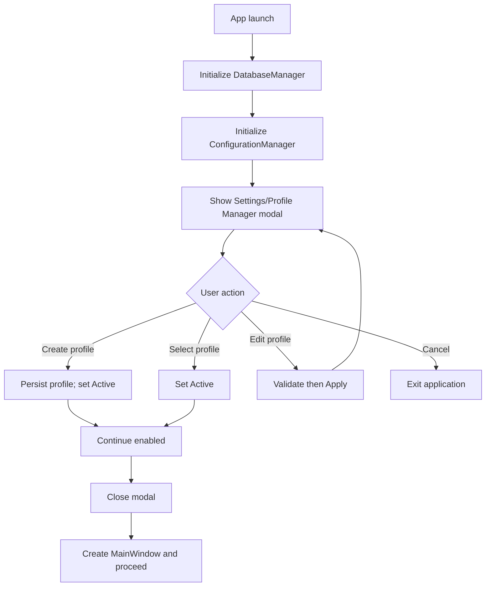
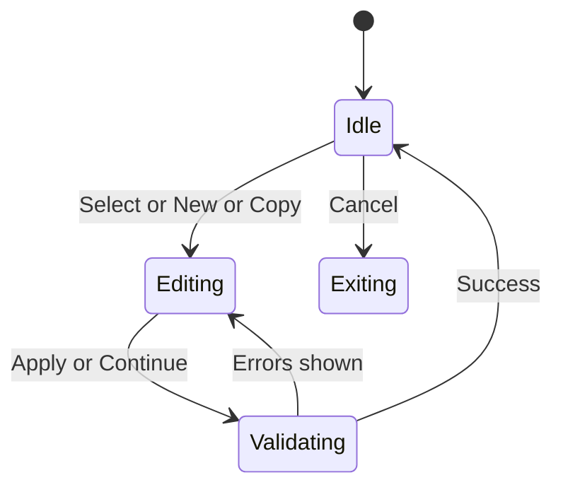

# KDC Image Organizer - UI/UX Design Document

## 1. Design Principles

### 1.1 Core Principles
- **Clarity**: Every element should have a clear purpose
- **Efficiency**: Minimize clicks and navigation for common tasks
- **Consistency**: Uniform design patterns throughout the application
- **Feedback**: Immediate visual feedback for all user actions
- **Flexibility**: Support both novice and power users
- **Accessibility**: Full keyboard navigation and screen reader support

### 1.2 Visual Hierarchy
- Primary actions: Prominent buttons with accent colors
- Secondary actions: Standard buttons with neutral colors
- Destructive actions: Red coloring with confirmation dialogs
- Information density: Progressive disclosure for complex features

## 2. Application Layout

### 2.1 Main Window Structure
```
┌──────────────────────────────────────────────────────────────┐
│ KDC Image Organizer                                    [_][□][X]│
├──────────────────────────────────────────────────────────────┤
│ File  Edit  View  Tools  Help                               │
├──────────────────────────────────────────────────────────────┤
│ [New Scan] [Open] [Save] | [Basic ▼] | [Settings] [Help]    │
├────────────┬─────────────────────────────┬──────────────────┤
│            │                             │                  │
│  Files     │      Results Area           │    Preview       │
│  Panel     │                             │    Panel         │
│            │                             │                  │
│ ┌────────┐ │  ┌─────────────────────┐   │ ┌──────────────┐ │
│ │□ Folder│ │  │■ Group 1 (5 images) │   │ │              │ │
│ │  □ img1│ │  │  □ DSC001.jpg      │   │ │   [Image]    │ │
│ │  □ img2│ │  │  □ DSC002.jpg      │   │ │              │ │
│ └────────┘ │  └─────────────────────┘   │ └──────────────┘ │
│            │                             │                  │
├────────────┴─────────────────────────────┴──────────────────┤
│ Ready | Files: 1,234 | Groups: 23 | Selected: 5 | ████ 45% │
└──────────────────────────────────────────────────────────────┘
```

### 2.2 Panel Specifications

#### 2.2.1 File Browser Panel (Left)
**Purpose**: File and folder selection for scanning

**Components**:
- Tab bar: "Single Set" | "Reference/Target Sets"
- Tree view with checkboxes
- Quick action buttons:
  - Add Files [+]
  - Add Folder [📁]
  - Remove Selected [−]
  - Clear All [🗑]
- Statistics display:
  - Total files selected
  - Total size
  - File type breakdown

**Interactions**:
- Drag and drop files/folders
- Right-click context menu
- Multi-select with Ctrl/Shift
- Space to toggle selection

#### 2.2.2 Results Panel (Center)
**Purpose**: Display similarity detection results

**Components**:
- Toolbar:
  - View mode selector: [Tree] [Grid] [List]
  - Sort dropdown: "By Similarity ▼"
  - Filter button: [Filter ⚙]
  - Export button: [Export 📤]
- Results tree/list:
  - Group headers with statistics
  - Individual file entries
  - Selection checkboxes
  - Action buttons per item

**Group Header Display**:
```
▼ Group 1 - 95% Similar (5 images, 25.3 MB total)
  □ IMG_001.jpg - 5.2 MB - 3024×4032 - 95% match
  □ IMG_001_copy.jpg - 5.2 MB - 3024×4032 - 100% match
  □ IMG_001_edited.jpg - 4.8 MB - 3024×4032 - 92% match
```

#### 2.2.3 Preview Panel (Right)
**Purpose**: Visual preview and comparison

**View Modes**:
1. **Single Preview**:
   - Large image display
   - Zoom controls: [−][Fit][1:1][+]
   - Image info overlay
   
2. **Comparison View**:
   - Side-by-side images
   - Synchronized zoom/pan
   - Difference highlight toggle
   
3. **Grid View**:
   - Thumbnail grid of group
   - Adjustable thumbnail size

**Controls**:
- View mode selector
- Zoom slider
- Full screen button
- Quick actions (rotate, delete, open)

### 2.3 Dialogs and Modals

#### 2.3.1 New Scan Dialog
```
┌─────────────────────────────────────────┐
│     Start New Similarity Scan           │
├─────────────────────────────────────────┤
│                                         │
│ Scan Mode:                              │
│ ○ Single Set (find duplicates within)   │
│ ● Two Sets (find matches between)       │
│                                         │
│ Algorithms:                             │
│ ☑ Perceptual Hash (pHash)              │
│ ☑ Histogram Comparison                  │
│ ☐ Feature Matching (slower)            │
│                                         │
│ Similarity Threshold: [====|----] 85%   │
│                                         │
│ ☐ Advanced Options ▼                    │
│                                         │
│        [Cancel]  [Start Scan]           │
└─────────────────────────────────────────┘
```

#### 2.3.2 Progress Dialog
```
┌─────────────────────────────────────────┐
│         Scanning for Duplicates         │
├─────────────────────────────────────────┤
│                                         │
│ Processing: IMG_2834.jpg                │
│                                         │
│ ████████████████░░░░░░░░░ 68%          │
│                                         │
│ Files: 823 / 1,210                     │
│ Groups found: 15                        │
│ Time elapsed: 00:02:34                 │
│ Time remaining: ~ 00:01:15              │
│                                         │
│ ☐ Close when complete                  │
│                                         │
│     [Run in Background]  [Cancel]       │
└─────────────────────────────────────────┘
```

## 3. Settings Management UI

### 3.1 Settings Dialog Structure
```
┌─────────────────────────────────────────────────────┐
│                Settings                             │
├───────────┬─────────────────────────────────────────┤
│           │                                         │
│ General   │  Profile: [Default Profile ▼] [➕][📋][🗑]│
│ Profiles  │                                         │
│ Pools     │  Profile Name: [___________________]    │
│ Detection │  Description:  [___________________]    │
│ Advanced  │                                         │
│           │  ☑ Set as default profile              │
│           │                                         │
│           │  [Validate Paths] [Test Settings]       │
│           │                                         │
│           │      [Cancel]  [Apply]  [OK]           │
└───────────┴─────────────────────────────────────────┘
```

### 3.2 Profile Management Section
**CRUD Operations:**
- **Create Profile** [➕]: Opens new profile dialog with name validation
- **Clone Profile** [📋]: Copies current profile to new name
- **Delete Profile** [🗑]: Shows confirmation dialog
- **Select Profile**: Dropdown with all available profiles
- **Set Default**: Checkbox to auto-load on startup

**Profile Fields:**
```
┌─────────────────────────────────────────────────────┐
│ Profile Configuration                               │
├─────────────────────────────────────────────────────┤
│ Name: [My Workflow_______________] *Required        │
│ Description: [Optional description text_______]     │
│                                                     │
│ Algorithm Defaults:                                 │
│ ☑ Perceptual Hash (pHash)                          │
│ ☑ Histogram Comparison                              │
│ ☐ SHA-256 Identical File Detection                 │
│                                                     │
│ Default Threshold: [════════|══] 85%               │
│                                                     │
│ [Import Profile...] [Export Profile...]            │
└─────────────────────────────────────────────────────┘
```

### 3.3 Pool Configuration Section
```
┌─────────────────────────────────────────────────────┐
│ Pool Configuration                                  │
├─────────────────────────────────────────────────────┤
│                                                     │
│ Pool Mode:                                         │
│ ● Single Pool (find duplicates within)             │
│ ○ Dual Pool (compare between pools)                │
│                                                     │
│ ┌─── Pool 1 (Primary) ─────────────────────────┐  │
│ │ Include Directories:                         │  │
│ │ [C:\Photos\2024________________] [Browse...] │  │
│ │ [D:\Backup\Images_____________] [Browse...] │  │
│ │ [________________________] [Add] [Remove]    │  │
│ │                                               │  │
│ │ Exclude Directories:                         │  │
│ │ [C:\Photos\2024\temp__________] [Browse...] │  │
│ │                                               │  │
│ │ Include Patterns: *.jpg;*.png;*.heic         │  │
│ │ Exclude Patterns: *_thumb.*;.*.              │  │
│ └───────────────────────────────────────────────┘  │
│                                                     │
│ ┌─── Pool 2 (Target) ──────────────────────────┐  │
│ │ ⚠️ Only available in Dual Pool mode           │  │
│ └───────────────────────────────────────────────┘  │
│                                                     │
│ ☐ Inverse Mode (show Pool 1 files with no match)  │
│                                                     │
│ [Preview Effective Paths...]                       │
└─────────────────────────────────────────────────────┘
```

### 3.4 File Identity Detection Section
```
┌─────────────────────────────────────────────────────┐
│ File Identity Detection                            │
├─────────────────────────────────────────────────────┤
│                                                     │
│ Hash Algorithm: [SHA-256 (Recommended) ▼]          │
│                                                     │
│ ☑ Enable Staged Hashing (Recommended)              │
│   │                                                 │
│   ├─ Pre-filter by file size                      │
│   ├─ Partial hash size: [256] KB per end          │
│   └─ Full hash only for candidates                │
│                                                     │
│ Cache Invalidation Triggers:                       │
│ ☑ File path changed                                │
│ ☑ File size changed                                │
│ ☑ Modification time changed                        │
│ ☑ Inode changed (where available)                  │
│                                                     │
│ [Test Hash Settings...]                            │
└─────────────────────────────────────────────────────┘
```

### 3.5 Settings Validation Features

#### 3.5.1 Path Validation Dialog
```
┌─────────────────────────────────────────────────────┐
│         Path Validation Results                    │
├─────────────────────────────────────────────────────┤
│                                                     │
│ ✅ C:\Photos\2024 (5,234 files)                    │
│ ✅ D:\Backup\Images (2,156 files)                  │
│ ⚠️ E:\OldPhotos (not accessible)                   │
│ ❌ F:\Missing (path does not exist)                │
│                                                     │
│ Total accessible files: 7,390                      │
│ Total size: 45.6 GB                               │
│                                                     │
│ [Fix Issues] [Ignore Warnings] [OK]               │
└─────────────────────────────────────────────────────┘
```

#### 3.5.2 Hash Settings Test Dialog
```
┌─────────────────────────────────────────────────────┐
│        Test Hash Settings                          │
├─────────────────────────────────────────────────────┤
│                                                     │
│ Testing on 10 sample files...                      │
│                                                     │
│ ████████████████████████ 100%                      │
│                                                     │
│ Results:                                           │
│ ├─ Average hash time: 0.23s per file              │
│ ├─ Partial hash saved: 78% of time                │
│ ├─ Memory usage: 12 MB peak                       │
│ └─ No hash collisions detected                    │
│                                                     │
│ Recommendation: Current settings are optimal ✅     │
│                                                     │
│ [View Details] [Run Again] [Close]                │
└─────────────────────────────────────────────────────┘
```

#### 3.5.3 Preview Effective Paths Dialog
```
┌─────────────────────────────────────────────────────┐
│      Preview Effective File List                   │
├─────────────────────────────────────────────────────┤
│                                                     │
│ After applying includes/excludes:                  │
│                                                     │
│ Pool 1: 5,234 files                               │
│ ├─ C:\Photos\2024\IMG_001.jpg                     │
│ ├─ C:\Photos\2024\IMG_002.jpg                     │
│ ├─ C:\Photos\2024\vacation\DSC_001.jpg            │
│ └─ ... (showing first 100)                        │
│                                                     │
│ Pool 2: 2,156 files                               │
│ ├─ D:\Backup\Images\2023\photo1.jpg               │
│ └─ ... (showing first 100)                        │
│                                                     │
│ Excluded: 423 files                               │
│                                                     │
│ [Export List...] [Refresh] [Close]                │
└─────────────────────────────────────────────────────┘
```

### 3.6 Settings GUI Behaviors

#### Profile Management Behaviors:
1. **Create New Profile**:
   - Validate name is unique
   - Cannot use reserved characters
   - Optionally clone from existing profile

2. **Delete Profile**:
   - Show confirmation dialog
   - Cannot delete default profile while it's active
   - Warn if profile has recent scan sessions

3. **Set as Default**:
   - Only one profile can be default
   - Default profile loads on application startup
   - Visual indicator (star icon) for default profile

#### Validation Behaviors:
1. **On Save**:
   - Validate all paths exist
   - Warn about inaccessible paths
   - Check disk space for cache requirements

2. **Real-time Feedback**:
   - Red border for invalid fields
   - Tooltips with validation errors
   - Enable/disable Save based on validity

3. **Test Functions**:
   - Non-blocking test operations
   - Show progress during tests
   - Provide actionable recommendations

## 4. User Workflows

### 4.1 Basic Duplicate Scan Workflow
1. **Launch**: User opens application
2. **Select**: Drag folder to file panel or click "Add Folder"
3. **Configure**: Click "New Scan" (uses default settings in basic mode)
4. **Process**: Progress dialog shows scanning
5. **Review**: Results appear in center panel
6. **Preview**: Click group to see preview
7. **Select**: Check files to delete
8. **Action**: Click "Delete Selected" with confirmation
9. **Complete**: Success notification

### 3.2 Advanced Comparison Workflow
1. **Mode Switch**: Toggle to "Advanced" mode
2. **Setup Reference**: Add reference images to first set
3. **Setup Target**: Add target images to second set
4. **Configure**: 
   - Select specific algorithms
   - Adjust threshold
   - Set processing options
5. **Execute**: Start comparison
6. **Filter Results**: Apply filters to narrow results
7. **Batch Operations**: Select multiple results for operation
8. **Export**: Export results to CSV/JSON

## 4. Visual Design Specifications

### 4.1 Color Palette

#### Light Theme
```css
--primary: #0066CC;        /* Primary actions */
--primary-hover: #0052A3;  /* Hover state */
--secondary: #6C757D;      /* Secondary actions */
--success: #28A745;        /* Success states */
--warning: #FFC107;        /* Warnings */
--danger: #DC3545;         /* Destructive actions */
--background: #FFFFFF;     /* Main background */
--surface: #F8F9FA;        /* Panel background */
--border: #DEE2E6;         /* Borders */
--text-primary: #212529;   /* Primary text */
--text-secondary: #6C757D; /* Secondary text */
```

#### Dark Theme
```css
--primary: #4A9EFF;        /* Primary actions */
--primary-hover: #3A8EEF;  /* Hover state */
--secondary: #8B959E;      /* Secondary actions */
--success: #3FB950;        /* Success states */
--warning: #D29922;        /* Warnings */
--danger: #F85149;         /* Destructive actions */
--background: #0D1117;     /* Main background */
--surface: #161B22;        /* Panel background */
--border: #30363D;         /* Borders */
--text-primary: #F0F6FC;   /* Primary text */
--text-secondary: #8B949E; /* Secondary text */
```

### 4.2 Typography
```css
/* Font Stack */
font-family: -apple-system, BlinkMacSystemFont, "Segoe UI", 
             Roboto, "Helvetica Neue", Arial, sans-serif;

/* Font Sizes */
--font-size-h1: 24px;
--font-size-h2: 20px;
--font-size-h3: 16px;
--font-size-body: 14px;
--font-size-small: 12px;

/* Font Weights */
--font-weight-normal: 400;
--font-weight-medium: 500;
--font-weight-bold: 600;
```

### 4.3 Spacing System
```css
/* Spacing Scale (4px base) */
--space-xs: 4px;
--space-sm: 8px;
--space-md: 16px;
--space-lg: 24px;
--space-xl: 32px;
--space-xxl: 48px;
```

### 4.4 Component Styling

#### Buttons
```css
/* Primary Button */
.btn-primary {
    background: var(--primary);
    color: white;
    padding: 8px 16px;
    border-radius: 4px;
    border: none;
    font-weight: 500;
    cursor: pointer;
    transition: all 0.2s;
}

.btn-primary:hover {
    background: var(--primary-hover);
    transform: translateY(-1px);
    box-shadow: 0 2px 8px rgba(0,0,0,0.15);
}

/* Danger Button */
.btn-danger {
    background: var(--danger);
    /* Additional styling with confirmation */
}
```

## 5. Interaction Design

### 5.1 Mouse Interactions
- **Hover**: Visual feedback on all interactive elements
- **Click**: Immediate response with visual confirmation
- **Drag**: Ghost image for drag operations
- **Right-click**: Context menus for quick actions
- **Double-click**: Open/expand actions

### 5.2 Keyboard Shortcuts
```
Global:
Ctrl+N          - New scan
Ctrl+O          - Open results
Ctrl+S          - Save results
Ctrl+Q          - Quit application
F1              - Help
F11             - Full screen

Navigation:
Tab             - Next element
Shift+Tab       - Previous element
Arrow Keys      - Navigate lists/trees
Enter           - Activate/expand
Space           - Toggle selection

View:
Ctrl+1          - Tree view
Ctrl+2          - Grid view
Ctrl+3          - List view
Ctrl+Plus       - Zoom in
Ctrl+Minus      - Zoom out
Ctrl+0          - Reset zoom

Selection:
Ctrl+A          - Select all
Ctrl+Shift+A    - Deselect all
Ctrl+Click      - Toggle selection
Shift+Click     - Range selection

Actions:
Delete          - Delete selected
Ctrl+Z          - Undo
Ctrl+Y          - Redo
```

### 5.3 Touch Gestures (Future)
- **Pinch**: Zoom in/out on images
- **Swipe**: Navigate between images
- **Long press**: Context menu
- **Two-finger scroll**: Pan large images

## 6. Responsive Behavior

### 6.1 Window Resizing
- **Minimum size**: 1024×768 pixels
- **Panel behavior**:
  - Collapsible below 1280px width
  - Stack vertically below 768px height
- **Toolbar adaptation**:
  - Icon-only mode below 1440px
  - Overflow menu for hidden items

### 6.2 High DPI Support
- Vector icons for all UI elements
- Scalable fonts with proper hinting
- Resolution-independent rendering
- Per-monitor DPI awareness

## 7. Accessibility Features

### 7.1 Screen Reader Support
- Semantic HTML structure
- ARIA labels for all controls
- Meaningful alt text for images
- Keyboard navigation announcements

### 7.2 Visual Accessibility
- High contrast mode support
- Configurable font sizes
- Color blind friendly palettes
- Focus indicators for keyboard navigation

### 7.3 Motor Accessibility
- Large click targets (minimum 44×44px)
- Keyboard alternatives for all actions
- Configurable double-click speed
- Sticky keys support

## 8. Animation and Transitions

### 8.1 Animation Principles
- **Purpose**: Animations should guide, not distract
- **Duration**: 200-300ms for most transitions
- **Easing**: Use ease-out for entrances, ease-in for exits

### 8.2 Common Animations
```css
/* Panel slide */
@keyframes slideIn {
    from { transform: translateX(-100%); }
    to { transform: translateX(0); }
}

/* Fade */
@keyframes fadeIn {
    from { opacity: 0; }
    to { opacity: 1; }
}

/* Progress */
@keyframes progress {
    from { width: 0%; }
    to { width: var(--progress); }
}
```

## 9. Error States and Feedback

### 9.1 Error Display
- **Inline errors**: Red text below fields
- **Toast notifications**: Temporary alerts
- **Modal dialogs**: Critical errors
- **Status bar**: Persistent warnings

### 9.2 Loading States
- **Skeleton screens**: For initial loads
- **Progress bars**: For determinate operations
- **Spinners**: For indeterminate operations
- **Subtle animations**: Keep UI responsive

### 9.3 Empty States
- **Helpful messaging**: Guide user to action
- **Visual interest**: Icons or illustrations
- **Clear CTAs**: What to do next

## 10. Platform-Specific Considerations

### 10.1 Windows
- Native title bar with system controls
- Windows snap support
- Jump list integration
- Native file dialogs

### 10.2 macOS
- Native menu bar
- Dock integration
- Full screen mode support
- Native notifications

### 10.3 Linux
- GTK/Qt theme integration
- Desktop environment compliance
- Standard freedesktop.org compliance
- Package manager integration

## 11. Mockup Descriptions

### 11.1 Main Application State - Initial
```
The application opens with an empty state showing:
- Welcome message in center panel
- "Get Started" guide with numbered steps
- Prominent "Add Files" or "Add Folder" buttons
- Sample workflow animation
```

### 11.2 Main Application State - Processing
```
During scanning:
- File panel shows selected files/folders
- Center panel displays real-time results as found
- Progress bar in status bar
- Non-blocking UI allows result preview
- Cancel button always accessible
```

### 11.3 Main Application State - Results
```
After scanning:
- Groups displayed hierarchically
- Color coding for similarity levels
- Preview panel shows selected group
- Action toolbar becomes active
- Statistics summary in status bar
```

## 12. User Testing Scenarios

### 12.1 First-Time User
1. Can user find how to add files?
2. Is the scan process intuitive?
3. Are results understandable?
4. Can user safely delete duplicates?

### 12.2 Power User
1. Can shortcuts speed up workflow?
2. Are batch operations efficient?
3. Is configuration accessible?
4. Can complex filters be applied?

### 12.3 Accessibility User
1. Is keyboard navigation complete?
2. Are screen readers supported?
3. Is contrast sufficient?
4. Are targets large enough?
## 13. Settings/Profile Manager

Status: Planned

Purpose
- Provide a first-launch and every-launch modal manager to create, copy, edit, delete, search, and select an active settings profile before proceeding to the main application UI.
- Guarantee that the application runs with a valid, explicitly chosen active profile, reducing ambiguity and preventing misconfigured scans.

Startup Modal Behavior
- The Settings/Profile Manager is shown as a blocking modal on application startup before creating the main window.
- The application continues only after a valid active profile is created/selected and saved.
- If the dialog is canceled while no active profile exists (fresh install, zero profiles), the application exits immediately.
- If the dialog is canceled but an active profile exists, policy is to still exit to enforce explicit confirmation each run (canonical decision; see [docs/roo/canonical-decisions.md](docs/roo/canonical-decisions.md:1)).

References
- Application bootstrap: [img_app/img_app/app.py](img_app/img_app/app.py:1)
- Configuration manager: [src/pk_py_lib/core/configuration.py](src/pk_py_lib/core/configuration.py:1)
- Profile switching: [ConfigurationManager.switch_profile()](src/pk_py_lib/core/configuration.py:399)
- Proposed profile API: [src/pk_py_lib/api/settings_profiles.py](src/pk_py_lib/api/settings_profiles.py:1)
- Proposed profile core: [src/pk_py_lib/core/settings_profiles.py](src/pk_py_lib/core/settings_profiles.py:1)
- Proposed GUI dialog: [src/pk_py_lib/gui/settings/profile_manager.py](src/pk_py_lib/gui/settings/profile_manager.py:1)
- App integration widget: [img_app/img_app/widgets/settings_manager.py](img_app/img_app/widgets/settings_manager.py:1)

13.1 User Flows

A) Zero Profiles (first launch)
1) Show modal Settings/Profile Manager.
2) Display empty-state on List pane with CTA Create Profile.
3) Launch inline create form on Detail pane (name required). Validation: unique, 1–64 chars, allowed: letters, numbers, spaces, hyphen, underscore.
4) On Save:
   - Persist profile
   - Set as Active
   - Optionally Set as Default
5) Continue button becomes enabled. User clicks Continue to proceed to main app.

B) Existing Profiles, none Active (meta.active_profile_id missing)
1) Show modal with profiles listed, none Active indicated.
2) Require selection or creation; Continue disabled until a valid Active is set.
3) User can:
   - Select a profile and press Set Active → Continue enabled
   - Create new or Copy existing → edit fields → Save → Set Active → Continue
4) Press Continue to proceed.

C) Existing Active Profile
1) Show modal with the currently Active profile pre-selected and Continue enabled.
2) User may:
   - Press Continue immediately to proceed
   - Manage profiles: edit, copy, delete (subject to constraints)
   - Change Active to a different profile, then Continue

D) Edit Profile
- Edit fields in Detail pane with live validation.
- Save applies changes; unsaved changes prompt on navigation away or dialog close.

E) Delete Profile
- Require confirmation.
- Disallow deleting Active profile; require switching Active first.
- Disallow deleting the last remaining profile; require creating a replacement first.

F) Copy Profile
- Copy creates New Profile with fields cloned; prompts for unique name; focuses Detail pane for edits.

13.2 Layout and Interaction

Two-pane list/detail layout with global toolbar:

```
┌──────────────────────────────────────────────────────────────────────────────┐
│ Settings Profiles                                                     [X]    │
├───────────────┬──────────────────────────────────────────────────────────────┤
│ Profiles      │ Details                                                      │
│ ───────────── │ ──────────────────────────────────────────────────────────── │
│ [🔎 Search]   │ Profile Info                                                 │
│ ┌───────────┐ │ Name: [__________________________] *                        │
│ │★ Default  │ │ Description: [______________________________]               │
│ │● Active   │ │                                                             │
│ │  Default  │ │ Options                                                     │
│ │           │ │ ☐ Set as default    ⦿ Set active                            │
│ │  Travel   │ │                                                             │
│ │  Studio   │ │ Algorithm Defaults                                          │
│ │  Archive  │ │ [ phash ☑ ] [ histogram ☑ ] [ feature ☐ ]                   │
│ └───────────┘ │ Threshold: [═══════|═══] 85%                                │
│ [New][Copy]   │                                                             │
│ [Delete]      │ Paths                                                       │
│               │ Pool mode: [ Single ▼ ]   ☐ Inverse (dual only)             │
│               │ Pool 1 include dirs: [ .. ] [+] [−]                         │
│               │ Excludes: [ .. ]                                            │
│               │                                                             │
│               │ [Validate Paths] [Preview Effective] [Test Hash Settings]    │
│               │                                                             │
│               │ [Cancel] [Apply] [Continue ▶]                                │
├───────────────┴──────────────────────────────────────────────────────────────┤
│ Status: Ready                                                                │
└──────────────────────────────────────────────────────────────────────────────┘
```

Left List Pane
- Search/filter updates list dynamically (case-insensitive substring on name and description).
- Badges:
  - ★ indicates Default profile (is_default=1)
  - ● indicates Active profile (matches meta.active_profile_id)
- Actions:
  - New: opens a blank Detail form (or template chooser if extended later)
  - Copy: clones selected into Detail form with editable name
  - Delete: deletes selected profile (confirmation), disabled for Active or only remaining profile

Right Detail Pane
- Editable fields with live validation and inline errors.
- Options:
  - Set active: marks this as the Active profile (writes meta.active_profile_id and [ConfigurationManager.switch_profile()](src/pk_py_lib/core/configuration.py:399))
  - Set as default: toggles profiles.is_default (exclusive)
- Validation utilities:
  - Validate Paths: checks existence/access and counts files (non-blocking UX with progress)
  - Preview Effective: shows effective include/exclude results with a cap (100 items)
  - Test Hash Settings: runs quick test against sample files
- Buttons:
  - Cancel: aborts and exits app (startup policy)
  - Apply: saves changes but stays in dialog
  - Continue: enabled only when there is a valid Active profile

13.3 UI States and Rules

Button/Control States
- Continue enabled when: Active profile exists and all required fields in the currently edited profile (if it is Active) are valid.
- Delete disabled when:
  - The selected profile is Active; or
  - Only one profile exists.
- Set active disabled when current edits are invalid; enabled once validation passes.
- Set as default toggles exclusivity; changes are persisted on Apply/Continue.
- Apply disabled if no changes; enabled when dirty.

Validation Rules
- Name: required; unique (case-insensitive); 1–64 chars; allowed [A–Z a–z 0–9 _ - and space].
- Threshold: 0–100 UI percent maps to 0.0–1.0 internal (see [docs/roo/canonical-decisions.md](docs/roo/canonical-decisions.md:148) and [src/pk_py_lib/core/utils/thresholds.py](src/pk_py_lib/core/utils/thresholds.py:1)).
- Paths: warn if missing/inaccessible; do not block saving unless strict mode is enabled.
- Default/Active:
  - Exactly one Default profile can exist (is_default=1).
  - Exactly one Active profile at a time, stored under meta.active_profile_id (see decisions).
  - Converting Default does not implicitly change Active; user must explicitly Set active.

Non-destructive Behaviors
- Edits are local until Apply/Continue.
- Delete uses confirmation; cannot delete Active nor last profile.
- Copy produces a distinct profile; original unmodified.

13.4 Event and State Flows

Startup flow (modal first)


Top-level interactions


13.5 Rationale

- Enforcing an explicit Active profile reduces configuration drift and enables deterministic processing.
- Separation of Default vs Active:
  - Default is a preference for future runs.
  - Active is the current session’s explicitly chosen profile.
- Modal-first design ensures dependent subsystems (cache size, hashing policy, UI defaults) can be initialized according to the chosen profile before the main window initializes. See bootstrap notes in [img_app/img_app/app.py](img_app/img_app/app.py:60) and DB init via [DatabaseManager.initialize()](src/pk_py_lib/core/database.py:405).

13.6 Accessibility and Keyboarding

- Full keyboard access:
  - Tab order from List to Detail fields to action buttons.
  - List selection with Arrow keys; Enter focuses Detail name field.
  - Shortcuts: Alt+N New, Alt+C Copy, Alt+D Delete, Alt+A Apply, Alt+K Continue, Esc Cancel.
- Screen reader labels on all form inputs and buttons; meaningful ARIA-like descriptions.

13.7 Next Steps
- Implement reusable dialog widget [src/pk_py_lib/gui/settings/profile_manager.py](src/pk_py_lib/gui/settings/profile_manager.py:1) with the two-pane layout and behaviors described.
- Implement library core [src/pk_py_lib/core/settings_profiles.py](src/pk_py_lib/core/settings_profiles.py:1) to encapsulate profile CRUD, validation, meta.active_profile_id, and default handling.
- Implement API adapter [src/pk_py_lib/api/settings_profiles.py](src/pk_py_lib/api/settings_profiles.py:1) with methods documented in API specs.
- Integrate dialog at startup in [img_app/img_app/app.py](img_app/img_app/app.py:60) prior to creating the main window.
- Add tests using pytest-qt for dialog behaviors (zero profiles, active selection, delete constraints).
<!-- Settings Manager UI finalization -->

## 13A. Settings/Profile Manager — Finalized UI, States, and Acceptance Criteria

Status: Approved

Path update and scope
- Supersedes earlier references to `src/pk_py_lib/gui/settings/profile_manager.py`.
- Canonical reusable dialog path is now:
  - [src/pk_py_lib/gui/settings_manager/dialog.py](src/pk_py_lib/gui/settings_manager/dialog.py:1)
  - Controller, models, validators co-located under `src/pk_py_lib/gui/settings_manager/` (see technical architecture addendum 11A).
- The dialog consumes the library API [SettingsProfilesAPI](src/pk_py_lib/api/settings_profiles.py:69) and never touches the DB directly.

UI states
- Empty state (no profiles)
  - List pane shows guidance; primary CTA “Create profile”
  - Detail pane shows inline create form; name validation immediate via [SettingsProfilesAPI.validate_name()](src/pk_py_lib/api/settings_profiles.py:295)
- List state (>=1 profile)
  - List pane with search/filter; badges:
    - ★ Default (is_default=1)
    - ● Active (matches meta.active_profile_id)
  - Toolbar: New, Copy, Delete
- Edit state (detail form)
  - Fields bound to JSON payload in `settings_profiles.data`
  - Inline validation; Apply persists via [SettingsProfilesAPI.update()](src/pk_py_lib/api/settings_profiles.py:191)
  - Set Active and Set Default actions wired to [SettingsProfilesAPI.set_active()](src/pk_py_lib/api/settings_profiles.py:260) and [SettingsProfilesAPI.set_default()](src/pk_py_lib/api/settings_profiles.py:276)

Startup modal contract
- Runs as a blocking modal before main window creation (see integration helper under [img_app/img_app/widgets/settings_manager.py](img_app/img_app/widgets/settings_manager.py:1))
- Continue is enabled only when a valid Active profile exists; Cancel exits app per policy (see decisions)

Key interactions (library API-backed)
- Create profile: [SettingsProfilesAPI.create()](src/pk_py_lib/api/settings_profiles.py:172)
- Copy profile: [SettingsProfilesAPI.copy()](src/pk_py_lib/api/settings_profiles.py:230)
- Update profile: [SettingsProfilesAPI.update()](src/pk_py_lib/api/settings_profiles.py:191)
- Delete profile: [SettingsProfilesAPI.delete()](src/pk_py_lib/api/settings_profiles.py:214) — disabled when Active or last remaining
- Set Active: [SettingsProfilesAPI.set_active()](src/pk_py_lib/api/settings_profiles.py:260)
- Set Default: [SettingsProfilesAPI.set_default()](src/pk_py_lib/api/settings_profiles.py:276)
- List and highlight Active: [SettingsProfilesAPI.list_profiles()](src/pk_py_lib/api/settings_profiles.py:109)
- Name validation: [SettingsProfilesAPI.validate_name()](src/pk_py_lib/api/settings_profiles.py:295)

UX details
- Search/filter is case-insensitive substring on name (and optional description if present in payload)
- Name entry uses immediate validation with inline error text; Save/Apply disabled when invalid
- Dangerous actions (Delete) require confirmation with explicit invariant hints
- Non-blocking “Validate Paths” and “Preview Effective” hooks are optional for MVP; when present, they must not block core CRUD flows

Keyboard and accessibility
- Shortcuts: Alt+N (New), Alt+C (Copy), Alt+D (Delete), Alt+A (Apply), Alt+K (Continue), Esc (Cancel)
- Focus order: List → Detail → Actions
- Screen reader: accessible names for fields and badges; announce validation errors

Acceptance criteria (UI)
- First launch (no profiles): Create → Save with valid name → Continue becomes enabled
- Existing profiles but no active: Selecting a profile and hitting Set Active enables Continue
- Existing active profile: Continue enabled on open; CRUD operations available; Delete disabled if selected is Active or when only one profile exists
- Name rules enforced: ^[A-Za-z0-9 _-]{1,64}$; collisions surface INVALID_CONFIG via API; UI shows inline error
- Set Default reflects exclusivity immediately in list badges
- Continue closes the dialog only when a valid Active profile exists
- Cancel exits the app regardless of prior active (policy)

References
- Core invariants: [SettingsProfilesManager.delete_profile()](src/pk_py_lib/core/settings_profiles.py:439), [SettingsProfilesManager.set_default_profile()](src/pk_py_lib/core/settings_profiles.py:574)
- Active persistence: [SettingsProfilesManager.set_active_profile()](src/pk_py_lib/core/settings_profiles.py:541) writes meta.active_profile_id and triggers on_active_change
- Startup integration: [img_app/img_app/app.py](img_app/img_app/app.py:60) and helper [img_app/img_app/widgets/settings_manager.py](img_app/img_app/widgets/settings_manager.py:1)
