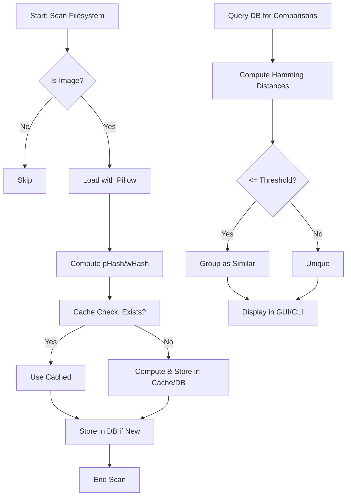

# Image Similarity Detection Design: pHash and wHash Implementation

## Overview

The purpose of this design document is to define the process and implementation for detecting visually similar images in the pk-py-lib library, extending beyond exact duplicate detection (which relies on cryptographic hashes like MD5 or SHA-256 in the existing duplicate file finder). This feature targets a robust similar image finder for large image collections, supporting use cases such as identifying edited, resized, cropped, or slightly modified versions of images (e.g., memes, watermarked photos, or variants in photo libraries).

Key algorithms:
- **pHash (Perceptual Hash via DCT)**: Uses Discrete Cosine Transform (DCT) on a grayscale image to extract low-frequency components, creating a hash robust to minor changes in brightness, contrast, or compression. It is computationally efficient and suitable for general perceptual similarity.
- **wHash (Wavelet Hash via DWT)**: Employs Discrete Wavelet Transform (DWT) to capture multi-resolution features, providing better invariance to scaling, rotation, and translation compared to pHash.

High-level workflow:
1. **Image Loading**: Use Pillow to load and resize images to a standard size (e.g., 32x32 for pHash, 8x8 for wHash).
2. **Hash Computation**: Apply imagehash library to generate fixed-length hashes (typically 64-bit, represented as 16 hex characters).
3. **Storage**: Persist hashes in the database, keyed by image ID and algorithm.
4. **Comparison**: Compute Hamming distance between hashes; group images where distance ≤ configurable threshold (e.g., 10 for pHash, indicating high similarity).
5. **Output**: Integrate with CLI/GUI for displaying groups with similarity scores.

This extends the core duplicate finder by introducing fuzzy matching, with thresholds tunable via settings. For reference, see [img-app-implementation-guide.md](docs/roo/img-app-implementation-guide.md) for existing duplicate logic integration.

## Algorithm Details

### pHash Mechanism
pHash focuses on perceptual similarity by emphasizing low-frequency image content:
- **Inputs**: Image path or PIL Image object; parameters include `hash_size` (default 8, yielding 64-bit hash), `highfreq_factor` (default 4, for DCT coefficient selection).
- **Process**:
  1. Convert to grayscale and resize to `hash_size * 2` x `hash_size * 2` (e.g., 16x16).
  2. Apply DCT to get frequency coefficients.
  3. Retain the top-left `hash_size` x `hash_size` low-frequency block.
  4. Compute average DCT value (excluding DC component), threshold bits (1 if > average, 0 otherwise) to form the hash.
- **Outputs**: 64-bit hash as hexadecimal string (16 chars).
- **Pros**: Fast, robust to JPEG compression, color/brightness shifts; good for near-identical images.
- **Cons**: Less effective for large geometric transformations (e.g., heavy rotation).

Parameters in imagehash.phash: `highfreq_threshold=10` (bits above this frequency are zeroed for noise reduction).

### wHash Mechanism
wHash uses wavelet decomposition for hierarchical feature extraction:
- **Inputs**: Image path or PIL Image; parameters include `hash_size` (default 8), `wavelet` (default 'db1' for Daubechies wavelet), `mode` (default 'constant' for edge handling).
- **Process**:
  1. Convert to grayscale and resize to `hash_size * 8` x `hash_size * 8` (e.g., 64x64) to leverage wavelet multi-resolution.
  2. Apply 2D DWT recursively (levels based on size).
  3. Compute mean of approximation coefficients (low-frequency subband).
  4. Threshold wavelet coefficients against the mean to form bits.
- **Outputs**: 64-bit hash as hexadecimal string.
- **Pros**: Handles scale/rotation better than pHash; useful for detecting similar images under affine transformations.
- **Cons**: Slower due to wavelet computation; requires PyWavelets dependency.

Both algorithms use Hamming distance for comparison: count differing bits (0-64 range; lower = more similar). Thresholds: pHash ~5-15 (exact=0, similar~10), wHash ~8-20.

Both are chosen for complementarity: pHash as default for speed, wHash for advanced scenarios. Optional color hashing: Compute separate hashes for RGB channels and concatenate or average.

## Implementation Strategy

Introduce a new module `src/pk_py_lib/core/image/similarity.py` to encapsulate hash computation and comparison logic, ensuring modularity and reusability (functions can be imported by CLI, GUI, or other libs).

Key functions:

```python
def compute_phash(image_path: str, hash_size: int = 8, highfreq_factor: int = 4) -> str:
    """
    Compute perceptual hash using DCT.

    Args:
        image_path (str): Path to the image file.
        hash_size (int): Size of the hash matrix (default 8, 64 bits).
        highfreq_factor (int): Factor for high-frequency cutoff (default 4).

    Returns:
        str: Hexadecimal hash string (16 chars).

    Raises:
        ValueError: If image cannot be loaded or is not supported.
        IOError: For file access issues.

    Example:
        >>> compute_phash("path/to/image.jpg")
        'a1b2c3d4e5f67890'
    """
    # Use imagehash.phash with PIL.Image.open(image_path)
    # Handle exceptions with logging
    pass
```

```python
def compute_whash(image_path: str, hash_size: int = 8, wavelet: str = 'db1', mode: str = 'constant') -> str:
    """
    Compute wavelet hash using DWT.

    Args:
        image_path (str): Path to the image file.
        hash_size (int): Size of the hash matrix (default 8, 64 bits).
        wavelet (str): Wavelet family (default 'db1').
        mode (str): DWT mode (default 'constant').

    Returns:
        str: Hexadecimal hash string (16 chars).

    Raises:
        ValueError: If image cannot be loaded or wavelet is invalid.
        ImportError: If PyWavelets not available.

    Example:
        >>> compute_whash("path/to/image.jpg")
        '1234567890abcdef'
    """
    # Use imagehash.whash with PIL.Image.open(image_path)
    # Error handling as above
    pass
```

```python
def compare_hashes(hash1: str, hash2: str, algorithm: str = 'phash', threshold: int = 10) -> tuple[float, bool]:
    """
    Compare two hashes using Hamming distance.

    Args:
        hash1 (str): First hex hash.
        hash2 (str): Second hex hash.
        algorithm (str): 'phash' or 'whash' (affects default threshold).
        threshold (int): Max distance for similarity (default 10).

    Returns:
        tuple[float, bool]: (distance, is_similar).

    Example:
        >>> distance, similar = compare_hashes('a1b2c3d4e5f67890', 'a1b2c3d4e5f67891')
        >>> (1.0, True)
    """
    # Convert hex to binary, count differing bits
    # Use bin(int(h, 16)).count('1') for XOR
    pass
```

- **Dependencies**: Leverage `imagehash` for core computation, `Pillow` for image loading. Error handling: Catch `PIL.UnidentifiedImageError` for unsupported formats, log via [core/logging/logger.py](src/pk_py_lib/core/logging/logger.py) with file path and params.
- **Batch Processing**: Function like `compute_hashes_batch(image_paths: list[str], algorithm: str, **kwargs) -> dict[str, str]` for efficiency, with progress via logger.info.
- **Color Support**: Optional param `mode='color'` to average RGB phash/whash.

Integration with existing: Import from `core.image` for image validation.

## Data Model and Storage

Extend the database schema in [core/database.py](src/pk_py_lib/core/database.py) to support similarity hashes without breaking existing exact duplicate tables.

- **New Table**: `image_hashes`
  - `id`: Primary key (auto-increment int).
  - `image_id`: Foreign key to `images.id` (int, not null).
  - `algorithm`: Enum('phash', 'whash') (str, not null).
  - `hash_value`: Hex string (varchar(16), not null).
  - `computed_at`: Timestamp (datetime, default now()).
  - Indexes: On `image_id, algorithm`, `hash_value` (for fast similarity queries).

Schema extension example (SQLAlchemy-style stub):
```python
class ImageHash(Base):
    __tablename__ = 'image_hashes'
    id = Column(Integer, primary_key=True)
    image_id = Column(Integer, ForeignKey('images.id'), nullable=False)
    algorithm = Column(Enum('phash', 'whash'), nullable=False)
    hash_value = Column(String(16), nullable=False)
    computed_at = Column(DateTime, default=func.now())
```

- **Cache Integration** ([core/cache.py](src/pk_py_lib/core/cache.py)): Use a dict-based or TTL cache (e.g., via `cachetools`). Key: f"{image_path}:{algorithm}", value: hash str, TTL=86400s (1 day) for recompute avoidance.
- **Settings** ([core/settings_schema.py](src/pk_py_lib/core/settings_schema.py), [settings_profiles.py](src/pk_py_lib/core/settings_profiles.py)): Add section:
  ```json
  {
    "similarity": {
      "enabled_algorithms": ["phash", "whash"],
      "phash_threshold": 10,
      "whash_threshold": 12,
      "max_distance": 20,
      "compute_on_scan": true
    }
  }
  ```
  Load via profiles for user-specific tuning.

## Integration

- **Filesystem Traversal** ([core/filesystem/traversal.py](src/pk_py_lib/core/filesystem/traversal.py)): Add optional flag `compute_similarity_hashes=True`. During scan, if image file (via `is_image_file`), call `compute_phash`/`compute_whash` and store in DB via `database.session.add(ImageHash(...))`. Batch inserts for efficiency.
- **Duplicate Manager** ([img_app/widgets/duplicate_manager.py](img_app/img_app/widgets/duplicate_manager.py)): Extend to "similarity_mode". Query: 
  ```python
  # Pseudocode
  def find_similar_groups(algorithm: str, threshold: int):
      hashes = db.query(ImageHash).filter_by(algorithm=algorithm).all()
      # Compute pairwise distances or use efficient indexing (e.g., LSH for large sets)
      # Group where distance <= threshold, join with images table
      return groups  # list of dicts with image_paths, scores
  ```
  GUI: Add tab/radio for similarity, display tree/list with scores (Hamming dist), preview thumbnails, actions (delete/move).
- **Error Handling**: In all functions, raise custom `ImageSimilarityError(Exception)` with details (path, algorithm, traceback). Log to console/GUI via logger. Handle non-images by skipping with warning.
- **Testing**: Unit tests in `tests/test_image_similarity.py`:
  - Test hash computation on sample images (assert len(hash)==16).
  - Comparison: Assert distance=0 for identical, ~10 for similar.
  - Edges: Corrupted files (raises ValueError), non-images (skip/log), zero-size images.

Cross-reference: Align with [img-app-implementation-guide.md](docs/roo/img-app-implementation-guide.md) for DB query patterns.

### Workflow Diagram


## Performance and Extensibility

For PoC, prioritize simplicity: Sequential batch processing (no parallelization yet). For large collections (10k+ images), expect ~1-5s per image for wHash (pHash faster). Use logging for progress: `logger.info(f"Processed {i}/{total} images")`.

Extensibility:
- **Parallelization**: Future use `concurrent.futures.ThreadPoolExecutor` for hash computation (IO-bound).
- **Advanced**: Integrate ML (e.g., Torch/TensorFlow for CLIP embeddings) as alternative "deep_hash" algorithm.
- **Threshold Tuning**: Expose via settings; suggest empirical testing (e.g., threshold=0 for exact, 5 for near-duplicates).
- **Scalability**: For millions, consider approximate nearest neighbors (e.g., Annoy/FAISS) for distance queries instead of brute-force.

This design ensures reusability (e.g., `compute_phash` callable standalone) and flexibility for PoC evolution.

### Group Model and Metadata Processing

To support hierarchical GUI display and rich statistics, new dataclasses are introduced in [src/pk_py_lib/gui/models.py](src/pk_py_lib/gui/models.py):

- **ImageData**: Holds individual image details for tree child items.
  - `path` (str): Full file path.
  - `size` (int): File size in bytes.
  - `resolution` (str): Dimensions "WxH" (from PIL.Image.size).
  - `mod_date` (str): Formatted date "dd-MMM-yy" (from os.stat.st_mtime).
  - `score` (float): Normalized similarity (0.0-1.0) to group reference.
  - `thumb` (QPixmap | None): Optional pre-rendered thumbnail; generated on-demand in delegate.

- **Stats**: Group aggregates.
  - `min_score` / `max_score` / `avg_score` (float): Score range/average.
  - `total_size` (int): Sum of image sizes.

- **Group**: Cluster representation.
  - `id` (int): Sequential identifier.
  - `images` (List[ImageData]): Member images.
  - `stats` (Stats): Computed aggregates.
  - `ref_path` (str): Reference path for group header thumbnail.

**Metadata Fetching**: `get_image_metadata(path)` uses os.stat for size/date, PIL for resolution, `format_timestamp` for date formatting. Errors logged, "Unknown" fallback.

**Stats Computation**: `compute_group_stats(images)` calculates min/max/avg scores (list comprehension), total_size as sum.

**Updated Functions**: `find_similar_phash` and `find_similar_whash` now return `List[Group]`:
- After union-find clustering, for each group (2+ paths):
  - Sort paths, ref_path = first.
  - For each path: fetch metadata, compute dist = hamming_distance(ref_hash, path_hash), score = 1 - (dist / 64.0).
  - Create ImageData, collect in list.
  - Compute Stats, create Group, append.
- For exact duplicates (`find_exact_duplicates`): Group by hash equality, score=1.0, stats min/max/avg=1.0.

**Dispatcher**: `find_similar_images(algorithm: str, hashes: List[Dict], threshold: int, settings: Dict) -> List[Group]` routes to exact/phash/whash.

**Batch Integration**: `compute_phash_batch` / `compute_whash_batch` return {path: hash or None}, used to build hashes list for grouping. Progress logged every 50 files.

**GUI Integration**: In [duplicate_manager.py](img_app/img_app/widgets/duplicate_manager.py), populate QTreeWidget with Group data: top item for group stats/thumb, children for ImageData (checkbox, thumb via delegate). Post-delete filters groups, recomputes stats.